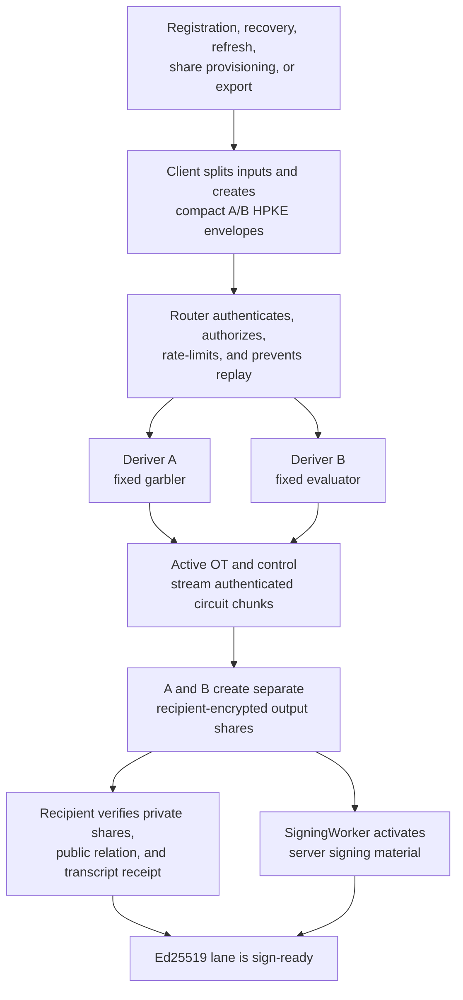
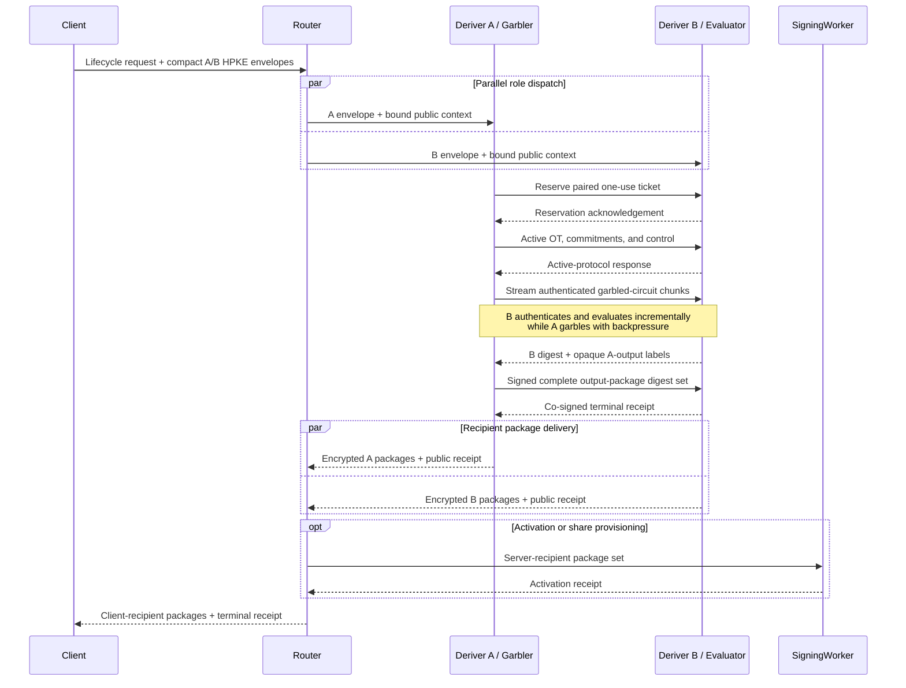
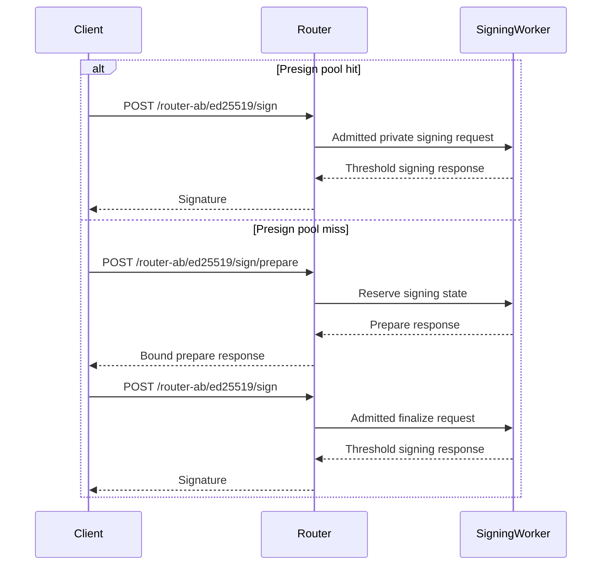

# Streaming Yao A/B

Streaming Yao is the approved Ed25519 lifecycle protocol for Router A/B.
Deriver A garbles one fixed circuit and Deriver B evaluates it. The circuit
computes the export-compatible Ed25519 derivation while neither Deriver learns
the joined seed, scalar, or signing outputs.

The deployed P0 profile uses the reviewed free-XOR/half-gates construction in
separate Deriver Workers connected by a Service Binding WebSocket. Its release
claim is passive, honest execution with abort: the roles remain isolated while
the shared Cloudflare account control plane remains honest. Stronger active
security and independently administered Deriver accounts remain deferred
profiles and are not implied by the deployed benchmark.

## When Yao runs

Yao runs during infrequent lifecycle ceremonies that create, reproduce,
redistribute, or export Ed25519 material:

| Operation                                                    | Uses Yao? | Reason                                                                         |
| ------------------------------------------------------------ | --------- | ------------------------------------------------------------------------------ |
| Registration and initial activation                          | Yes       | Creates client and SigningWorker shares for the canonical Ed25519 identity.    |
| Recovery onto a new device or credential                     | Yes       | Recreates recipient shares while preserving the registered public key.         |
| Signing-share or SigningWorker refresh                       | Yes       | Produces fresh recipient shares under a new activation epoch.                  |
| Explicit key export                                          | Yes       | Releases masked seed shares after fresh export authorization.                  |
| Device linking that provisions a new signing lane            | Yes       | Creates signing shares for the new recipient.                                  |
| Device linking that only authorizes existing sealed material | No        | No derivation or redistribution occurs.                                        |
| Signing a transaction, message, or delegate action           | No        | Uses already-activated threshold shares.                                       |
| ECDSA lifecycle or signing                                   | No        | Uses the separate strict Router A/B threshold-PRF and additive-share protocol. |

A delegation action is an ordinary signature. Provisioning a new delegated
signing lane is a lifecycle ceremony. This distinction determines whether Yao
runs.

## Lifecycle flow



The large garbled-circuit stream travels directly between A and B. The client
and Router exchange compact requests and encrypted output packages measured in
KiB rather than MiB.

## Server-side sequence



The exact A/B request graph is frozen with the selected active-security suite.
The design target is one A/B round trip, with two to four sequential A/B round
trips accepted. Circuit chunks belong to one streaming request and do not each
create another round trip.

From the client's perspective, one Yao ceremony normally fits in one
client-to-Router request and response. An asynchronous deployment can return a
ceremony handle and use authenticated polling. A complete product operation may
also include separate authentication, recovery, or activation steps.

## Normal signing flow

Normal Ed25519 signing performs zero Yao work and makes zero Deriver calls.



| Flow                       |            Client to Router |      Router to SigningWorker |                    A/B | Yao |
| -------------------------- | --------------------------: | ---------------------------: | ---------------------: | --: |
| Ed25519 lifecycle ceremony | 1 request/response normally | 1 for activation when needed | Target 1, accepted 2-4 | Yes |
| Ed25519 sign, pool hit     |          1 request/response |           1 request/response |                      0 |  No |
| Ed25519 sign, pool miss    |    2 request/response pairs |     2 request/response pairs |                      0 |  No |
| Background presign refill  |   No user-facing round trip |              Background work |                      0 |  No |

## Compute and embedded clients

Streaming Yao is compute-intensive on A and B. Its dominant operations are
symmetric-key hashes, XORs, OT, transcript authentication, and active-security
checks over a fixed circuit. Streaming controls peak memory and overlaps
garbling, transfer, and evaluation. It does not reduce the total cryptographic
work.

The target wall time approaches:

```text
max(garbling CPU, transfer time, evaluation CPU) + protocol round trips
```

The client has a much smaller workload. It splits compact inputs, creates two
HPKE envelopes, opens small recipient packages, verifies commitments and the
public key, and stores the resulting signing material. It does not garble or
evaluate the circuit, run OT, transfer the multi-megabyte stream, or buffer
garbled tables.

This division suits mobile and embedded clients better than a client-side HSS
evaluation. Devices still need a secure random number generator, protected key
storage, ordinary curve and AEAD support, and network access to Router. Normal
signing uses the device's threshold-signing share and stays independent of Yao.

## Measured payload and latency

The fixed activation ceremony transfers exactly `2,222,584` bytes between the
Derivers: `2,185,420` bytes from A to B and `37,164` bytes from B to A. The
largest encoded envelope is `131,180` bytes. Explicit export transfers
`103,416` A/B bytes. Ordinary signing performs no Deriver traffic.

The selected same-account Service Binding WebSocket was measured in two paired
deployed campaigns on July 17, 2026:

| Transport and campaign | p50 | p95 | p99 | Mean | Failures |
| --- | ---: | ---: | ---: | ---: | ---: |
| Service Binding HTTP stream, 60-pair control | 234 ms | 258 ms | 318 ms | 232.5 ms | 0/60 |
| Service Binding WebSocket, 60-pair candidate | **202 ms** | **230 ms** | **236 ms** | **204.7 ms** | 0/60 |
| Service Binding WebSocket, 40-pair control | **198 ms** | **222 ms** | **232 ms** | **200.8 ms** | 0/40 |
| Native Workers RPC streams, 40-pair candidate | 231 ms | 249 ms | 264 ms | 227.5 ms | 0/40 |
| Cross-account public WebSocket, separate checkpoint | 203 ms | 315 ms | 424 ms | 219.4 ms | 0/30 |

A later production-artifact campaign recorded 21 successful ceremonies and no
failures. Its 20 warm samples measured `202 ms` p50, `216 ms` p95, and `219 ms`
p99 of Worker protocol time. The first immediate post-deploy cohort in the
promotion campaign measured `298 ms` p50, `360 ms` p95, and `480 ms` p99; the
following warm cohort measured `196 ms` p50, `224 ms` p95, and `296 ms` p99.
Cloudflare does not expose whether an invocation created a fresh isolate, so
these first-observation measurements describe warm-up behavior without claiming
a cold-start distribution.

Local release-mode lifecycle measurements provide implementation baselines,
rather than deployed latency claims:

| Operation | p50 | p95 | p99 |
| --- | ---: | ---: | ---: |
| Registration | 94.070 ms | 100.068 ms | 102.040 ms |
| Recovery | 64.607 ms | 70.351 ms | 72.197 ms |
| Refresh | 64.205 ms | 72.893 ms | 74.966 ms |
| Export | 19.035 ms | 23.780 ms | 24.566 ms |
| Ordinary signing | 2.362 ms | 2.430 ms | 2.471 ms |

The canonical benchmark sources are checked in with the implementation:

- [deployed Cloudflare release evidence](https://github.com/seams-tech/seams-wallet/blob/main/docs/router-ab/ed25519-yao/deployment.md)
- [local lifecycle latency report](https://github.com/seams-tech/seams-wallet/blob/main/crates/router-ab-dev/reports/ed25519-yao-local-latency-v1.json)
- [same-account Worker benchmark report](https://github.com/seams-tech/seams-wallet/blob/main/crates/ed25519-yao-cloudflare-bench/docs/phase9b-same-account-report.md)

## Cloudflare deployment

The client protocol is identical for both supported deployment profiles. The
profile is selected before startup and cannot be selected by a request.

| Profile | Status and use | A/B transport | Security property |
| --- | --- | --- | --- |
| One Cloudflare account | Selected P0 production, staging, local parity, and benchmarks | Service Binding WebSocket | Separate Worker runtimes and role-local secrets while the shared control plane remains honest. |
| Two independent Cloudflare accounts | Deferred stronger-operator experiment | Public WebSocket in the measured checkpoint | Independent administration can strengthen the control-plane boundary after reconnect and tail-latency gates pass. |

Same-account deployment contains a compromise confined to one Worker runtime
while the account administration and deployment control plane remain honest.
An account administrator or shared deployment credential can replace both
Workers and create effective A+B collusion. The selected P0 claim excludes that
threat. The cross-account experiment preserved the exact wire protocol but its
`315 ms` p95 missed the `250 ms` objective and a later reconnect defect remains
unresolved.

## Security properties

The selected P0 profile provides split-role privacy under passive, honest
execution while the shared account control plane remains honest:

- Router sees public metadata, timing, ciphertexts, and signed receipts;
- Deriver A never receives B's plaintext input or joined output;
- Deriver B never receives A's plaintext input or joined output;
- output shares are generated inside the approved protocol and encrypted
  separately to the client and SigningWorker;
- one-use tickets prevent preprocessing, labels, masks, and transcript nonces
  from being reused;
- the client can reconstruct the seed only during a freshly authorized export;
- normal signing never reconstructs the private key.

The claim excludes malicious Deriver behavior, A+B collusion, shared-account
administrator compromise, Cloudflare platform-wide compromise, fairness,
guaranteed output delivery, and availability when a Deriver aborts. Active
security, malicious-secure OT, input consistency, and authenticated private
outputs belong to a stronger future profile.

## Cost model

The July 10, 2026 planning snapshot for Cloudflare Workers Standard assumes a
`$5` monthly minimum per paid account, included request and CPU allowances,
CPU overage at `$0.02` per million CPU-ms, and no added Workers data-transfer or
egress charge. Pricing and Enterprise contracts can change, so deployment
estimates must refresh these inputs.

Under that snapshot, the large A-to-B payload affects latency and optional
storage while contributing `$0` in Workers bandwidth fees. CPU, active-protocol
rounds, retries, Durable Objects, and any prepositioned circuit storage drive
variable cost.

The production-artifact campaign measured mean CPU of `226.3 ms` for Deriver A
and `167.0 ms` for Deriver B, or `393.2 ms` combined per ceremony. Sampled p99
isolate memory was `27.7 MB` for A and `33.8 MB` for B, with no
`exceededMemory` outcome. At the July 17 pricing snapshot, those measurements
model to approximately `$8.16` of gross request plus CPU usage per million
ceremonies before included monthly usage. Service Binding calls and Worker
bandwidth add no separate charge, and the benchmark Workers use no storage
binding.

The historical approximately `300 ms` repository HSS measurement covered a
simulator and wrapper path. It does not establish latency, cost, or security for
a genuine succinct-HSS construction. The closed succinct-HSS analysis predicted
group-heavy computation and left amplification, active security, and complete
wire volume unresolved. Streaming Yao is the selected Ed25519 path. The
measurements above describe the deployed P0 profile; stronger active-security
profiles require their own latency, resource, and cost evidence.
