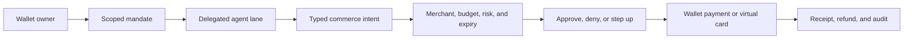

# Shopping agents

A shopping agent purchases from ecommerce stores that have no Seams or agent
integration. Seams gives it a narrow mandate and a wallet or payment credential
that can execute only within the approved purchase boundary.

## Example mandate

Allow one agent to buy an approved product from named merchants, up to a
per-order budget and fixed expiry. Require human approval when the final cart,
shipping address, price, delivery date, or merchant falls outside the original
instruction.

## Execution path

Keep catalog browsing outside wallet authority. Enter the signing path only
when an operation reserves value, moves funds, or commits an order. Revoke the
agent lane without rotating the owner's credential.

Use direct stablecoin payment when the merchant supports it. An optional virtual
card supplies compatibility with unrelated card-only stores. In both cases, the
mandate must bind the final merchant, items, total cost, expiry, and approval
conditions before payment executes.

Start with [delegated agents](/guides/delegated-agents) and [policies and
mandates](/guides/policies-and-mandates).
