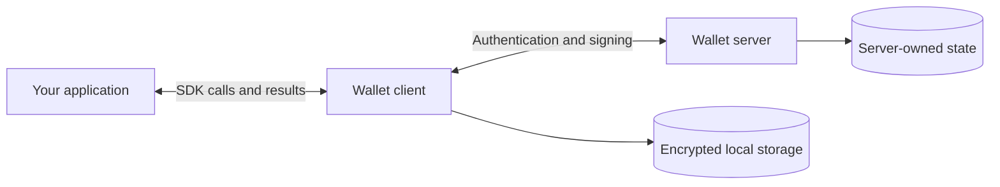

# How the wallet works

Seams Wallet lets people use blockchain accounts with a passkey or an email
verification code. An application uses the Wallet SDK to handle sign-in, request
signatures, and manage access to those accounts.

A wallet keeps its keys as the user adds sign-in methods, links devices, or
recovers access. Normal signing uses cryptographic material held by the client
and separate server roles.

## The three parts

- **Your application** decides what the user wants to do, such as send a
  transaction. It opens the Wallet UI through the SDK.
- **The wallet client** handles authentication screens, prepares signing requests,
  and runs client cryptography. It stores local secret material encrypted.
- **The wallet server** checks permissions and usage limits, stores account state,
  and runs the server side of signing.

The server is divided into roles so each role has access only to the material
it needs. You can understand the usual wallet flow before learning those roles.

## Using a wallet

Registration creates the wallet's keys and protects access with the user's chosen
sign-in method.

Unlocking creates a **Wallet Session**: permission to use selected keys for a
limited time and number of signatures. The client and server then work together
to sign requests allowed by that session.

Refreshing the page can restore an existing session. It grants no extra time or
signatures. Exporting keys requires fresh approval for that export.

If the user loses access, a recovery code lets them set up a new sign-in method
for the same wallet. Existing valid access stays available.

To try these flows, start with the
[local Wallet Console Lite example](../examples/wallet-console-lite/README.md).

## Choose a topic

Read Specs 1–3 for the core system. Continue with the topics relevant to your work.

| Spec | What you will learn |
| --- | --- |
| [1. Runtime](spec-1-runtime-and-platform-boundaries.md) | What runs in the client and server |
| [2. Authentication and custody](spec-2-auth-custody-and-credentials.md) | How sign-in, device linking, and recovery preserve wallet access |
| [3. Sessions and signing lanes](spec-3-wallet-sessions-and-execution-lanes.md) | What unlocking allows and how signing uses that permission |
| [4. Persistence](spec-4-persistence-and-durable-authority.md) | What is saved and how interrupted requests recover |
| [5. Router A/B](spec-5-router-ab-threshold-protocol.md) | How the cryptographic roles work together |
| [6. Tenant recovery](spec-6-tenant-roots-recovery-and-portability.md) | How operators back up and move the server side |
| [7. Integration](spec-7-hosted-surfaces-and-provider-boundaries.md) | How an application opens Wallet UI and connects providers |
| [8. Agent payments](spec-8-agent-authority-spending-and-payment-rails.md) | Wise first for Japanese businesses, then eligible Airwallex cards and bank transfers |
| [9. Testing](spec-9-behaviour-and-test-authority.md) | How to check a change against expected behaviour |

The specs state architecture requirements. Exact user journeys live in
[Intended Behaviours](intended-behaviours.md), and each chapter links to further
detail where needed.

Code excerpts link to their source. Diagrams show the main relationships and
steps; the linked references cover the full protocols and record formats.
