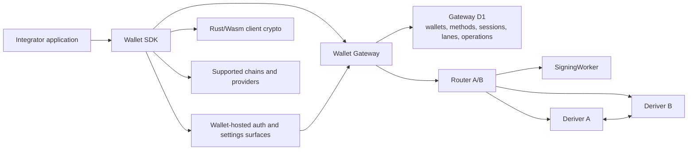

# Wallet architecture guide

This is the starting point for engineers who need to understand or change Seams
Wallet. It explains the whole system first and then points to the specifications
that own each part.

The numbered specifications are normative architecture documents. Their numbers
identify stable areas of ownership. Use the reading paths below instead of assuming
that every engineer should read all nine files in numerical order.

## The system in one paragraph

Seams Wallet lets an application create and use blockchain signing identities while
keeping authentication, client-held custody material, server-held signing material,
and tenant-level derivation authority separate. A passkey or Email OTP proves access
through one Wallet authentication method. The server turns that proof into an exact,
expiring Wallet Session. The session activates selected execution lanes, and each lane
is one authorized way to use a Wallet key. Signing requests pass through the Wallet
Gateway and Router to isolated protocol roles. Durable claims, quotas, and receipts
make retries safe without treating browser state or network success as authority.

## System map



Normal signing uses the Router and SigningWorker. Deriver A and Deriver B join
derivation-time operations such as registration, recovery, export, and share refresh.
Each private role can access only its own secret state.

## The domain model

| Concept | Meaning | Authority |
| --- | --- | --- |
| Wallet | Durable identity that owns blockchain keys and authorities | Gateway |
| Wallet key | One chain-family signing identity | Gateway public metadata plus cryptographic roles |
| Wallet authority | One permissioned installation or recovery authority for a Wallet | Gateway |
| Authentication method | A passkey, Email OTP, or supported external identity attached to an authority | Gateway |
| Custody envelope | Method-bound encrypted Wallet custody material stored for later unlock | Client storage plus authenticated server metadata |
| Wallet Session | Expiring server authorization for one exact authority, method, and activation set | Gateway |
| Execution lane | One admissible way to use one Wallet key | Gateway, with local material readiness |
| Operation claim | Durable record that binds one mutation to its authenticated input and retry identity | Owning database |
| Tenant derivation root | Tenant-scoped authority used to derive Wallet-serving material | Separated Router roles |

The most common relationship is:

```text
Wallet
├── Wallet keys
└── Wallet authorities
    ├── authentication methods and custody envelopes
    ├── execution-lane activations
    └── Wallet Sessions
```

## Secret material: keep these concepts separate

| Material | Purpose | Where it may exist in plaintext |
| --- | --- | --- |
| Wallet custody seed | Reproduces one Wallet's owner signing roots | Inside the narrow client cryptographic operation that needs it |
| Ed25519 Yao Client root | Wallet-owner Ed25519 signing root derived from the custody seed | Client cryptographic runtime |
| ECDSA client root share | Wallet-owner ECDSA material derived from the custody seed | Client cryptographic runtime |
| Lane holder share | Per-lane MPC material provisioned by a signing protocol | Its owning client or protocol runtime |
| Tenant-root role share | One role's share of tenant derivation authority | Its owning Deriver only |
| SigningWorker material | Activated server-side material used for normal signing | SigningWorker only |

Owner signing roots derive independently from the Wallet custody seed. A lane holder
share is provisioned for one execution lane. A tenant-root role share belongs to the
tenant-level Router protocol. None is an alias for another.

## Three journeys to understand first

### Registration

1. The Wallet surface verifies the chosen authentication factor.
2. A custody ceremony creates the Wallet custody seed, derives the configured owner
   roots, and verifies the resulting public key manifest.
3. The client seals the seed into an envelope bound to the exact Wallet and method.
4. The Gateway atomically commits the Wallet, authority, method, signer inventory,
   envelope metadata, and activation references.
5. The Gateway issues a Wallet Session for the registered method. Ready lanes may sign.

### Unlock and sign

1. The user proves one existing authentication method.
2. The client opens that method's custody envelope and prepares the selected lanes.
3. The Gateway issues an exact Wallet Session and operation credential.
4. A signing request resolves the session, lane, scope, digest, expiry, and budget.
5. The Gateway durably claims the operation before protocol work begins.
6. The Router and signing roles produce a signature, and the Gateway records the
   terminal or unresolved result under the same operation identity.

### Recovery

1. A recovery code selects one Wallet without requiring an old device or credential.
2. The recovery flow verifies a new target factor.
3. A custody ceremony proves that the recovered seed reproduces the existing key set.
4. The Gateway atomically installs a fresh authority, method, envelope, and activation
   references while consuming the recovery code.
5. Recovery itself creates no reusable Wallet Session. The owner logs in normally with
   the new method.

## Reading paths

| Goal | Recommended order |
| --- | --- |
| Understand the core Wallet | This guide → [Spec 7](spec-7-hosted-surfaces-and-provider-boundaries.md) → [Spec 1](spec-1-runtime-and-platform-boundaries.md) → [Spec 2](spec-2-auth-custody-and-credentials.md) → [Spec 3](spec-3-wallet-sessions-and-execution-lanes.md) → [Spec 4](spec-4-persistence-and-durable-authority.md) |
| Work on Router or cryptography | Core path → [Spec 5](spec-5-router-ab-threshold-protocol.md) → [Spec 6](spec-6-tenant-roots-recovery-and-portability.md) → [detailed Router protocol](router-ab/protocol.md) |
| Integrate or self-host Wallet | This guide → [Spec 7](spec-7-hosted-surfaces-and-provider-boundaries.md) → [Spec 1](spec-1-runtime-and-platform-boundaries.md) |
| Work on agent spending | Core path → [Spec 8](spec-8-agent-authority-spending-and-payment-rails.md) |
| Change tests or architecture contracts | Owning domain spec → [Spec 9](spec-9-behaviour-and-test-authority.md) |

For exact registration, unlock, signing, step-up, export, recovery, method-addition,
and linked-device behaviour, consult [Intended Behaviours](intended-behaviours.md).

## Repository map

| Area | Primary location |
| --- | --- |
| Shared domain types and boundary parsers | `packages/shared-ts/src` |
| Browser SDK and hosted Wallet runtime | `packages/wallet/src` |
| Gateway, server domain services, and D1 adapters | `packages/wallet-server/src` |
| Canonical cryptographic operations | `crates/signer-core/src` |
| Custody-ceremony Wasm boundary | `wasm/wallet_custody_ceremony` |
| Router protocol types and tenant-root operations | `crates/router-ab-core/src` |
| Cloudflare Router roles and private persistence | `crates/router-ab-cloudflare/src` |
| Public local composition | `examples/wallet-console-lite` |
| All TypeScript tests | `tests` |

## Document authority

1. [Intended Behaviours](intended-behaviours.md) owns supported user-visible lifecycle
   behaviour.
2. Specs 1–8 own architecture, domain, security, persistence, and integration rules.
3. The [Router protocol](router-ab/protocol.md) owns detailed threshold-protocol rules.
4. Rust vectors, cross-language fixtures, and type fixtures own exact cryptographic,
   wire, and compile-time invariants.
5. [Spec 9](spec-9-behaviour-and-test-authority.md) explains how to interpret tests and
   lower-level evidence.

Resolve contradictions in every affected authority. Avoid relying on document rank to
leave an inconsistency unexplained.
