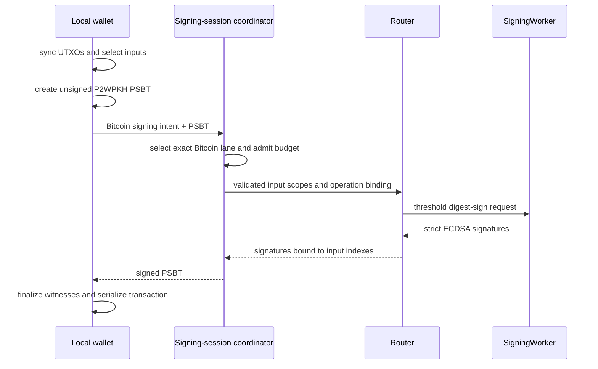

# Bitcoin signer support (deferred)

**Status:** Deferred design. Bitcoin signing, Bitcoin descriptors, PSBT handling,
UTXO synchronization, and Taproot/FROST are unimplemented in this repository.
This document records the intended integration shape so future work can be
reviewed against the current custody and signing-session architecture.

## Decision summary

The first Bitcoin release, when scheduled, will support native SegWit v0
P2WPKH addresses and threshold ECDSA. The public signing boundary will be a
validated PSBT. The wallet will construct and finalize transactions locally;
the threshold signer will receive the exact input data needed to produce
signatures and will return signatures that the wallet inserts into the PSBT.

Bitcoin will have a separate custody root and key scope. The existing EVM-family
`ecdsaThresholdKeyId`, owner address, derivation context, and chain-target lanes
will never sign a Bitcoin input. The Bitcoin root will be derived in parallel
from the wallet custody seed through a distinct HKDF domain, following the
current rule that owner roots derive from the seed independently. It will have
its own entry in the wallet-key manifest, root identifier, descriptor identity,
and recovery evidence.

Taproot and FROST are a later phase. FROST is threshold Schnorr and requires a
separate protocol, nonce lifecycle, key manifest, and review. Existing ECDSA
threshold signing does not authorize a Taproot implementation.

Here, private threshold wallet describes custody: neither participant holds the
complete signing scalar during normal operation. Standard Bitcoin transactions,
addresses, amounts, and graph relationships remain visible on-chain. This plan
does not claim confidential transaction or network-layer privacy.

## Current architecture anchors

The design follows these active repository boundaries:

| Existing boundary | Bitcoin implication |
| --- | --- |
| `router-ab-ecdsa-derivation` derives a fixed 2-of-2 secp256k1 key as additive client and relayer shares. | Reuse the split-custody and threshold-signing construction only behind a Bitcoin-specific key scope and request parser. |
| Router A/B normal signing accepts an admitted digest and uses SigningWorker presignature state. | A Bitcoin adapter computes BIP143 digests from a validated PSBT, then calls the generic sign-time seam. The public API never accepts an arbitrary Bitcoin digest. |
| EVM-family ECDSA identity is shared across concrete EVM targets and yields an Ethereum address. | Bitcoin identity is separate. It yields a descriptor and network-specific addresses, never an Ethereum address or EVM lane. |
| `signing-session-architecture` selects one exact lane before restore, auth, budget, signing, and finalization. | Bitcoin adds a concrete Bitcoin lane carrying network, descriptor, root/key version, session, quota, and threshold-session identity. |
| `wallet custody seed` derives owner roots in parallel, and key sets carry independent manifests. | A Bitcoin custody root is a parallel, domain-separated root with its own manifest. It is never derived from an EVM root. |
| Recovery distinguishes `VerifiedWalletKeyManifestDigestV1` from `WalletCustodySeedFromSealedEnvelopeV1`. | Bitcoin recovery preserves that distinction and verifies the Bitcoin descriptor/key manifest before publishing or resealing material. |

No Bitcoin-specific route, type, persistence schema, Rust crate, WASM worker,
descriptor parser, UTXO store, or fixture exists today.

## First release: P2WPKH threshold ECDSA

### Key and descriptor model

The Bitcoin key scope is conceptually:

```text
walletId
+ rpId
+ bitcoinCustodyRootId
+ bitcoinCustodyRootVersion
+ network
+ descriptorId
+ keyVersion
+ keyScope = "bitcoin"
=> one threshold account public key / extended public key
=> one descriptor wallet
```

The account-level key and chain code are provisioned by the Bitcoin custody
ceremony. Runtime address derivation uses BIP32 non-hardened public child
derivation. For a child index, the adapter derives the public BIP32 tweak
`epsilon` and the threshold protocol applies it once to the joint key:

```text
epsilon      = IL(parent_chain_code, parent_public, index)
child_public = parent_public + epsilon * G
```

At signing time, `epsilon` uses the Cait-Sith public-key-tweak equation already
documented in `docs/threshold-ecdsa/cait-sith-math.md`: each participant adapts
its presignature share with `sigma_i' = sigma_i + epsilon * k_i`. The key shares
remain unchanged, and the combined signature verifies under `child_public`.
The production integration currently pins this tweak to zero, so enabling a
non-zero value requires a Bitcoin-scoped API, independent vectors, and an audit
of the complete presignature path. The path, index, parent fingerprint,
network, and descriptor identity are bound into the signing request. A caller
cannot provide an unrelated child public key or path.

Derivation must implement BIP32's invalid-child rules for `IL >= n`, a zero
derived scalar, or the point at infinity. The descriptor index manager advances
deterministically before reserving an address; signing never substitutes a
different index for an already approved input.

The initial descriptor shape is equivalent to a native SegWit descriptor with
receive and change branches:

```text
wpkh([fingerprint/account-origin]xpub/0/*)
wpkh([fingerprint/account-origin]xpub/1/*)
```

The exact descriptor grammar, checksum handling, version bytes, gap policy,
and supported origin paths require their own reviewed parser. Hardened account
derivation is a custody-ceremony concern for this phase. The runtime public
tweak surface is limited to non-hardened branches and indexes. Address
generation uses compressed secp256k1 public keys and network-specific P2WPKH
encoding.

For a compressed public key `P`, a P2WPKH output is:

```text
witness_program = HASH160(P)       // 20 bytes
scriptPubKey    = 0x00 0x14 witness_program
```

The address string is presentation data. The scriptPubKey and network are the
funds-safety values used during validation.

### PSBT boundary and signing flow

PSBT (BIP174) is the chain adapter boundary. The generic threshold signer sees
only a typed, validated digest request after the Bitcoin adapter has checked
the PSBT. The intended flow is:



The adapter must:

1. Parse the PSBT at the request boundary and normalize it into an internal
   Bitcoin signing request. Raw PSBT maps and caller-provided partial records
   do not cross into core signing logic.
2. Require an unsigned transaction, unique input outpoints, exact input
   amounts, and either a valid `witness_utxo` or a verified matching
   `non_witness_utxo` according to the selected PSBT policy.
3. Resolve every signing input through the descriptor and non-hardened child
   path. The derived compressed public key and P2WPKH script must match the
   input's scriptPubKey.
4. Build the BIP143 witness-v0 preimage from the unsigned transaction,
   previous-output amount, P2WPKH scriptCode, input index, and the allowed
   sighash type. Bind the resulting digest to the exact PSBT and lane.
5. Send one bounded signing request to the existing threshold sign-time seam
   for each selected input or one request containing an explicitly ordered set
   of input digests. The response identifies each input index and digest.
6. Verify every returned signature against the derived child public key before
   adding it to the PSBT. Finalization and transaction serialization stay local
   to the wallet.

The PSBT is the user-review and approval artifact. Any change to inputs,
outputs, amounts, fee, descriptor path, network, or sighash policy after
approval invalidates the operation binding and requires a new approval.

### Strict DER and sighash policy

The first release supports `SIGHASH_ALL` for P2WPKH. `SIGHASH_NONE`,
`SIGHASH_SINGLE`, `SIGHASH_ANYONECANPAY`, and combinations are excluded until
each has a separate policy and vector set.

Each witness signature is exactly:

```text
strict-DER-encoded-(r,s) || 0x01
```

The adapter and signer enforce:

- BIP66 strict DER encoding: canonical sequence and integer lengths, positive
  non-zero integers, no redundant leading bytes, and no trailing bytes;
- `1 <= r,s < n` for secp256k1;
- low-`s` normalization before the signature leaves the threshold boundary;
- exactly one supported sighash byte, bound to the digest that was signed;
- verification against the descriptor-derived compressed public key;
- rejection of malformed, high-`s`, wrong-key, wrong-input, duplicate, or
  digest-mismatched signatures.

The signer does not accept a caller-supplied DER blob as a completed signature,
and a PSBT finalizer does not infer a sighash byte from untrusted metadata.

## Local UTXO wallet responsibilities

Bitcoin transaction construction is local wallet state. A configured indexer,
Electrum-compatible service, or node supplies synchronization data; that data
is untrusted input and must be normalized at the boundary.

The local wallet owns:

- UTXO synchronization keyed by `(txid, vout)`, confirmation height, and chain
  tip; reorgs invalidate affected observations and pending selections;
- script and amount verification against the descriptor and transaction data;
- deterministic coin selection using effective value, a bounded input count,
  and an outpoint tie-breaker;
- fee-rate policy, exact virtual-size estimation, and fee calculation;
- change creation on the descriptor's change branch with a reserved index;
- dust checks, insufficient-funds checks, and a maximum-fee/feerate policy;
- local PSBT construction, user review, finalization, and broadcast handoff.

Coin selection must be deterministic for the same normalized UTXO set,
outputs, fee policy, and descriptor state. A selection is invalidated when an
outpoint is spent, the relevant chain view reorgs, the fee policy changes, or
the unsigned transaction changes. The signer does not select coins, estimate
fees, choose change, or trust an indexer assertion that is absent from the
PSBT.

The initial release should use one explicitly specified selection policy and
one fee estimator interface. It should avoid silently switching strategies on
failure. A change output is either a descriptor-derived change output included
in the approved transaction or absent; the signer never adds one.

## Integration points

The future implementation should introduce the smallest chain-specific seams
needed to preserve current ownership:

| Area | Planned integration |
| --- | --- |
| Domain types | Add discriminated Bitcoin network, descriptor, PSBT, UTXO, input-scope, and signing-result types. Required identity and auth fields remain mandatory after boundary parsing. |
| Signing sessions | Add `BitcoinTransactionLane` with `chain = "bitcoin"`, `network`, `descriptorId`, `bitcoinCustodyRootId`, key version, `walletSessionId`, `quotaId`, and `thresholdSessionId`. Lane selection and exact restore follow the existing state machine. |
| Custody | Add a Bitcoin root derivation label and independent Bitcoin key-set manifest. Registration and recovery verify the descriptor/account public identity before activation. |
| Router A/B | Add a Bitcoin-scoped request context or dedicated adapter. Existing EVM-family derivation identifiers and Ethereum-address fields stay out of Bitcoin requests. |
| SigningWorker | Reuse the existing admitted threshold sign-time ownership and one-use presignature lifecycle behind Bitcoin-bound request validation. The worker never receives coin-selection authority. |
| Browser/WASM | Keep root shares, child signing shares, presignature secrets, and nonce material in the cryptographic worker boundary. TypeScript carries normalized public metadata and opaque handles. |
| Persistence | Persist encrypted Bitcoin lane/descriptor metadata and sealed refresh records with explicit Bitcoin scope. UTXO caches are replaceable chain observations, not custody material. |
| Recovery | Re-derive the Bitcoin root, replay the descriptor/key manifest, and fail closed on any public identity or network mismatch. Preserve the two existing custody proof types without conversion. |
| Broadcast | Keep broadcast separate from signing. A broadcaster accepts only a locally finalized transaction whose inputs, outputs, fee, and network match the approved operation. |

## Recovery and rotation

Bitcoin registration is a custody ceremony because it establishes an owner root
and verifies a key manifest. The manifest must cover at least the wallet
identity, Bitcoin root id/version, network, descriptor checksum and shape,
account origin, parent fingerprint, account extended public key, and a digest
of the supported derivation policy.

Recovery re-derives the Bitcoin root in parallel with the other owner roots,
reconstructs the threshold account public identity, and compares the complete
manifest before activating the descriptor. A mismatch stops recovery. It does
not create a new descriptor under an old identity or fall back to an EVM key.

Adding a factor opens and reseals the wallet custody seed using the existing
`WalletCustodySeedFromSealedEnvelopeV1` proof. Registration and recovery use
`VerifiedWalletKeyManifestDigestV1` after the Bitcoin manifest has been
verified. These proofs remain distinct.

Key rotation creates a new Bitcoin root/key version and descriptor identity.
Old descriptors remain watch-only for balance and recovery accounting until
their funds are swept through an explicitly approved transaction. Rotation
does not mutate an existing descriptor or reinterpret old UTXOs under a new
root.

## Security constraints

The implementation must satisfy all of the following before production use:

- The EVM-family ECDSA key, Ethereum owner address, and Bitcoin key scope are
  separate at type, derivation, persistence, route, and audit boundaries.
- No Router, server database, log sink, indexer, or TypeScript state contains a
  joined Bitcoin private scalar or both threshold signing shares.
- Normal signing never exports the canonical Bitcoin private key. Any future
  export requires a separately reviewed, explicit authorization flow.
- Every signature is bound to the wallet session, exact Bitcoin lane, root and
  key version, descriptor identity, network, PSBT digest, input index, outpoint,
  amount, script, child path, sighash policy, operation id, threshold session,
  and admitted budget.
- Missing or conflicting UTXO amounts, scripts, derivation paths, network,
  descriptor checksums, or PSBT fields fail closed before threshold signing.
- Fee, output, change, dust, and input-count policy is checked before signing;
  policy data is part of the user-approved operation digest.
- One-use presignatures and replay protections follow the current Router A/B
  lifecycle. Aborted, expired, drifted, or mismatched material is consumed or
  quarantined according to the existing one-use semantics.
- Reorgs and stale indexer state cannot turn a previously observed outpoint into
  an implicitly trusted spend. The local wallet must refresh and re-approve.
- Secret material is zeroized at worker boundaries, and diagnostics contain
  identifiers, hashes, and failure classes without PSBT secrets or nonce data.

## Delivery phases

1. **Specification and vectors** — freeze the Bitcoin key scope, custody label,
   descriptor subset, network policy, PSBT policy, BIP32 non-hardened tweak
   encoding, BIP143 digest inputs, strict DER rules, and error taxonomy. Add
   independent Rust and TypeScript boundary fixtures before product routes.
2. **P2WPKH key and descriptor layer** — implement the separate Bitcoin root,
   account identity, descriptor parser/checksum, public child tweaks, address
   scripts, and key-manifest/recovery verification. No signing or broadcast yet.
3. **Local wallet construction** — implement normalized UTXO sync, deterministic
   selection, fee and dust policy, reserved change indexes, PSBT construction,
   review binding, and local finalization against regtest vectors.
4. **Threshold signing integration** — add the Bitcoin-scoped lane and PSBT
   adapter, connect validated BIP143 digests to Router A/B sign-time machinery,
   enforce strict DER plus sighash policy, and preserve exact restore/budget
   semantics. Exercise 2-of-2 signing on regtest with both roles.
5. **Recovery, rotation, and release evidence** — verify registration,
   factor-addition reseal, recovery, key rotation, reorg handling, replay
   rejection, fee/output tamper rejection, and broadcast handoff. Start with
   regtest, then a testnet pilot, followed by an explicit mainnet review.
6. **Taproot/FROST (later)** — design and implement a separately reviewed
   threshold Schnorr/FROST protocol and `tr(...)` descriptor support. This phase
   begins only after P2WPKH evidence is complete.

## Explicit exclusions

The deferred P2WPKH release excludes:

- Taproot key-path or script-path spends, MuSig2, FROST, and Schnorr;
- P2WSH, P2SH-wrapped SegWit, legacy P2PKH, multisig descriptors, and custom
  script policies;
- `SIGHASH_NONE`, `SIGHASH_SINGLE`, `SIGHASH_ANYONECANPAY`, and mixed sighash
  batches;
- runtime hardened BIP32 derivation and arbitrary caller-provided descriptors;
- browser-held private keys, canonical private-key export, and server-side
  coin selection;
- blind signing of raw transaction bytes or caller-supplied pre-hashed digests;
- implicit network switching, address reuse across descriptor identities, and
  automatic sweep or rotation;
- Lightning, PSBT proprietary extension semantics, confidential transactions,
  SPV validation, and a built-in full-node implementation.

## Acceptance evidence

The feature remains deferred until the following evidence exists and is linked
from the implementation and release documentation:

- BIP32 non-hardened public-tweak vectors agree with an independent private-key
  reference implementation for parent keys, indexes, chain codes, aggregate
  child keys, adapted presignature shares, and invalid-child handling.
- Descriptor checksum, origin, network, receive/change branch, compressed-key,
  P2WPKH script, and address vectors match independent BIP173/BIP84 tooling.
- BIP143 witness-v0 sighash vectors cover amounts, scriptCode, input ordering,
  output ordering, and the supported sighash byte.
- DER parser and encoder tests reject every malformed, high-`s`, wrong-key,
  wrong-input, trailing-byte, and unsupported-sighash case in the negative
  corpus.
- PSBT fixtures prove exact parse/normalize/round-trip behavior, missing-input
  rejection, UTXO mismatch rejection, descriptor-path mismatch rejection,
  tampered-output rejection, and input-index binding.
- Local wallet tests prove deterministic selection, exact fee calculation,
  dust/change handling, reserved change indexes, stale UTXO invalidation, and
  reorg recovery.
- Regtest end-to-end evidence shows a 2-of-2 threshold signature producing a
  valid P2WPKH witness, with neither party able to sign alone. The final
  transaction is accepted by an independent Bitcoin implementation.
- Lifecycle evidence shows exact Bitcoin lane selection, sealed refresh,
  budget admission, one-use presignature behavior, factor-addition reseal,
  registration, recovery, and key rotation.
- Isolation evidence proves Bitcoin never reuses the EVM-family key id/address,
  no joined private scalar reaches Router/SigningWorker persistence or logs, and
  recovery fails closed on a changed descriptor, network, or manifest.

Until these artifacts exist, Bitcoin support is documentation only and no
Bitcoin transaction should be accepted by the SDK.

## References

- [BIP32: Hierarchical Deterministic Wallets](https://github.com/bitcoin/bips/blob/master/bip-0032.mediawiki)
- [BIP66: Strict DER signatures](https://github.com/bitcoin/bips/blob/master/bip-0066.mediawiki)
- [BIP84: Native SegWit derivation](https://github.com/bitcoin/bips/blob/master/bip-0084.mediawiki)
- [BIP143: SegWit v0 signature digest](https://github.com/bitcoin/bips/blob/master/bip-0143.mediawiki)
- [BIP173: Bech32 P2WPKH addresses](https://github.com/bitcoin/bips/blob/master/bip-0173.mediawiki)
- [BIP174: Partially Signed Bitcoin Transaction](https://github.com/bitcoin/bips/blob/master/bip-0174.mediawiki)
- [BIP340: Schnorr signatures for secp256k1](https://github.com/bitcoin/bips/blob/master/bip-0340.mediawiki)
