# NEAR ML-DSA-65 threshold signer support (deferred)

**Status:** Deferred design. NEAR ML-DSA-65 keys, signatures, custody material,
threshold protocols, and public SDK APIs are unimplemented in this repository.
This document records the intended integration shape and the evidence required
before production work begins.

## Decision summary

When scheduled, Seams should add ML-DSA-65 as an independent NEAR wallet-key
family. It should use a 2-of-2 threshold protocol whose final output is an
ordinary FIPS 204 ML-DSA-65 signature accepted by an unmodified NEAR verifier.
The existing Ed25519 Yao/FROST protocol cannot produce ML-DSA signatures and
must remain a separate signing family.

The leading protocol candidate is Mithril. It supports 2-of-2 signing, all
three FIPS 204 parameter sets, distributed key generation, and a-posteriori
sharing of an existing key. Its official implementation is an academic
proof-of-concept. It uses floating-point sampling, lacks identifiable aborts
and robustness, and has not received the review required for production
custody. No production implementation should begin until the protocol,
constant-time implementation, licensing, patent position, and independent
review satisfy the readiness gates in this document.

The first engineering milestone should be a private interoperability harness:
encode an ML-DSA-65 NEAR key, enroll it with an existing full-access key, sign
one test transaction with a single-party test key, verify the result
independently, and remove the key. This harness proves the NEAR wire path. It is
not a public wallet mode and should be deleted once the threshold operating
path replaces it.

## NEAR protocol capability

NEAR supports ML-DSA-65 as an access-key and transaction-signature scheme.
Validators and staking keys remain Ed25519. The relevant sizes and encodings
are:

| Value                  | NEAR representation                                 |
| ---------------------- | --------------------------------------------------- |
| Public key             | `ml-dsa-65:` followed by base58-encoded 1,952 bytes |
| Expanded secret key    | 4,032 bytes; never persisted or logged by Seams     |
| Signature              | key-type variant `2` carrying 3,309 bytes           |
| Access-key list handle | `ml-dsa-65-hash:` followed by a 32-byte hash        |

The on-chain trie stores a compact public-key handle. Its digest is:

```text
SHA3-256("near:ml-dsa-65-pubkey-hash:v1" || raw_public_key_1952)
```

`AddKey`, `DeleteKey`, direct access-key lookup, and transaction signing use
the full public key. `view_access_key_list` returns the hash handle. The SDK
must model these as distinct types because a handle cannot sign and cannot be
recovered into the full public key.

An ordinary NEAR transaction remains the existing tag-less transaction wire
format. The signer hashes its exact Borsh bytes with SHA-256, then runs pure
ML-DSA-65 over that 32-byte transaction hash with the NEAR-required context.
Gas-key `TransactionV1` and nonce lanes are an independent feature and are
outside this plan's initial scope.

ML-DSA-65 verification incurs an additional 100 Ggas protocol charge. The
selected RPC must report an active protocol version that supports the scheme
before enrollment or signing. Node software version and advertised future
protocol version are insufficient activation evidence.

## Why threshold signing is possible

FIPS 204 specifies single-party ML-DSA key generation, signing, and
verification. Threshold behavior comes from an additional multi-party
protocol. NEAR sees only the final public key and standard signature, so it
does not need to understand the participant set or share format.

Recent constructions can produce standard-compatible ML-DSA signatures:

| Candidate | Useful property                                                                             | Constraint for Seams                                                                                                  |
| --------- | ------------------------------------------------------------------------------------------- | --------------------------------------------------------------------------------------------------------------------- |
| Mithril   | Dishonest-majority security, 2-of-2 support, standard output, DKG, and a-posteriori sharing | Proof-of-concept implementation; static-corruption proof; no identifiable abort or robustness; patent review required |
| Quorus    | Standard output and scalable MPC construction                                               | Current efficient instantiation assumes an honest majority, which does not fit a two-party client/server lane         |
| TALUS-MPC | Standard output and a one-round online phase after preprocessing                            | Current fully distributed profile requires an honest majority and at least three participants                         |

Mithril is the only candidate currently aligned with the existing two-party
deployment. Its 2-of-2 ML-DSA-65 parameters use tens of kilobytes of
communication per party for one signing attempt. Each attempt has a
probabilistic acceptance step, so the route and UI must tolerate bounded retry
without reusing consumed protocol state.

## Current repository boundary

The repository currently assumes Ed25519 throughout the NEAR signing path:

- `wasm/near_signer/src/types/near.rs` stores a public key in `[u8; 32]` and a
  signature in `[u8; 64]`.
- `wasm/near_signer/src/actions.rs` accepts only `ed25519:` keys for `AddKey`
  and `DeleteKey` actions.
- `crates/router-ab-core/src/protocol/normal_signing.rs` decodes fixed-size
  Ed25519 public keys and signatures and rejects any other key type.
- `crates/signer-core/src/wallet_seed_derivation.rs` defines only
  `NearEd25519` and `EvmFamilyEcdsa` wallet key-set manifests.
- `packages/shared-ts/src/signing-lanes/records.ts` defines wallet-key records
  for Ed25519 and ECDSA only.
- The NEAR nonce coordinator binds one Ed25519 operational public key to an
  ordinary access-key nonce stream.
- Registration, recovery, linked-device provisioning, session authorization,
  Router admission, signing quotas, persistence, and confirmation all carry
  Ed25519-specific identities.

Existing transport, operation admission, session planning, authorization,
quota, confirmation, and observability patterns remain useful. Existing
Ed25519 cryptographic types, routes, custody records, manifests, and protocol
transcripts must not be widened into optional multi-scheme bags.

Until every production gate is complete, callers receive no ML-DSA capability
and no placeholder key-family value. There is no fallback from an ML-DSA
request to Ed25519.

## Custody and recovery decision

The first design should preserve the repository invariant that every owner
signing root derives independently from the wallet custody seed. Add a
domain-separated ML-DSA-65 derivation alongside the Ed25519 Yao Client root and
ECDSA client root share:

```text
wallet custody seed
  + wallet identity and manifest binding
  + "near-ml-dsa-65-owner-root/v1"
  => 32-byte ML-DSA-65 seed
  => standard ML-DSA-65 key pair
  => a-posteriori 2-of-2 threshold sharing
```

The complete expanded secret may exist only inside registration or recovery
ceremony memory while the standard key is generated and split. It must be
zeroized before the ceremony returns. Normal unlock and signing receive only
the sealed client share and authenticated remote participant state.

This approach keeps recovery deterministic: the recovered wallet custody seed
reproduces the same ML-DSA public key, which is checked against its key
manifest before new shares are established. Mithril's published security
analysis attributes a 7-to-12-bit loss to a-posteriori sharing. The protocol
review must accept that bound for ML-DSA-65 or choose a different construction
before implementation.

A pure DKG key is excluded from the first design because the wallet custody
seed could not independently reproduce it. Supporting DKG later would require
a separate, explicit recovery design for the client share and public identity.

The new manifest branch must bind at least:

```text
walletId
+ nearMlDsa65SigningKeyId
+ threshold protocol and parameter-set identifier
+ threshold and participant identifiers
+ full registered public key and derived hash handle
+ root/share version and material activation
+ network and protocol-activation policy
```

`VerifiedWalletKeyManifestDigestV1` continues to prove that a recovered seed
reproduces the registered key set. `WalletCustodySeedFromSealedEnvelopeV1`
continues to prove envelope-authenticated seed origin during factor addition.
ML-DSA support must preserve the distinction between those proofs.

## Domain model

Add exact branches instead of generalizing the Ed25519 state:

```ts
type NearAccountSignatureScheme =
  | { kind: 'ed25519'; publicKey: NearEd25519PublicKey }
  | {
      kind: 'ml_dsa_65';
      publicKey: NearMlDsa65PublicKey;
      publicKeyHandle: NearMlDsa65PublicKeyHandle;
    };

type NearMlDsa65KeyLifecycle =
  | { state: 'derived_unshared'; ceremonyId: CustodyCeremonyId }
  | { state: 'shares_established'; activation: MpcMaterialActivationRef }
  | { state: 'enrollment_pending'; activation: MpcMaterialActivationRef }
  | { state: 'active'; activation: MpcMaterialActivationRef }
  | { state: 'retired'; retiredAtMs: number };
```

The concrete implementation should use the repository's branded identifiers,
branch-specific builders, and boundary parsers. The sketch documents state
separation rather than final field names.

Full public keys and list handles require separate parsers with exact decoded
length checks. A route, signer, or deletion command that needs the full public
key must reject a hash handle. Raw RPC key records are normalized once at the
RPC boundary.

Account migration should also be explicit:

```ts
type NearPostQuantumAccountState =
  | { state: 'classical_only'; ed25519PublicKey: NearEd25519PublicKey }
  | {
      state: 'hybrid_active';
      ed25519PublicKey: NearEd25519PublicKey;
      mlDsa65PublicKey: NearMlDsa65PublicKey;
    }
  | {
      state: 'post_quantum_only';
      mlDsa65PublicKey: NearMlDsa65PublicKey;
      ed25519PublicKey?: never;
    };
```

The transition into `post_quantum_only` requires a completed recovery drill and
finalized deletion of every classical full-access key. A single absent RPC
read is insufficient evidence that a key was never enrolled or has been
deleted.

## Threshold signing flow

The intended 2-of-2 operating path is:

```mermaid
sequenceDiagram
  participant W as Wallet worker
  participant R as Router
  participant SW as SigningWorker
  participant N as NEAR RPC

  W->>W: Build exact NEAR transaction bytes
  W->>W: SHA-256 transaction bytes
  W->>R: Typed intent, transaction bytes, ML-DSA lane, round 1
  R->>R: Verify session, quota, policy, manifest, and activation
  R->>SW: Admitted ML-DSA-65 threshold request
  loop Bounded threshold attempts and rounds
    W->>R: Client protocol message
    R->>SW: Authenticated relay
    SW-->>R: Server protocol message
    R-->>W: Authenticated relay
  end
  SW-->>R: Candidate standard ML-DSA-65 signature
  R->>R: Verify signature against exact hash and public key
  R-->>W: Verified 3,309-byte signature
  W->>W: Serialize signed NEAR transaction
  W->>W: Verify serialized transaction and signature again
  W->>N: Broadcast exact signed bytes
```



The protocol route must commit to the exact unsigned transaction bytes,
transaction hash, account, network, public key, key handle, wallet key version,
lane, participant set, material activation, signing operation, display digest,
authorization, and retry attempt. A participant never accepts a caller-supplied
bare digest without the admitted NEAR intent that produced it.

Each threshold attempt owns fresh randomness and transcript identifiers.
Rejected attempts, timeouts, malformed messages, and successful attempts all
consume their private state. The final standard signature is verified before
it crosses the signing boundary. Verification failure returns a typed failure
and releases no candidate signature.

Mithril currently lacks identifiable aborts. Initial production support must
either gain an independently reviewed blame mechanism or document and accept
availability-with-unattributed-abort as part of the product threat model.

## Initial supported scope

The first production profile, after all readiness gates pass, should include:

- named NEAR accounts on configured mainnet and testnet networks;
- one owner ML-DSA-65 full-access key per wallet;
- direct ordinary NEAR transactions using the existing supported action set;
- enrollment and retirement authorized by an existing full-access key;
- RPC lookup by full key and list reconciliation by hash handle;
- registration, unlock, signing, recovery re-establishment, and key rotation;
- account states that retain or remove the Ed25519 full-access key explicitly.

The first profile should exclude:

- gas keys, nonce lanes, strict-nonce `TransactionV1`, and `DelegateV2`;
- ML-DSA function-call access keys;
- NEP-413 message signing;
- validator and staking keys;
- implicit-account creation from an ML-DSA public key;
- linked-device and delegated-execution ML-DSA lanes;
- threshold protocols or parameter sets other than the reviewed 2-of-2
  ML-DSA-65 profile;
- public export of a reconstructed expanded secret key.

Each excluded capability needs its own domain state, policy, vectors, and
review before it joins the supported union.

## Delivery phases

### 1. Codec and interoperability proof

- Implement internal discriminated public-key and signature codecs for
  Ed25519 and ML-DSA-65 with exact length and key-type validation.
- Add full-key and hash-handle derivation and parsing.
- Cross-check Borsh bytes against nearcore or an independent maintained NEAR
  implementation.
- Run FIPS 204 known-answer tests for key generation, signing, and
  verification.
- Use a disposable single-party signer to enroll, query, sign one transaction,
  and delete a testnet key.
- Remove the disposable signer after the threshold operating path replaces it.

### 2. Threshold protocol evaluation

- Pin one exact Mithril specification and parameter table for 2-of-2
  ML-DSA-65.
- Reproduce the authors' vectors and final signatures with an independent FIPS
  204 verifier.
- Review rejection sampling, randomness, transcript authentication, state
  consumption, abort behavior, and a-posteriori sharing.
- Resolve the patent and distribution terms for browser, server, embedded, and
  self-hosted builds.
- Select an audited constant-time Rust, C, or WASM-capable implementation.

### 3. Custody and lifecycle

- Add the parallel seed derivation and `NearMlDsa65` manifest branch.
- Extend registration and recovery ceremonies to derive, share, verify, and
  zeroize the key.
- Add sealed local shares, remote participant records, material activations,
  rotation, retirement, and recovery convergence.
- Add static TypeScript fixtures proving Ed25519 and ML-DSA lifecycle records
  cannot be mixed or broadly spread into one another.

### 4. Signing and Router integration

- Add ML-DSA-specific prepare, round, finalize, and abort routes.
- Extend signing-session planning with an exact ML-DSA lane and required
  authorization state.
- Add ML-DSA transaction decoding, intent fingerprinting, confirmation, quota
  accounting, and final-signature verification.
- Keep the Ed25519 Router A/B protocol and presign pool unchanged.
- Bound request sizes, rounds, retries, memory, and execution time.

### 5. Account enrollment and migration

- Add the ML-DSA full-access key with the current Ed25519 full-access key.
- Wait for finality and verify both direct lookup and the derived list handle.
- Sign and finalize an ML-DSA transaction before considering Ed25519 removal.
- Complete a recovery re-establishment drill that reproduces the same public
  key and successfully signs.
- Delete classical full-access keys only through an explicit
  `hybrid_active -> post_quantum_only` operation with final-state evidence.

### 6. Product enablement

- Add intended-behaviour contracts for the complete supported lifecycle.
- Document transaction-size and 100 Ggas verification costs.
- Expose the feature only on networks whose active protocol version supports
  ML-DSA-65.
- Enable production after the cryptographic and account-migration audits close
  every high-severity finding.

## Security constraints

- A NEAR account is resistant to forged classical signatures only after every
  classical full-access key has been removed. A hybrid account retains the
  security of its weakest full-access key.
- ML-DSA transaction signatures do not make the complete Seams system
  post-quantum. WebAuthn authenticators, TLS, session tokens, deployment
  identity, recovery delivery, and administrative control require a separate
  post-quantum threat model.
- Public keys, signatures, shares, hash handles, and expanded secret keys have
  distinct types and exact lengths. Prefix inspection alone cannot classify
  secret and public `ml-dsa-65:` values safely.
- Expanded secret keys and threshold shares are excluded from logs,
  diagnostics, telemetry, request errors, and public recovery records.
- Implementations used in browser or WASM environments require explicit
  constant-time and memory-erasure review. JavaScript best-effort zeroization
  is insufficient for a strong erasure claim.
- Threshold rejection sampling is bounded. Retry exhaustion is a typed
  recoverable failure and never triggers a single-party fallback.
- Every released signature is verified against the exact public key and
  transaction hash. Serialization after signing must reproduce the same
  unsigned bytes that were authorized.
- The larger public key and signature require strict request-size limits and
  denial-of-service budgets at every parsing and Router boundary.
- Key deletion retains the full public key and public recovery metadata until
  finalized chain evidence proves the intended state.

## Production readiness gates

ML-DSA-65 threshold support remains deferred until all of these are true:

1. The selected threshold protocol has a stable specification for 2-of-2
   ML-DSA-65 and standard-compatible output.
2. A constant-time implementation for every deployed target is available
   under acceptable license and patent terms.
3. Independent cryptographic review covers key derivation, a-posteriori
   sharing, signing, abort behavior, state consumption, and final
   verification.
4. FIPS 204 vectors, threshold transcript vectors, NEAR Borsh vectors, and
   cross-implementation tests pass.
5. Registration and recovery reproduce the identical public key and hash
   handle without persisting the expanded secret.
6. One share cannot sign, derive the other share, or reconstruct the complete
   key during normal operation.
7. Testnet accepts enrollment, threshold-signed transactions, rotation, and
   finalized deletion through the same code used in production.
8. The hybrid-to-post-quantum migration cannot strand an account or remove its
   last verified recovery-capable key.
9. Intended-behaviour contracts cover registration, unlock, signing, retry
   exhaustion, recovery, rotation, migration, and failure states.
10. Product language distinguishes NEAR transaction-signature protection from
    end-to-end post-quantum system security.

## References

- [NEAR access keys and signature schemes](https://docs.near.org/protocol/accounts-contracts/access-keys)
- [nearcore 2.13 protocol changes](https://github.com/near/nearcore/blob/master/CHANGELOG.md#2130)
- [FIPS 204: Module-Lattice-Based Digital Signature Standard](https://csrc.nist.gov/pubs/fips/204/final)
- [NIST Multi-Party Threshold Cryptography call](https://csrc.nist.gov/Projects/threshold-cryptography/tcall-1)
- [Mithril NIST preview](https://csrc.nist.gov/csrc/media/Projects/threshold-cryptography/documents/TCall-1/Mithril-PW01.pdf)
- [Efficient Threshold ML-DSA](https://eprint.iacr.org/2026/013)
- [Mithril proof-of-concept implementation](https://github.com/Threshold-ML-DSA/Threshold-ML-DSA)
- [Quorus: Efficient, Scalable Threshold ML-DSA Signatures from MPC](https://www.usenix.org/conference/usenixsecurity26/presentation/bienstock)
- [near-kit ML-DSA-65 implementation](https://github.com/r-near/near-kit)
