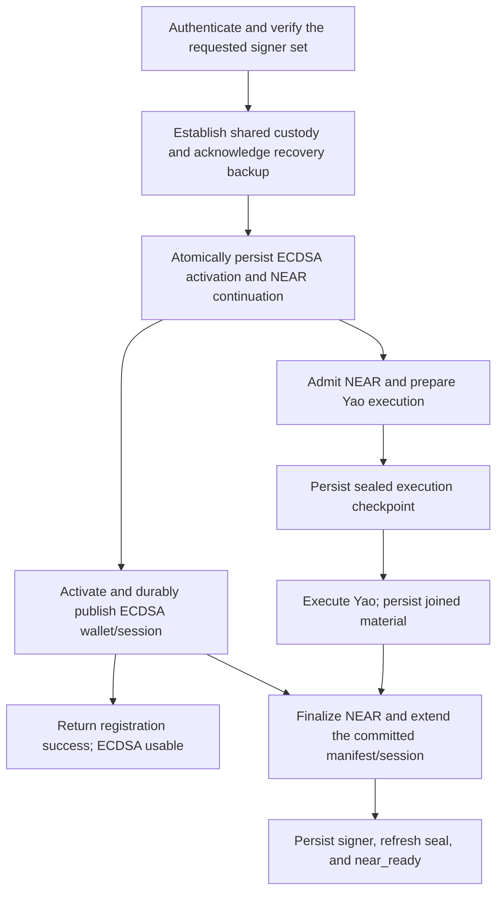

# Independent NEAR provisioning during mixed registration

Status: implementation and local acceptance complete on shared `dev`.
Release, deployment, and private Console adoption remain on hold.

## Implementation progress — 2026-09-23

The initial checkpoint was developed on `codex/independent-near-registration`
and integrated into `dev` as `e214e94`. Follow-up implementation is on `dev`.

Implemented:

- Mixed registration persists ECDSA activation and planned NEAR continuation in
  one transaction. EVM activation and signing proceed independently of NEAR
  admission and Yao execution, for both passkey and Email OTP.
- The shared continuation handles planned admission, an exact encrypted execution
  checkpoint, joined material, and final publication. Normal founding-method
  unlock resumes every durable phase, including old joined-material records.
- Checkpoints use a separate HKDF/ChaCha20-Poly1305 purpose and bind the wallet,
  application context, and exact request. Recipient keys remain in Rust/WASM.
  Restoring a checkpoint requires opening the existing custody envelope and grants
  no server authority.
- Fresh exact Wallet Session authorization resumes the original admitted request
  after grant expiry and Route 3 cleanup. Authorization refresh updates ceremony
  and execution records atomically, retaining claimed/completed/failed outcomes.
  A retried respond operation keeps its first material activation identity.
- NEAR finalization preserves session identity, quota, expiry, revocation epoch,
  and all existing capabilities. Concurrent EVM signing accepts only the exact
  NEAR-only authority extension. A lost finalization response is reconciled from
  the retained journal and the authenticated session-status digest.
- Exhausted Wallet Sessions finish NEAR provisioning without renewing their quota.
  Finalization uses the exact current Wallet Session even in the initial background
  run. Durable receipts preserve a zero balance. Passkey step-up reads the existing
  sealed signing material independently of a warm-session seal, including after
  refresh; Email OTP uses its existing exact-operation installation path.
- Local publication preserves the selected method and lock generation. Final
  readiness and journal removal share one transaction. Late responses cannot
  undo a lock; failed persistence leaves an unlock-repairable journal.
- Email OTP unlock leaves unfinished NEAR installation with the retained
  continuation, including after a readiness transaction rollback.
- Benchmark testing exposed a passkey session-restore encoding defect: integer
  serialization drops leading zero bytes. Both factors now use the existing
  fixed-width normalization at the session-seal boundary. A deterministic browser
  contract covers a passkey factor with three leading zeroes.

Verification already completed:

- 37 custody Rust tests, the wire-fixture test, and 10 real-circuit Yao tests.
- Fresh-worker checkpoint restoration against the local real Yao backend, with
  public-key/manifest continuity and ciphertext/context/request tamper checks.
- State type fixtures reject incompatible phases and plaintext secret substitution.
- Both factors' gated admission/execution, exact replay, lost responses, normal
  unlock, old joined-material migration, lock, and persistence rollback contracts.
- Single-curve registrations, recovery from the original recovery codes, signing,
  both key exports, and step-up after recovery.
- Focused expiry, retained activation identity, capability-extension, revoked-epoch,
  replacement-material, and fixed-width session-secret tests.
- Both factors complete provisioning after spending every EVM signing use, then
  sign through normal step-up while preserving session, quota, and expiry. The
  passkey case refreshes before step-up. Existing passkey unlock/export and refresh
  step-up contracts also pass.
- A terminal Yao execution remains failed under fresh unlock authority while
  EVM remains usable.
- Full Rust/WASM/local-worker/SDK/server build, refreshed runtime packaging, and
  intended/state type checks.

The balanced 20-pair benchmark passed all 40 runs. Median registration return
improved from 848.5 to 601.0 ms (29%), and durable NEAR readiness improved from
1059.3 to 1007.0 ms (5%). Authentication medians were 211 / 214 ms. The test-only
serialized gate uses the same build/backend; no production flag is added.
See [the latency report](./independent-near-registration-latency.md) for p95s,
first-pair and warmed results, stage timings, reproducibility, and limitations.
These local measurements use automated authentication and stubbed public chain
RPC; deployed acceptance remains release work.

`cargo yao-fv constant-time-qualification` previously qualified the pinned analyzer
against arm64 fixtures at O0/O3. It does not prove the checkpoint constant-time.
Manual review found fixed-width secret copies and existing AEAD/HKDF primitives;
branches inspect public metadata or authentication success. Session-secret
normalization restores the width of the already-decoded integer representation.

Remaining release work: publish coordinated Wallet/Wallet-server versions, deploy
the backend, adopt exact versions in Console, and run deployed acceptance and
representative network/device measurements. These actions remain explicitly held.

## Outcome and scope

Mixed registration returns when the wallet, founding authentication method,
ECDSA material, and ECDSA Wallet Session are durable. NEAR admission, Yao
execution, finalization, and session installation have their own continuation.
A slow or failed NEAR branch leaves a committed ECDSA wallet usable.

Implement this for both passkey and Email OTP registration. Preserve one wallet
custody seed, one recovery set, and the same configured key identities. Keep
Ed25519-only and ECDSA-only registration working through their existing public
entry points. A live successful mixed ceremony requires one authentication
prompt; resuming after lost volatile authority may require the normal unlock.

Wallet source, protocol work, and lifecycle tests belong in `seams-wallet`.
`seams-monorepo` adopts exact published Wallet releases and owns Console
composition/deployed acceptance.

The earlier measurement found approximately 245 ms in the Yao/custody join,
922 ms to registration return, and 1,114 ms to durable NEAR readiness. Those are
local browser measurements with automated confirmations. The target is to
remove the Yao dependency from the foreground path. Any improvement in total
NEAR-ready latency comes from overlapping the branches and must be measured.
Session-seal pipelining is a separate optimization.

## Existing dependencies to remove

| Boundary | Current behavior | Required change |
| --- | --- | --- |
| Gateway respond | Awaits ECDSA registration and NEAR admission together; a failed NEAR admission fails the response | Commit the verified authority/ECDSA result independently; give NEAR a durable, authorized continuation |
| Client ceremony | `runEcdsaEnabledThreeRouteRegistrationCeremony` awaits `startDeferredNearCustody` before Route 3 | Start NEAR work independently after the shared custody checkpoint |
| Local journal | A mixed `registration_activate` row requires completed material for both curves | Persist the ECDSA activation and the planned NEAR continuation separately |
| Mixed resume | `resumePendingMixedRegistration` awaits Route 4 before returning the ECDSA result | Restore ECDSA independently and schedule the appropriate NEAR continuation |
| Server cleanup | Route 3 cleans up the ceremony; later NEAR finalization reconstructs it from the committed installation | Preserve the exact facts needed for deferred admission, execution, authorization, and finalization |

Primary implementation files:

- [registration.ts](/Users/pta/Dev/rust/seams-wallet/packages/wallet/src/SeamsWeb/operations/registration/registration.ts)
- [pendingWalletRegistrationCommit.ts](/Users/pta/Dev/rust/seams-wallet/packages/wallet/src/core/indexedDB/pendingWalletRegistrationCommit.ts)
- [IndexedDB repositories](/Users/pta/Dev/rust/seams-wallet/packages/wallet/src/core/indexedDB/seamsWalletDB/repositories.ts)
- [pendingRegistrationRecovery.ts](/Users/pta/Dev/rust/seams-wallet/packages/wallet/src/SeamsWeb/operations/registration/pendingRegistrationRecovery.ts), [ECDSA recovery validation](/Users/pta/Dev/rust/seams-wallet/packages/wallet/src/SeamsWeb/operations/registration/pendingEcdsaRegistrationRecoveryValidation.ts)
- [D1 registration service](/Users/pta/Dev/rust/seams-wallet/packages/wallet-server/src/router/cloudflare/d1/registration/d1WalletRegistrationService.ts)
- [Yao registration authorization](/Users/pta/Dev/rust/seams-wallet/packages/wallet-server/src/router/domains/ed25519Yao/registration/routerAbEd25519YaoRegistrationIntentAuthorization.ts)

## Execution model

The split occurs after authority verification, local custody establishment, and
recovery-code backup acknowledgement. The shared checkpoint contains the ECDSA
activation intent and enough sealed custody/identity information to begin NEAR
later. Writing it performs no NEAR network operation.

NEAR finalization still requires the committed base wallet and its exact ECDSA
session. EVM activation has no dependency on NEAR admission or computation.
NEAR may finish computation first and wait at that finalization boundary.

After ECDSA publication, the existing public states describe NEAR progress:
`near_pending`, `near_provisioning`, `near_ready`, and
`near_failed_retryable`. Readiness events must remain observable when a
subscriber attaches after registration returns. Preserve durable-state replay
and avoid a late `near_pending` write overwriting `near_ready`.

Keep the custody proof types distinct. Reopening an envelope retains its
authenticated binding to the existing manifest. Adding NEAR requires the custody
ceremony to verify the extended manifest before publication; envelope provenance
must not be converted into a fresh manifest-verification proof.

## Durable state and crash recovery

Reuse the existing pending-registration store and its operation-keyed records.
Use one `registration_activate` record for ECDSA and one `near_provisioning`
record for NEAR, linked by ceremony, wallet, and founding method identities.
Persist their initial creation in one IndexedDB transaction. A failure to save
that shared checkpoint prevents activation.

The mixed activation record carries the mixed signer plan and ECDSA replay
material. It does not require NEAR local material. The NEAR record uses explicit
phases with required fields and `never` exclusions:

| NEAR phase | Required durable facts | Resume action |
| --- | --- | --- |
| `planned` | Exact intended NEAR key/slot/scope, founding method, custody-envelope reference/binding, registration continuation identity | Obtain valid authority, reconcile admission, prepare execution |
| `execution_prepared` | Admission identity, exact serialized execute request and digest, sealed client completion checkpoint | Reconcile the existing attempt and replay only its exact request when permitted |
| `joined` | Verified activation reference, sealed local material, public metadata, NEAR custody commit, deterministic finalization identity | Reconcile/replay Route 4 and complete local installation |

Completion removes the NEAR record only after local `near_ready` is durable.
ECDSA publication can remove its own completed activation record while retaining
the NEAR continuation. Each branch owns its record updates; avoid replacing a
shared mixed snapshot that could overwrite the other branch's progress.

Transient execution status and diagnostics do not establish durable progress.
Use existing transactional/claim patterns for cross-tab ownership and monotonic
phase transitions. An uncertain request retains its identity until reconciled.

### Preserve the client side of an in-flight Yao attempt

A custody envelope and an activation reference are insufficient to reconstruct
an arbitrary in-flight exchange. The current Rust `ClientActivationStateV1`
contains a client-only recipient private key and ceremony binding, and lives in
volatile protocol state. This is a prerequisite to resolve before concurrency
ships.

Add the smallest encrypted checkpoint needed to resume that exact prepared
exchange. Seal and restore it inside the custody/protocol WASM boundary using
the existing sealing machinery and a distinct checkpoint purpose. Bind it to
the wallet, custody identity, intended NEAR key, lifecycle/attempt identity,
protocol version, and exact request digest. Preserve fresh randomness and
existing one-use protocol rules. TypeScript stores ciphertext and validated
public metadata; plaintext protocol state stays inside WASM.

The execution request must not leave the browser before its checkpoint is
durable. After reload and authorized custody unlock, restore the checkpoint,
reconcile the server attempt, complete against its exact result, and replace
the checkpoint with `joined` material. A stored checkpoint creates no authority
to execute or sign. No wallet custody seed, PRF, factor secret, primary Wallet
Session credential, or unsealed protocol secret is added to browser storage.

First implementation milestone: demonstrate this round trip with a real
prepared exchange and a worker restart. Confirm which existing sealing and
protocol APIs can be reused before fixing the checkpoint's wire format.
Concurrency is gated on that milestone. A fresh Yao request under an old
lifecycle is not a recovery strategy.

## Gateway authorization and commit ordering

1. Decouple NEAR admission from the ECDSA `respond` result. Persist a scoped
   continuation descriptor from the verified signer intent. Execute admission
   from the NEAR branch through the existing domain, extending its request
   boundary where necessary. A NEAR service outage must not fail ECDSA respond.
2. Extend the committed installation projection to represent both planned and
   admitted NEAR continuations. Its current admitted-only assumptions must not
   force admission back onto Route 3's path. Preserve exact subject and intent
   checks in projection readers and replay builders.
3. Make Route 3 cleanup retain/reconstruct the minimal continuation facts.
   Test admission and execution both before and after ceremony cleanup. Reuse
   existing operation receipts and Yao execution records; avoid another queue
   or duplicate replay cache.
4. Keep initial execution bound to the verified registration grant and its
   expiry. After that authority expires, require a freshly authorized exact
   wallet/method continuation through normal session/unlock mechanisms.
   Authorize resumption of the existing attempt without rewriting its immutable
   request identity. Do not extend expired credentials or reinterpret a stored
   receipt as a new session credential.
5. Route 4 waits for the committed ECDSA installation, commits the NEAR manifest
   extension, and preserves the existing Wallet Session identity. Keep the
   deterministic NEAR idempotency key distinct from ECDSA activation.
6. Merge the new NEAR capability without restoring stale ECDSA quota, expiry,
   material, or authority. ECDSA signing and presignature refill may already be
   running. Revalidate revocation/material epochs and use existing commit/CAS
   boundaries to detect concurrent recovery or authority replacement.

Source areas for checkpoint work are
[custody orchestration](/Users/pta/Dev/rust/seams-wallet/packages/wallet/src/core/signingEngine/walletCustody/registrationCeremony.ts),
[custody worker](/Users/pta/Dev/rust/seams-wallet/packages/wallet/src/core/signingEngine/workerManager/workers/wallet-custody-ceremony.worker.ts),
[custody WASM](/Users/pta/Dev/rust/seams-wallet/wasm/wallet_custody_ceremony), and
[Yao client state](/Users/pta/Dev/rust/seams-wallet/crates/router-ab-ed25519-yao-client/src/lib.rs).

## Client orchestration and failure isolation

After the shared checkpoint commits, launch ECDSA activation and the NEAR
continuation with separately owned outcomes. Attach NEAR error handling when
starting it. ECDSA return must not await a combined promise or NEAR cleanup.
The NEAR finalizer can await the ECDSA commit receipt independently.

Factor-secret ownership must be explicit across the branches. Give each worker
the material it owns and zeroize it on completion, cancellation, or failure.
The ECDSA cleanup path must not clear live NEAR material, and the NEAR failure
path must not remove the ECDSA wallet/session.

Refactor mixed resume to return once ECDSA is usable and dispatch NEAR by its
durable phase. Run the same continuation from initial registration and resume.
Use existing single-flight and lifecycle hooks. A refresh can continue with
valid restored authority; otherwise retain the task until normal unlock.
Explicit logout cancels volatile work and prevents late readiness publication.

| Failure/interruption | Required result |
| --- | --- |
| NEAR admission unavailable or Yao held indefinitely | ECDSA registration completes and signs; NEAR remains pending or reports its failure |
| ECDSA activation fails before a durable commit | Registration fails; NEAR cannot publish a wallet or ready state |
| ECDSA activation response is lost | Reconcile its existing operation before NEAR finalization; preserve prepared NEAR state |
| Reload before NEAR execution | Resume from `planned` or `execution_prepared` after the required authority check |
| Reload after Yao executes but before the response/local join is saved | Recover the exact result using the sealed completion checkpoint |
| Route 4 response is lost | Replay/reconcile its deterministic operation; avoid a second key/session |
| Local NEAR installation or ready write fails | Keep ECDSA usable and retain the NEAR continuation for repair |
| Yao attempt is burned or terminal | Preserve terminal attempt status; stop automatic replay. Any replacement attempt requires the explicit authorized retry policy and the same intended key identity |
| Concurrent tabs, logout, revocation, or recovery | One valid continuation may commit; stale work cannot overwrite current authority or resurrect readiness |

Use the existing retryable public NEAR state for an actionable logical
continuation, with a precise reason when fresh authorization is required. A
terminal protocol attempt must never be reset to executable by changing a
diagnostic flag or retry key. If an error has no supported continuation, expose
that error explicitly and preserve ECDSA usability.

## Implementation sequence

1. **Specify and prove recovery.** Update the intended registration/resume
   contract in the implementation change set. Add the real worker-restart
   checkpoint test and define exact expiry, reconciliation, and terminal-attempt
   behavior. Verify the checkpoint adds no plaintext secret to JS or persistence.
2. **Introduce precise journal phases.** Add branch-specific builders/parsers,
   atomic initial writes, monotonic transitions, and publication/deletion rules.
   Update type fixtures to reject impossible phase/material combinations, broad
   spreads, and unsafe construction. Extend existing stores rather than adding
   a persistence subsystem.
3. **Decouple server admission and continuation.** Update respond, committed
   projections, cleanup, request authorization, and replay. Prove continuation
   works after Route 3 and that NEAR admission failure leaves ECDSA unaffected.
4. **Switch registration and resume together.** Remove the pre-activation NEAR
   await, use the independent continuations, preserve exact Wallet Session
   extension, and make readiness publication durable and observable.
5. **Verify, measure, and remove obsolete coupling.** Run the contracts below,
   benchmark both milestones, and delete mixed helpers/fixtures whose sole
   purpose was requiring joined NEAR material before ECDSA activation.
6. **Release and adopt.** Publish coordinated Wallet/Wallet-server versions,
   deploy the required backend contract, then update exact package versions in
   the private Console and run composed acceptance. Define request-version
   handling for already-open clients at the boundary; ship one current internal
   flow without feature flags or duplicate implementations.

Existing persisted mixed rows must remain recoverable during adoption. Normalize
their completed NEAR material into the `joined` continuation and ECDSA record
transactionally at the persistence boundary. Preserve request identities,
sealed material, and manifests. Keep any bounded migration outside core control
flow and remove obsolete format handling once its retirement condition is met.

## Verification and performance acceptance

Update [intended behaviours](/Users/pta/Dev/rust/seams-wallet/docs/intended-behaviours.md)
and the relevant persistence/session specifications with implementation.
Use public lifecycle contracts for both auth methods; use focused repository
tests for transactions, parsers, and reconciliation. Build domain fixtures
through the current branch-specific builders. Classify existing failures before
repairing them under the repository's test-authority rules.

Required behavioral coverage:

- Hold NEAR admission and Yao execution separately behind test-controlled gates.
  Registration must return and a real ECDSA signature must verify while each
  gate remains closed. Release the gate and verify NEAR signs without another
  authentication prompt.
- Fail NEAR admission, execute, Route 4, local installation, and ready persistence
  independently. Verify the ECDSA session remains usable and NEAR cannot claim
  readiness prematurely.
- Reload/terminate the worker at every durable phase boundary, especially after
  server execution and before local material publication. Verify key continuity,
  exact replay, and the expected authentication behavior.
- Exercise NEAR-first and ECDSA-first completion, duplicate tabs, lost responses,
  grant expiry, terminal attempts, logout, revocation, and material replacement.
- Spend ECDSA signing quota while NEAR is pending; completing NEAR must preserve
  the remaining quota, Wallet Session identity, expiry, and active ECDSA material.
- Verify recovery/export of the completed key manifest, including recovery codes
  acknowledged before NEAR joined. Re-run single-curve registration contracts.

For Rust/WASM checkpoint changes, run affected Rust tests, encoding/tamper
vectors, and applicable `cargo yao-fv` checks. Regenerate generated custody-wire
fixtures only when the intended Rust/TS contract changes. Run Wallet and server
type checks, Wallet state type fixtures, SDK/server builds, and the relevant
registration, unlock, and recovery lifecycle suites. Run all Rust commands from
`seams-wallet`.

Extend the existing
[registration benchmark](/Users/pta/Dev/rust/seams-wallet/tests/e2e/intended-behaviours/passkey.registration.benchmark.test.ts)
and [timing module](/Users/pta/Dev/rust/seams-wallet/packages/wallet/src/SeamsWeb/operations/registration/registrationTiming.ts).
Measure SDK entry → registration return, SDK entry → durable NEAR readiness,
return → NEAR readiness, both branch spans, and confirmation waits. Once Yao is
deferred, its timing must be included in the NEAR continuation span rather than
silently excluded from the former post-return provisioning timer.

Use matched before/after cohorts of at least 20 local runs, identical builds and
topology apart from the change, and consistent automated confirmation timing.
Separate the first-request cohort from warmed backend runs. Follow with deployed
browser measurements on representative network/device conditions. Report
foreground and full-NEAR latency separately; avoid treating their medians as
additive or promising that the entire 245 ms disappears from both.

Completion requires the gated dependency tests to pass, durable restart/replay
coverage to pass, and measured registration-return improvement without a
material regression in NEAR-ready latency. Readiness, authority, key continuity,
and persistence guarantees remain release requirements.
