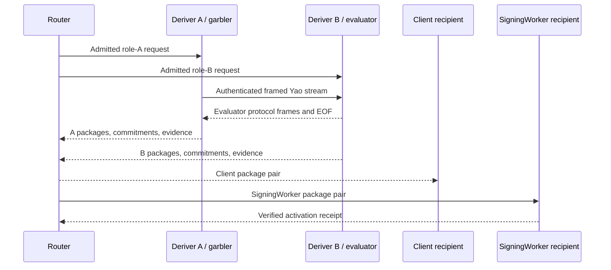

# Ed25519 Streaming Yao

Status: current Ed25519 lane-materialization protocol overview.

Ed25519 Router A/B provisioning uses a fixed two-party Streaming Yao protocol.
Deriver A is always the garbler and Deriver B is always the evaluator. The
protocol creates recipient-isolated client and SigningWorker material without
placing a joined Ed25519 seed or complete signing scalar in Router or either
Deriver.

Exact circuit artifacts, frames, encodings, and test vectors are owned by the
Ed25519 Yao crates and generator corpus. This document defines their product
composition and trust boundary.

## Scope

This document covers Ed25519 lane provisioning, recovery, refresh, explicit
export, recipient package custody, Streaming Yao transport, and the transition
to SigningWorker activation. Wallet authorization, tenant-root operations,
ordinary signing, and hosted resource provisioning are described in the parent
[protocol](./protocol.md) and [deployment](./deployment.md) documents.

## Goal

For one admitted lane operation:

- Deriver A and Deriver B contribute role-local values derived from their own
  active tenant-root shares;
- the fixed Yao computation derives the agreed Ed25519 result;
- output sharing creates separate client and SigningWorker lane material;
- each role emits only the package addressed to the intended recipient;
- Router sees public commitments, opaque packages, and receipts;
- SigningWorker activation verifies the package pair and public identity before
  persisting server material.

Normal Ed25519 signing then uses the client and SigningWorker lane shares. It
performs no Deriver call and no Yao evaluation.

The protocol assumes Deriver A and Deriver B do not collude. The current
same-account Cloudflare deployment also assumes the account administrator and
multi-role deployment authority are trusted, as described in
[deployment.md](./deployment.md#secret-separation).

## Fixed roles and transport

The role assignment is part of the protocol identity:

| Role | Yao responsibility | Product responsibility |
| --- | --- | --- |
| Deriver A | Garbler | Derives A input, starts the framed stream, emits A recipient packages and evidence |
| Deriver B | Evaluator | Derives B input, evaluates the framed stream, emits B recipient packages and evidence |

Role negotiation is unsupported. A cannot accept B's input, keys, frames, or
receipts, and B cannot accept A's.

The Cloudflare adapter relays the bounded binary stream directly between the
two Derivers over their service-binding connection. Router coordinates the
admitted operation and validates the public result; it does not buffer or open
the garbled stream. A complete run requires ordered frames and exact
directional EOF evidence. Timeout, cancellation, truncation, duplicate frames,
trailing bytes, and transcript mismatch terminate the ceremony.

## Frame Format and Incremental Evaluation

Frames bind the protocol and circuit family, fixed sender and receiver roles,
session, transcript digest, direction, sequence, payload length, and frame
digest. The decoder enforces family-specific size bounds before allocating or
advancing protocol state.

Garbled data is produced and consumed incrementally. Neither Worker retains an
entire ceremony stream as durable state. A ceremony reaches completion only
after the role engine accepts every expected frame and the transport records
the exact terminal EOF in both directions. Aborted engines and their ephemeral
labels, masks, OT state, and garbling state are destroyed rather than resumed
under another session.

## Stable Key Context and Ceremony Context

Key-affecting inputs and per-attempt inputs occupy separate typed contexts.

The stable key context binds the application and key identity used by the role
KDF. It includes the stable application binding and fixed participant ordering.
Changing it changes derived key material.

The ceremony context binds one execution attempt. It carries the operation,
session, authorization, active tenant-root epoch, role-input state, recipient
plan, protocol and circuit identity, and request-specific transcript values.
Retry or transport data never enters the stable key context.

The separation provides two guarantees:

1. registration, recovery, refresh, and export cannot accidentally reuse an
   authorization or transcript from another branch;
2. a retry can preserve stable identity while using a fresh ceremony session
   and replay record.

The canonical stable-context and ceremony encoders live in
`router-ab-ed25519-yao-protocol` and the generator corpus. Callers supply domain
inputs; they do not supply precomputed trusted digests in place of those inputs.

## Fixed Circuit Families

Two circuit families are supported:

### Activation family

The activation family produces randomized recipient shares for an Ed25519 lane.
It is used by registration, recovery, lane provisioning, and lane refresh
branches. Branch-specific bindings determine the accepted source state,
recipient set, epoch transition, and activation rules.

Activation itself opens and verifies already committed recipient packages. It
does not run a second Yao evaluation. SigningWorker checks the A and B package
pair, public commitments, operation, state epoch, key identity, and expected
public key before persisting the candidate.

### Export family

The export family reconstructs export material only inside the authorized
client recipient boundary. Export has its own one-use authorization,
transcript, package kinds, delivery receipts, and release transition. Activation
packages cannot be interpreted as export packages, and SigningWorker cannot
open the client export result.

No runtime circuit selection exists beyond these typed branches. Circuit and
protocol identifiers are fixed inputs to transcript validation.

## Input Provenance

Each role input is accepted only after binding it to:

- the Deriver role and active tenant-root share epoch;
- the tenant identity and custody lineage;
- wallet, account, key, lane, and application identity;
- the stable key-context digest;
- operation and ceremony session;
- authorization and request transcript;
- input-envelope recipient and key epoch;
- the expected circuit and protocol artifacts.

Derivers load active tenant-root shares from their own encrypted D1 records.
Request bodies cannot provide a replacement share or choose another role's
store. Encrypted client inputs are opened with the role-specific envelope key
and discarded after constructing the role engine.

Recovery proves continuity with the registered public identity. Refresh moves
to a later state epoch while preserving the joined Ed25519 identity. Stale
root, state, envelope-key, circuit, or activation epochs are rejected.

## Protocol-Generated Output Sharing

Output sharing belongs to the protocol. A caller cannot choose the output
shares or convert one recipient branch into another.

For activation-family work, each Deriver produces:

- one client package containing only that Deriver's contribution to the client
  lane material;
- one SigningWorker package containing only that Deriver's contribution to the
  server lane material;
- public commitments and package-set evidence bound to the ceremony.

The client combines only the two client packages. SigningWorker combines only
the two SigningWorker packages. Recipient keys, package-kind tags, role tags,
transcript digests, public commitments, and state epochs are checked before a
package is opened or committed.

Export produces client-addressed packages under its separate package family and
release lifecycle. The protocol never emits a plaintext joined seed to Router,
either Deriver, logs, or persistent role state.

## Payload Boundaries

Router may receive public identities, commitments, digests, opaque encrypted
packages, redacted failure classes, and signed receipts. It must never receive
role input plaintext, Yao wire labels or masks, OT secrets, garbling seeds,
recipient decryption keys, or opened client or SigningWorker material.

Each Deriver sees its own input and protocol view. It cannot open the opposite
role's input or either recipient's completed package set. SigningWorker sees
only its recipient packages and activation evidence. The client sees only its
recipient packages and public verification values. Logs follow the Router
public-view boundary and exclude bearer credentials and protocol payloads.

## Online Ceremony

At a high level, one evaluation follows this sequence:



Router accepts completion only when both role results bind the same ceremony,
circuit, stable context, package set, public commitments, and recipients.
Partial completion remains unusable. Retrying after an uncertain result first
resolves the durable branch state and replay record.

## Field and Byte Conventions

Canonical encoders use fixed domains, explicit lengths, fixed-width integers,
closed enums, and exact field ordering. Decoders reject unknown tags,
noncanonical scalar or point encodings, alternate field order, truncation, and
trailing bytes.

Cryptographic identifiers, transcript digests, circuit digests, package-set
digests, and receipt digests are distinct types and domains. An all-zero byte
sequence never represents an omitted value. Absence is represented by a branch
that lacks the field.

The normative artifacts are maintained with their implementations:

- [`crates/ed25519-yao`](../../crates/ed25519-yao) owns the fixed circuit engine
  and framed protocol;
- [`crates/router-ab-ed25519-yao`](../../crates/router-ab-ed25519-yao) owns the
  product adapter and recipient composition;
- [`crates/router-ab-ed25519-yao-protocol`](../../crates/router-ab-ed25519-yao-protocol)
  owns product protocol types and encodings;
- [`tools/ed25519-yao-generator`](../../tools/ed25519-yao-generator) owns the
  reference functionality, generated artifacts, and anti-drift corpus.

## Root and Key-Continuity Policy

Tenant-root epoch, Ed25519 role-input state epoch, lane activation epoch, and
envelope-key epoch are separate values.

- Tenant-root refresh advances the role shares used to derive future inputs.
- Lane refresh advances Ed25519 role-input and activation state while preserving
  the public signing identity.
- Recovery creates fresh delivery and activation artifacts for the same public
  identity.
- Envelope-key rotation changes transport decryption authority without changing
  the wallet key.

Every transition names its source and target epochs. A later epoch cannot be
downgraded by replaying an earlier package, receipt, or stored candidate.

## Network and Administrative Edges

The protocol's role types and authenticated frames are transport-independent.
The supported hosted adapter uses same-account Cloudflare service bindings and
separate Worker entrypoints. Deriver A and Deriver B also have separate D1
databases, R2 buckets, encryption keys, peer-signing keys, and input-envelope
keys.

This arrangement enforces role-local software and storage access. Its security
claim excludes Cloudflare account compromise, a deploy principal able to alter
both Derivers, A+B collusion, and compromise of both recipient endpoints.

## Production Capabilities

The production adapter provides fixed-role Worker artifacts, authenticated
service edges, role-private encrypted persistence, tenant-root epoch lookup,
recipient-specific HPKE, bounded streaming, replay checks, activation receipts,
normal-signing separation, and deployment smoke coverage. Release evidence is
owned by the deployment pipeline and immutable evidence artifacts. Local
vectors and benchmarks validate implementation behavior without serving as
proof of a particular hosted deployment.

## Explicit Exclusions

Ed25519 Streaming Yao does not:

- authorize Wallet operations or manage allowance;
- derive or store the wallet custody seed;
- provide ECDSA derivation or signing;
- run during normal Ed25519 signing;
- allow runtime role, circuit, protocol, or transport negotiation;
- recover from A+B collusion;
- turn same-account Workers into independent administrative domains;
- treat local vectors or formal scaffolding as deployed security evidence.

Product authorization belongs to Gateway. Tenant-root lifecycle authority
belongs to Router's Durable Object and the Tenant Root Control Plane. Activated
lane storage and normal signing belong to the client and SigningWorker.

## Verification

Run focused checks from the repository root:

```sh
cargo test --locked --manifest-path crates/ed25519-yao/Cargo.toml
cargo test --locked --manifest-path crates/router-ab-ed25519-yao/Cargo.toml
cargo test --locked --manifest-path crates/router-ab-ed25519-yao-protocol/Cargo.toml
pnpm -C crates/router-ab-cloudflare test:wasm-vectors
```

Generator and formal-verification commands remain documented beside their
artifacts. A change to circuit semantics, canonical bytes, output custody, or
the corruption model must update its vectors and proofs in the same change.
