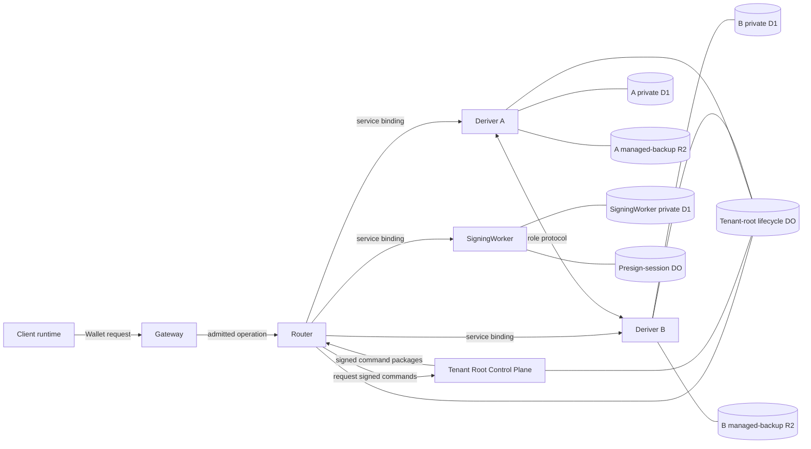
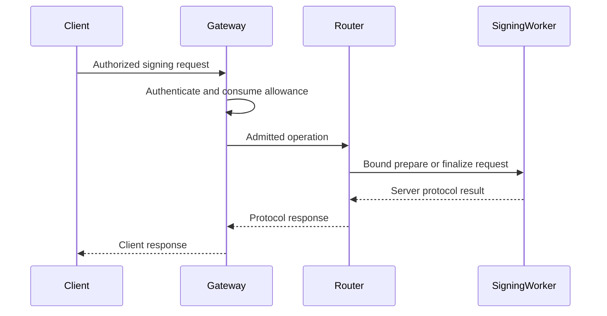

# Router A/B protocol and trust boundaries

Status: current architecture overview.

This document describes the deployed Router A/B role graph, custody boundaries,
and supported lifecycles. Rust types and canonical encoders remain authoritative
for exact bytes.

## Vocabulary

- A **wallet custody seed** is the client-side secret derivation origin for one
  wallet. It does not enter Router A/B tenant-root storage.
- A **tenant derivation root** is the server-side derivation origin shared by
  Deriver A and Deriver B. Each Deriver stores one role share.
- A **lane holder share** is per-wallet, per-lane signing material produced by a
  curve-specific provisioning protocol. It is independent of the wallet custody
  seed and tenant-root recovery packages.
- `signingRootId` and `signingRootVersion` identify an EVM-family key slot. They
  are metadata, never key material.
- A **Wallet Session** authorizes wallet operations. The Gateway owns product
  authorization and allowance; Router A/B consumes the admitted operation.

## Roles

| Role | Responsibility | Private state |
| --- | --- | --- |
| Client cryptographic runtime | Holds client lane material and executes the client side of signing | Live and sealed client material |
| Gateway | Authenticates the caller, enforces product permissions and allowance, records product state, and admits Router A/B operations | Wallet, session, authorization, and product records |
| Router | Verifies protocol admission, coordinates private roles, publishes the Router A/B keyset, and owns tenant-root lifecycle serialization | Tenant-root lifecycle Durable Object state |
| Tenant Root Control Plane | Issues signed tenant-root commands and verifies privileged recovery and activation inputs | Issuer signing key; external access to the Router-owned tenant-root Durable Object |
| Deriver A | Holds role A tenant-root material and runs role A derivation or ceremony work | Encrypted role-private D1 records and role-private managed backups |
| Deriver B | Holds role B tenant-root material and runs role B derivation or ceremony work | Encrypted role-private D1 records and role-private managed backups |
| SigningWorker | Holds activated server lane material and participates in normal signing | Encrypted lane records in D1 and live ECDSA presign-session Durable Object state |

The Gateway is the public product boundary. Router, the control plane, both
Derivers, and SigningWorker are separate Worker entrypoints with explicit
bindings.

The Router-owned tenant-root Durable Object is authoritative for serialized
tenant-root lifecycle progress. It never contains a tenant-root share. Deriver
D1 databases own the encrypted role shares and role-local replay and recovery
records.

## Authentication and message protection

Each boundary authenticates the narrowest caller it accepts:

- Gateway-issued Ed25519 JWTs bind public signing or ceremony requests to an
  admitted Wallet operation. Router verifies issuer, audience, expiry,
  operation, subject, and request bindings.
- Private Worker routes require the internal service-auth header. This is a
  service boundary and does not replace command signatures or transcript
  checks.
- The Tenant Root Control Plane signs role-specific tenant-root commands. A
  Deriver verifies the issuer, role, tenant identity, custody lineage, revision,
  epoch, nonce, and validity window before acting.
- Deriver peer messages are role- and transcript-bound. Same-role traffic and
  swapped A/B identities are rejected.
- Recipient output packages use recipient-specific HPKE keys. Client material
  can be opened only by the client recipient; SigningWorker material can be
  opened only by SigningWorker.
- Canonical encodings and transcript digests bind operation kind, tenant or
  wallet identity, key scope, role, epoch, and protocol-specific values.

Untrusted request bodies, JWTs, commands, stored records, and protocol frames
are decoded once at their Worker boundary into branch-specific Rust types.

## Tenant-root lifecycle

### Creation

Tenant-root creation begins with a signed creation grant for one authenticated
deployment identity and a fresh custody lineage. Router serializes the request
through its tenant-root Durable Object. The control plane derives and signs one
command for each Deriver. Each Deriver creates and persists only its role share,
records replay state, and returns signed installation evidence. Activation
requires a complete A/B evidence pair and the expected public root commitment.

Retries resolve through the same lifecycle record. They cannot create another
root, change a command's role, or advance an already terminal transition.

### Refresh

A refresh creates new A/B shares of the same tenant derivation root. The root
commitment and derived wallet identities remain unchanged. Both Derivers stage
the next epoch, provide signed evidence, and promote it only after the control
plane and Router-owned lifecycle state accept the complete pair. The old epoch
is retired after the activation boundary permits cleanup.

### Backup and restore

Each Deriver owns a role-private managed backup in its own R2 bucket. A managed
single-role restore is followed by a mandatory forward refresh so restored
material is not left as the active epoch.

Portable recovery keeps A and B artifacts separated. The destination verifies
the recovery trust bundle and manifest, issues role-specific import keys,
accepts the two encrypted role imports, performs a restore refresh, and reaches
a dormant verified checkpoint. Cutover and initial activation are explicit
control-plane operations. Source retirement is recorded separately.

No recovery operation assembles the tenant root or includes a wallet custody
seed.

## Lane provisioning

Derivers participate when new client and SigningWorker lane material must be
created, recovered, refreshed, or explicitly exported.

### Ed25519

Ed25519 provisioning uses fixed-role Streaming Yao. Deriver A is the garbler
and Deriver B is the evaluator. They stream the role protocol directly and
produce recipient-isolated packages. See [Ed25519 Streaming Yao](./ed25519-yao.md).

### ECDSA

ECDSA provisioning uses the fixed 2-of-2 threshold-PRF construction. Deriver A
and Deriver B derive role outputs and deliver additive secp256k1 lane shares to
the client and SigningWorker recipients. ECDSA provisioning does not use the
Ed25519 Yao circuit.

Registration, add-signer, refresh, recovery, and explicit export are distinct
admitted branches. Branch-specific contexts prevent an output from one branch
from being accepted by another.

## Product Operation to Ideal Functionality to Circuit Mapping

| Product operation | Ed25519 work | ECDSA work |
| --- | --- | --- |
| Registration or new lane provisioning | One activation-family Yao evaluation, followed by recipient activation | Threshold-PRF derivation, recipient delivery, and lane activation |
| Activation | Verify and consume committed packages; zero Yao evaluations | Verify and consume committed derivation output; zero new threshold-PRF derivations |
| Recovery | One activation-family Yao evaluation bound to identity continuity | Fresh recipient delivery bound to the existing key identity |
| Refresh | One activation-family Yao evaluation and forward-only epoch promotion | Fresh additive shares with the same public identity and a later activation epoch |
| Explicit export | One export-family Yao evaluation and one-use client release | Authorized client reconstruction from separately delivered export shares |

The admitted branch selects the protocol family. A request cannot supply a
circuit or ideal-function identifier.

## Normal signing

Once a lane is active, normal signing uses only the client, Gateway, Router, and
SigningWorker. Deriver A, Deriver B, and the Tenant Root Control Plane stay off
this path.

Ed25519 uses a prepare step when fresh round-one material is required, followed
by final signing. The active client and SigningWorker shares jointly produce a
standard Ed25519 signature.

ECDSA uses one-use presignatures and a two-party online protocol between the
client and SigningWorker. SigningWorker D1 owns persistent pool and lane state;
the presign-session Durable Object serializes live session steps. Consumption
is terminal even when later delivery fails, preventing nonce reuse.

## Failure and replay rules

Every protocol operation fails closed on:

- an unknown or expired authorization;
- a tenant, wallet, account, key, lane, role, or recipient mismatch;
- a stale root, lane, key, or activation epoch;
- a transcript, command, package-set, or public-key mismatch;
- a replayed nonce or already-consumed one-use artifact;
- out-of-order, duplicate, oversized, truncated, or trailing protocol frames;
- partial A/B evidence where a complete pair is required;
- an invalid lifecycle transition or conflicting revision;
- a missing required Worker binding, key, database, bucket, or Durable Object.

Diagnostics report these states. Control flow uses verified domain state and
persisted lifecycle state.

## Security boundary

The role split prevents either Deriver alone from reconstructing the tenant
root or a complete recipient lane. Recipient encryption keeps client and
SigningWorker output material separate. Normal signing does not expose
tenant-root shares and does not call either Deriver.

The current Cloudflare deployment places the five Router A/B Workers in one
account and connects them with service bindings. Separate Workers, Secrets,
databases, buckets, and typed protocol boundaries limit accidental authority
and single-role compromise. This topology does not claim protection from a
Cloudflare account administrator, a deployment principal able to replace
multiple Workers, or A+B collusion.

## Source map

| Concern | Source owner |
| --- | --- |
| Product-level role and lifecycle requirements | [`docs/spec-5-router-ab-threshold-protocol.md`](../spec-5-router-ab-threshold-protocol.md), [`docs/spec-6-tenant-roots-recovery-and-portability.md`](../spec-6-tenant-roots-recovery-and-portability.md) |
| Route constants | [`crates/router-ab-cloudflare/src/paths.rs`](../../crates/router-ab-cloudflare/src/paths.rs) |
| Worker entrypoints and boundary decoding | [`crates/router-ab-cloudflare/src/strict_worker`](../../crates/router-ab-cloudflare/src/strict_worker) |
| Tenant-root lifecycle authority | [`crates/router-ab-cloudflare/src/durable_object/tenant_root_creation.rs`](../../crates/router-ab-cloudflare/src/durable_object/tenant_root_creation.rs) |
| Tenant-root control plane | [`crates/router-ab-cloudflare/src/tenant_root_control_plane.rs`](../../crates/router-ab-cloudflare/src/tenant_root_control_plane.rs) |
| Deriver tenant-root persistence | [`crates/router-ab-cloudflare/src/tenant_root_role_d1.rs`](../../crates/router-ab-cloudflare/src/tenant_root_role_d1.rs) |
| Managed backup | [`crates/router-ab-cloudflare/src/tenant_root_managed_backup_r2.rs`](../../crates/router-ab-cloudflare/src/tenant_root_managed_backup_r2.rs) |
| Cloudflare bindings | [`crates/router-ab-cloudflare/wrangler.router.toml`](../../crates/router-ab-cloudflare/wrangler.router.toml) and the adjacent role manifests |
| Core role, transcript, and package types | [`crates/router-ab-core`](../../crates/router-ab-core) |
| Ed25519 role composition | [`crates/router-ab-ed25519-yao`](../../crates/router-ab-ed25519-yao) |
| ECDSA derivation | [`crates/router-ab-ecdsa-derivation`](../../crates/router-ab-ecdsa-derivation) |
| ECDSA presign and online signing | [`crates/router-ab-ecdsa-presign`](../../crates/router-ab-ecdsa-presign), [`crates/router-ab-ecdsa-online`](../../crates/router-ab-ecdsa-online), and [`crates/router-ab-ecdsa-pool`](../../crates/router-ab-ecdsa-pool) |
