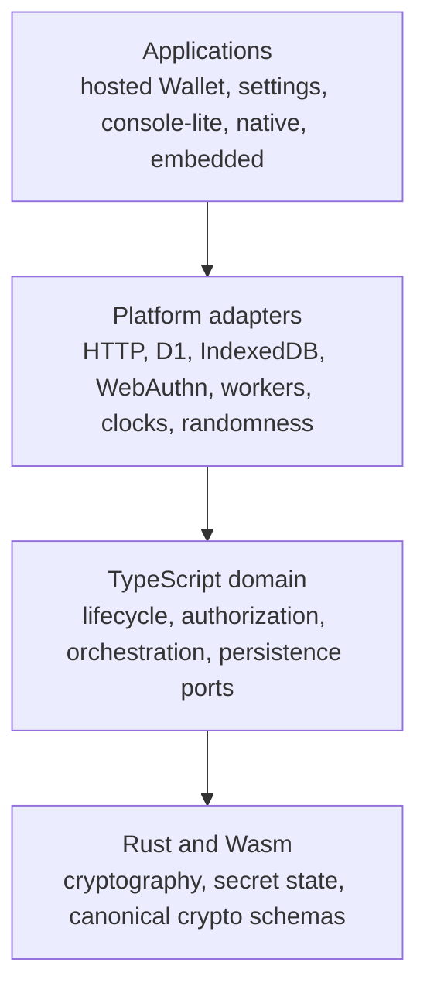

# Spec 1: Runtime and platform boundaries

Status: normative architecture specification.

Read [the architecture guide](README.md) first. Continue with
[Spec 2](spec-2-auth-custody-and-credentials.md) for custody and authentication or
[Spec 7](spec-7-hosted-surfaces-and-provider-boundaries.md) for public integration.

User-visible lifecycle behaviour is owned by
[Intended Behaviours](intended-behaviours.md).

## Mental model

Wallet is assembled in four layers. Each layer depends only on contracts owned by a
lower, more stable layer.



The diagram describes dependency direction, rather than call direction. A user action
usually enters an application, crosses adapters into domain services, invokes Rust or
Wasm cryptography, and returns through the same layers.

## Layer responsibilities

### Rust and Wasm

Rust owns:

- cryptographic algorithms and protocol state;
- operations over opaque secret material;
- canonical command schemas for cryptographic boundaries;
- encoders for cryptographic values and cross-language fixtures.

JavaScript receives versioned commands, public facts, opaque envelopes, and typed
results. It does not inspect or reconstruct Rust-owned secret internals.

### TypeScript domain

TypeScript domain services own:

- Wallet, authority, authentication-method, session, and lane lifecycles;
- authorization and operation admission;
- orchestration across cryptographic and durable effects;
- platform-neutral persistence and transport ports;
- request parsing and public SDK contracts.

Domain services accept precise internal types. Raw route bodies, database rows,
provider responses, browser records, and decoded tokens are parsed once at their
boundary.

### Platform adapters

Adapters implement the effects required by the domain:

- D1 and browser storage;
- WebAuthn and provider authentication;
- HTTP and worker transport;
- clocks, randomness, and environment configuration;
- relayer, chain, and provider access.

An adapter translates platform behaviour into a Wallet-owned result. Provider or
platform objects do not propagate into core services.

### Applications

Applications assemble the required adapters and choose the capabilities exposed in
one environment. The browser SDK, hosted iframe, settings application, console-lite,
native runtime, and embedded runtime all use the same domain contracts.

An assembly may report an unsupported capability explicitly. It cannot imitate support
with a weaker identity, storage, or security contract.

## The port boundary

Core use cases receive the effects they need. They never locate platform globals or
deployment bindings themselves.

```ts
type Result<T, E> =
  | { readonly ok: true; readonly value: T }
  | { readonly ok: false; readonly error: E };

interface WalletMaterialStore {
  read(walletId: WalletId): Promise<Result<SealedWalletMaterial | null, StoreError>>;
  write(material: SealedWalletMaterial): Promise<Result<void, StoreError>>;
}

interface AuthenticatorPort {
  verify(
    challenge: ExactAuthChallenge,
  ): Promise<Result<VerifiedAuthFactor, AuthError>>;
}
```

These types illustrate the boundary pattern. Follow the production interfaces and
branch-specific types in the codebase when implementing a use case.

## Canonical contracts

1. A Rust command has one canonical input and output schema. Generated bindings and
   vectors derive from that schema.
2. Secret material crosses runtime boundaries only through versioned opaque envelopes
   or narrow cryptographic commands.
3. Boundary parsers validate untrusted input once and return a precise domain type.
4. Lifecycle and protocol state use discriminated unions whose branches carry exactly
   the fields valid in that state.
5. Platform-neutral interfaces use domain language. Browser, Cloudflare, and provider
   names remain in their adapters.

## Browser and hosted composition

The browser stores sealed local custody material, activation references, preferences,
and caches. The Gateway remains authoritative for tenant membership, credential
validity, Wallet Sessions, grants, quotas, and durable protocol completion.

Wallet-origin UI is split into independent documents:

- the hosted iframe owns authentication and compact Wallet interactions;
- the settings application owns account, security, device, preference, and lock flows;
- the integrator application owns its layout and launches Wallet surfaces through the
  SDK;
- console-lite demonstrates the public contracts without importing the private Seams
  Console.

The parent application owns the native dialog, placement, dismissal, and focus return.
The iframe owns its rendered content, internal navigation, measurement, and focus order.
[Spec 7](spec-7-hosted-surfaces-and-provider-boundaries.md) defines their message and
origin contract.

## Packages and static assets

A published Wallet package must operate from its packed artifact. Runtime behaviour
cannot depend on workspace source aliases, Vite-only behaviour, or unpublished files.
Builds produce a complete deterministic asset tree and expose only supported entry
points.

One local router may serve the Wallet site, documentation, settings application, and
iframe. Each remains a separate document and bundle. Static fallback routes must leave
API and private Console routes untouched.

## Native and embedded runtimes

Native and embedded adapters implement the same domain ports and canonical command
schemas as the browser. They preserve storage durability, authentication-result
classification, public-key identity, and relying-party bindings.

Passkey relying-party identifiers and associated-domain configuration enter through
trusted application configuration. Request data cannot choose them.

## Failure model

Adapters convert failures into recoverable or terminal Wallet results. Domain state
advances only after the service that owns an effect reports durable success.

When an external result is ambiguous, the original operation identity stays active.
Reconciliation determines the existing outcome before any effect is attempted again.

## Code landmarks

| Responsibility | Location |
| --- | --- |
| Shared domain types and parsers | `packages/shared-ts/src` |
| Browser SDK and Wallet applications | `packages/wallet/src` |
| Gateway and server adapters | `packages/wallet-server/src` |
| Rust cryptographic core | `crates/signer-core/src` |
| Browser custody ceremony | `wasm/wallet_custody_ceremony` |
| Native and embedded runtime | `crates/seams-embedded`, `crates/signer-embedded-linux` |

## Repository boundary

The public repository owns the Wallet SDK, Wallet server, cryptographic crates, Wasm
modules, Router A/B, public documentation, examples, and conformance tests. The private
`seams-monorepo` owns production Console composition, customer operations, deployment
credentials, and Seams-specific infrastructure wiring.

## Non-goals

This specification does not define individual cryptographic protocols, database
schemas, production hostnames, provider secrets, or private Console behaviour.

## Source lineage

Consolidates the durable rules from R51, R51 native readiness, R51b, R85, R86, R108,
R110, R116, and R119.
