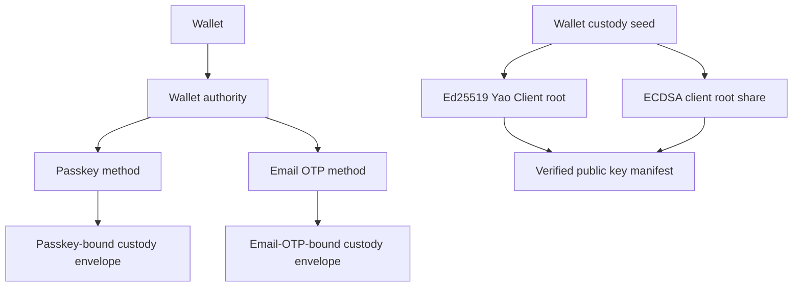

# Spec 2: Authentication, custody, and credentials

Status: normative security and domain specification.

Read [the architecture guide](README.md) and
[Spec 1](spec-1-runtime-and-platform-boundaries.md) first. Continue with
[Spec 3](spec-3-wallet-sessions-and-execution-lanes.md) for session and signing
authority.

Exact user journeys are owned by [Intended Behaviours](intended-behaviours.md).

## Authentication and custody answer different questions

Authentication answers: **which registered method did the user prove?**

Custody answers: **which encrypted Wallet secret may that proof open, and for which
operation?**

A provider login, application cookie, email address, or caller-supplied Wallet ID does
not establish Wallet authority. The Gateway resolves every proof through server-owned
Wallet, authority, method, and lifecycle bindings.

## Core vocabulary

| Term | Meaning |
| --- | --- |
| Wallet custody seed | The single random secret created for one Wallet |
| Owner signing root | A curve-specific root derived independently from the Wallet custody seed |
| Ed25519 Yao Client root | The owner root used by the Ed25519 Yao client protocol |
| ECDSA client root share | The owner material used by the ECDSA client protocol |
| Lane holder share | Per-lane multiparty-computation (MPC) material provisioned by the relevant signing protocol |
| Key manifest | The canonical public description of the Wallet key set that a seed must reproduce |
| Custody envelope | Authenticated encryption of custody material bound to one method and Wallet |
| Custody ceremony | Registration or recovery re-establishment that derives owner roots and verifies the key manifest |
| `signingRootId` / `signingRootVersion` | Durable EVM-family key-slot metadata; neither value is key material |
| `RootShareEpoch` | Epoch of durable ECDSA role material |
| Threshold | The MPC protocol |

Owner roots derive in parallel from the custody seed. A lane holder share is provisioned
for one execution lane and never belongs to a recovery set.

## Relationship model



An authority can have one active method from each supported family. Each method has its
own identity, lifecycle, and envelope. Adding a sibling method preserves the authority,
Wallet keys, and signer activations.

## Custody invariants

The custody seed exists in plaintext only inside the narrow cryptographic operation
that needs it. At rest it is sealed in a versioned, method-bound envelope.

Authenticated envelope data binds at least:

- Wallet identity;
- exact authentication-method identity and family;
- envelope and cryptographic versions;
- key-manifest digest;
- required policy and relying-party context.

Changing any binding makes the envelope invalid. An envelope issued for one method,
Wallet, relying party, or manifest cannot be replayed in another context.

## Two custody proofs

Custody operations accept one of two semantically distinct proofs:

- `VerifiedWalletKeyManifestDigestV1` says a seed was freshly proved to reproduce the
  Wallet key set during registration or recovery.
- `WalletCustodySeedFromSealedEnvelopeV1` says a seed came from an envelope
  authenticated to the Wallet and manifest during factor addition.

The proof types have no conversion between them. Registration and recovery require the
fresh manifest-verification proof. Factor addition requires the authenticated-envelope
proof. Unlocking and adding a factor are not custody ceremonies.

The Rust implementation keeps these capabilities non-serializable and non-cloneable.
They stay inside `signer-core` and do not cross the Wasm boundary.

## Authentication-method lifecycle

```text
pending_local_install -> active -> revoked
```

`pending_local_install` means the server has reserved the exact method transition and
the target still has to install or acknowledge local material. Only `active` methods
can unlock a Wallet or issue a Wallet Session. Revocation is durable and terminal for
that method identity.

Each method record requires:

- Wallet, authority, and method identities;
- method family and principal;
- registration or linking provenance;
- family-specific credential data;
- lifecycle timestamps and revocation state.

Passkey and Email OTP branches use separate record shapes. A passkey branch carries
WebAuthn relying-party and credential facts. An Email OTP branch carries the normalized
email principal and registration authority. Core functions never receive a partial
record containing fields from both branches.

## Registration

Registration establishes a new Wallet and its first authority:

1. Verify the selected passkey or Email OTP challenge.
2. Create the Wallet custody seed inside the custody-ceremony runtime.
3. Derive the configured owner roots independently from that seed.
4. Verify that the public result matches the Wallet key manifest.
5. Seal a method-bound custody envelope.
6. Atomically commit the Wallet, authority, method, envelope metadata, signer
   inventory, activation references, and audit effect.
7. Issue an exact Wallet Session after the durable commit succeeds.

Passkey registration never invokes Email OTP verification. Email OTP registration
never invokes passkey lookup, PRF, or passkey-sealed restore.

## Adding an authentication method

Adding a method extends one existing authority:

1. Prove an active source method and open its authenticated custody envelope.
2. Verify the target factor independently.
3. Reseal the authenticated seed under the target method.
4. Atomically commit the target method, envelope metadata, and audit record.

This operation creates no Wallet, authority, key set, signer activation, owner root, or
key manifest. A repeated request for an already configured family fails before the
target factor is challenged.

Connecting an external identity and adding a Wallet authentication method are separate
domain transitions, even when one product flow performs both.

## Linked devices

Device linking proves an existing source authority and separately verifies a target
factor. The link session is single-purpose, expiring, replay-protected, and bound to the
Wallet, source authority, target method, and activation set.

The target receives only its own envelope and activation material. It never receives
the Wallet custody seed. Installation acknowledgement and cleanup are durable, so a
reload or retry cannot create a second method or activation.

A linked device receives a new device, authority, method, and signer activations while
preserving the Wallet's public key identities and every existing authority.

## Revocation

Credential validity is server-authoritative. Revoking a method blocks future unlock,
linking, recovery admission, and session issuance through that method. Browser-cached
material cannot override revocation.

Revoking one sibling method invalidates only that method's sessions and hosted child
credentials. The final active method for a Wallet cannot be revoked through the normal
method-removal flow.

## Recovery

A recovery code is a high-entropy, Wallet-scoped admission capability. Persistence
stores only the locator and verifier representation required to find and validate it.
Revealing an existing code requires fresh, exact step-up authorization and occurs only
after that authorization succeeds.

Recovery proceeds as follows:

1. Resolve one Wallet and reserve one unused recovery code.
2. Select one active custody envelope as the continuity anchor.
3. Verify a new passkey or supported external-identity target.
4. Re-establish the custody seed and freshly verify the existing key manifest.
5. Atomically create a new device authority, target method, envelope, signer
   activations, audit effect, and recovery-code consumption or rotation.
6. Preserve all other valid methods, authorities, devices, and sessions.

Recovery creates no reusable Wallet Session. The user authenticates normally through
the new method after recovery completes.

## Failure and retry

- Expired preparation state changes no custody authority.
- Failed target verification does not consume the source method or recovery code.
- Revoked, expired, cross-Wallet, cross-tenant, and consumed capabilities fail before
  secret material is opened.
- An interrupted commit is reconciled under its stable operation identity.
- A client never repeats a custody ceremony solely because a transport response was
  lost.

## Code landmarks

| Responsibility | Location |
| --- | --- |
| Auth-method domain model | `packages/shared-ts/src/utils/walletAuthAuthority.ts` |
| Custody envelope contracts | `packages/shared-ts/src/passkey-custody` |
| Recovery contracts | `packages/shared-ts/src/wallet-recovery` |
| Registration orchestration | `packages/wallet/src/SeamsWeb/operations/registration` |
| Passkey and Email OTP methods | `packages/wallet/src/SeamsWeb/operations/authMethods` |
| Device linking | `packages/wallet/src/SeamsWeb/operations/devices` |
| Recovery orchestration | `packages/wallet/src/SeamsWeb/operations/recovery` |
| Rust custody operations | `crates/signer-core/src/passkey_custody.rs` |
| Custody ceremony | `wasm/wallet_custody_ceremony` |

## Non-goals

Console login, Console two-factor authentication, enterprise SSO administration, and
provider-account configuration are outside Wallet custody authority.

## Source lineage

Consolidates R82B, the R90 specification, R100, R103E, R103F, R109C, R109D, R113,
R114, and R115.
