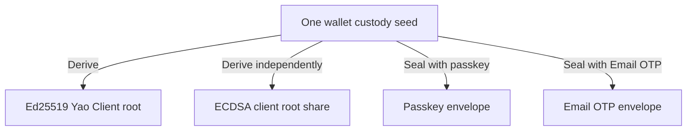

# Spec 2: Authentication, custody, and credentials

A passkey or Email OTP gives the user a way to access an existing wallet.
Adding another sign-in method or recovering access preserves the wallet's
public keys.

## Creating a wallet

Registration creates one random **wallet custody seed**. From it, the wallet
derives its owner signing material separately for each protocol. A **custody
ceremony** checks that this material matches the wallet's recorded public keys.
Registration and recovery both perform this check.

The seed is encrypted in a **custody envelope** associated with the wallet and
the sign-in method. Those associations are authenticated: an envelope cannot be
substituted for another wallet, method, or key set. The seed is opened only
inside the cryptographic operation that needs it.

Here is the sealed value from the
[Rust custody code](../crates/signer-core/src/passkey_custody.rs):

```rust
pub struct SealedPasskeyCustodyEnvelopeV1 {
    pub ciphertext: Vec<u8>,
    pub aad_hash: [u8; 32],
    pub ciphertext_digest: [u8; 32],
}
```

`ciphertext` holds the encrypted secret. `aad_hash` identifies the authenticated
context, and `ciphertext_digest` identifies the encrypted bytes. The surrounding
binding records which wallet, method, and key set this envelope belongs to.

The server saves the wallet, its sign-in method, and the access created by
registration. It issues a Wallet Session for signing as the configured keys
become ready. [Spec 3](spec-3-wallet-sessions-and-execution-lanes.md) explains
sessions and readiness.

Wallet authentication verifies the selected method. A passkey flow uses the
registered passkey; an Email OTP flow verifies the appropriate email challenge.
An application's login cookie or provider session alone does not establish
Wallet signing permission.

## Adding a sign-in method

A **Wallet authority** groups a set of permissions, sign-in methods, and signing
access. Adding a sibling method reuses that authority. Linking a device or
recovering access creates a separate authority for the same wallet.

To add a method, the user proves an existing method and verifies the new one.
Wallet opens the existing authenticated envelope and protects the same seed
under the new method. Keys and signing access stay unchanged.

For a passkey wallet using both signing protocols, adding Email OTP gives:



The two envelopes protect the same seed. Adding the method leaves the signing
roots unchanged.

Here, the proof comes from opening an authenticated envelope. Registration and
recovery check the seed against the wallet's keys directly. The code keeps these
two kinds of proof separate.

## Linking a device

Linking authorizes a new device through existing access and separately verifies
its sign-in method. The target receives its own signing material and permissions.
It never receives the wallet custody seed.

Both devices continue to use the same public wallet keys. The new device has its
own access record, so its methods can be managed without changing the original
device's access. Installation and retries preserve the same records.

## Recovering access

An unused recovery code identifies the wallet and admits the recovery flow. The
user verifies a new sign-in method, and a custody ceremony checks that recovery
reproduces the existing wallet keys.

The server saves the new access and consumes the code together. Existing valid
methods, devices, and sessions stay active. Recovery creates no reusable Wallet
Session by itself; normal login through the new method creates that session.

A failed final commit leaves the code unconsumed. If its result is uncertain,
the client checks the same recovery attempt before trying again.

## Removing access

The server enforces revocation even when a device still has old local data.
Removing a method disables the sessions issued through it. Other valid methods
remain available; removing the wallet's final active method is refused.

For detailed journeys, see [Intended Behaviours](intended-behaviours.md).
The [custody implementation](../crates/signer-core/src/passkey_custody.rs)
contains the cryptographic proof and envelope definitions.
