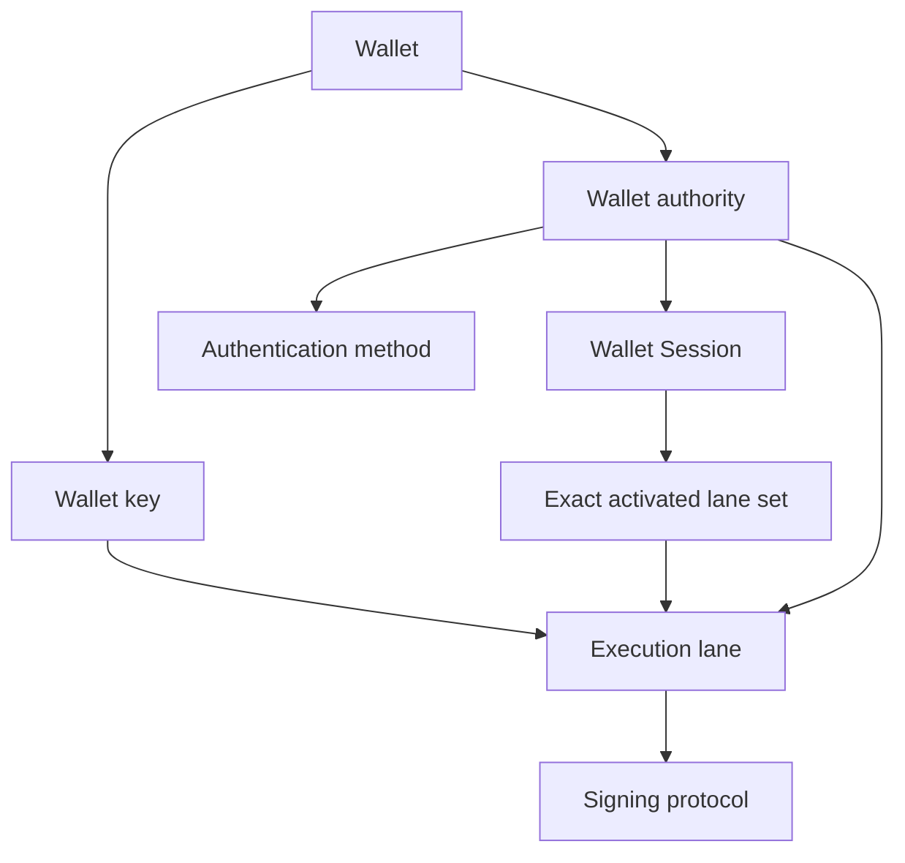
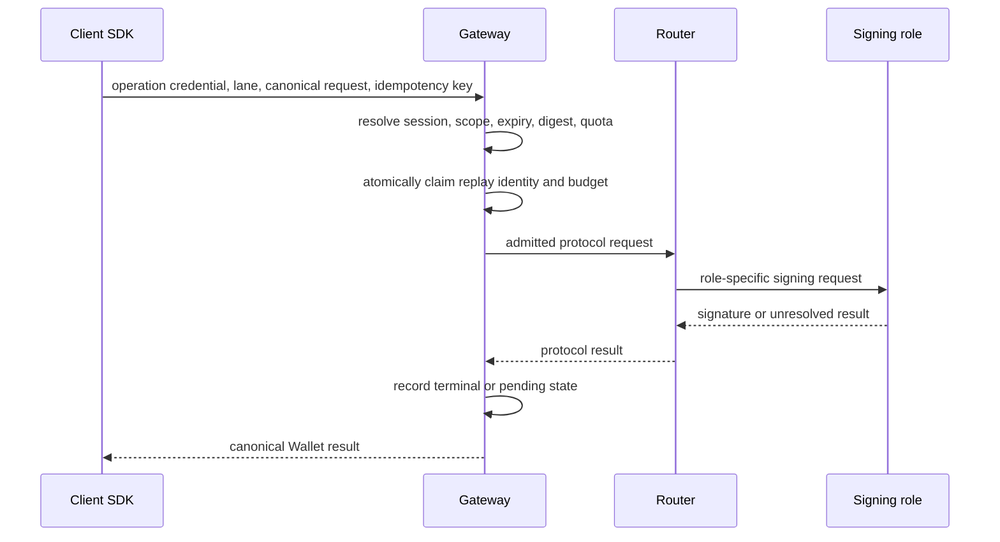

# Spec 3: Wallet sessions and execution lanes

Status: normative lifecycle and authorization specification.

Read [Spec 2](spec-2-auth-custody-and-credentials.md) first. Continue with
[Spec 4](spec-4-persistence-and-durable-authority.md) for durable operation ownership
and [Spec 5](spec-5-router-ab-threshold-protocol.md) for protocol dispatch.

## What this specification owns

This specification defines Wallet Sessions, execution lanes, signing authority,
operation admission, step-up authorization, and client material readiness.

Exact user-visible flows are owned by
[Intended Behaviours](intended-behaviours.md).

## Core model

A **Wallet key** is one chain-family signing identity owned by a Wallet.

An **execution lane** is one admissible way to use that key. The same public key can
have owner, linked-device, delegated, or service-assisted lanes with different
authority and material.

A **Wallet Session** is a reusable, server-authorized capability for one exact Wallet
authority, authentication method, and activation set. An application login session
authenticates an application user and grants no Wallet signing authority.



## Lane kinds

| Lane kind | Intended authority | Additional required state |
| --- | --- | --- |
| Owner | Normal owner signing through passkey, Email OTP, recovery, or break-glass policy | Claimed owner authorization and ready lane material |
| Linked device | Signing through a separately installed device authority | Exact linked-device enrollment and activation |
| Delegated execution | Narrow operation scope granted by an owner | Delegated authorization and atomically reserved budget |
| Service-assisted | A specifically defined service-owned execution path | Its branch-specific policy and protocol state |

Each lane is a discriminated domain branch. Core execution never receives a broad
record with optional owner, linked-device, and delegated fields.

A committed lane requires its Wallet key, authority digest, activation reference,
policy, lifecycle, revocation epoch, and material-readiness state.

## Lane lifecycle

```text
provisioning -> pending_receipt -> active -> revoked
```

- `provisioning` reserves the exact lane and its protocol inputs.
- `pending_receipt` means delivery or installation still needs durable confirmation.
- `active` requires a verified activation receipt and current revocation epoch.
- `revoked` rejects new use while preserving the audit trail.

Only an active lane with ready local or role-local material can enter signing.

## Wallet Session lifecycle

```text
active -> expired
       -> revoked
       -> consumed   (single-use session kinds only)
```

An active Wallet Session binds:

- tenant, environment, Wallet, and authority;
- exact authentication method and evidence;
- activated lane set;
- operation credential and quota;
- server expiry and revocation state.

The server clock owns expiry. A client may lock early and must lock when the Gateway
reports expiry.

Expiry invalidation clears in-memory secrets, marks persisted local session material
unusable, and emits one structured session event. Wallet credentials and custody
envelopes remain durable.

## Local material readiness

Server authorization and client material readiness are separate conditions.

```text
absent -> sealed -> opening -> ready
                    |          |
                    +------> invalidated
```

Only `ready` material can sign. Reload may restore a still-active Wallet Session when
the sealed material authenticates to the same Wallet, manifest, authority, method,
activation set, curve, and chain target. A browser record cannot revive an expired or
revoked server session.

## Authorization invariants

Every operation resolves the exact:

- tenant and environment;
- Wallet and Wallet key;
- authority, method, and principal;
- Wallet Session and operation credential;
- execution lane and activation;
- operation kind and canonical input digest.

Caller-supplied identifiers are lookup inputs. Server-owned relationships establish
authority. Selection is deterministic and rejects missing or ambiguous candidates.

The admitted operation is bound to its canonical digest before quota, delegated
budget, or protocol work is claimed. Browser hydration can narrow the server projection
through unavailable local material. It cannot widen authority.

A delegated lane grants only its declared operations and limits. It grants no Wallet
ownership, factor management, recovery, export, or policy authority.

## Signing flow



Admission follows this order:

1. Authenticate the caller and parse the request.
2. Resolve the exact Wallet Session and lane.
3. Validate lifecycle, scope, digest, expiry, and required step-up.
4. Atomically claim replay identity and applicable quota or budget.
5. Execute through the selected lane.
6. Record a terminal or explicitly unresolved result.

No network call occurs inside an atomic quota or budget transaction. Competing requests
cannot both consume the same remaining authority.

## Idempotency

A retry with the same authenticated scope, idempotency key, and canonical input returns
the recorded result or current pending state. Reusing the key with different input is
an idempotency conflict.

After protocol dispatch, an ambiguous response keeps the original claim. The client
cannot choose another lane or retry identity to evade that claim.

## Step-up and sensitive operations

Signing, export, recovery-code reveal, credential changes, and policy changes each
declare their own authorization requirement.

Step-up evidence binds the Wallet, principal, method, operation kind, canonical digest,
and short expiry. It authorizes one exact operation and leaves the existing Wallet
Session quota unchanged.

Key export requires owner-capable authority plus fresh export-scoped authorization.
Normal transaction authority is insufficient. Owner export never returns lane holder
shares or server role shares.

## Failure behaviour

- Structured expiry triggers canonical session invalidation.
- An admission race that observes expiry consumes no quota or budget.
- Missing or invalidated material returns a readiness failure before signing.
- An unresolved protocol result remains pending until reconciliation.
- Revocation invalidates only the exact affected method, session, lane, or delegated
  authority according to its domain transition.

## Code landmarks

| Responsibility | Location |
| --- | --- |
| Signing-lane types and parsers | `packages/shared-ts/src/signing-lanes` |
| Execution branch selection | `packages/shared-ts/src/signing-lanes/execution.ts` |
| Wallet authority types | `packages/shared-ts/src/authorization/walletAuthority.ts` |
| Session validation | `packages/wallet-server/src/core/sessionValidation.ts` |
| Browser session runtime | `packages/wallet/src/core/signingEngine/session` |
| Lane inventory and readiness | `packages/wallet/src/core/signingEngine/session/availability` |
| Sealed session restore | `packages/wallet/src/core/signingEngine/session/sealedRecovery` |

## Non-goals

This specification does not define application login sessions, payment-provider state,
or a generic policy language.

## Source lineage

Consolidates R90, R92, R100, R101, R103F, and R104.
