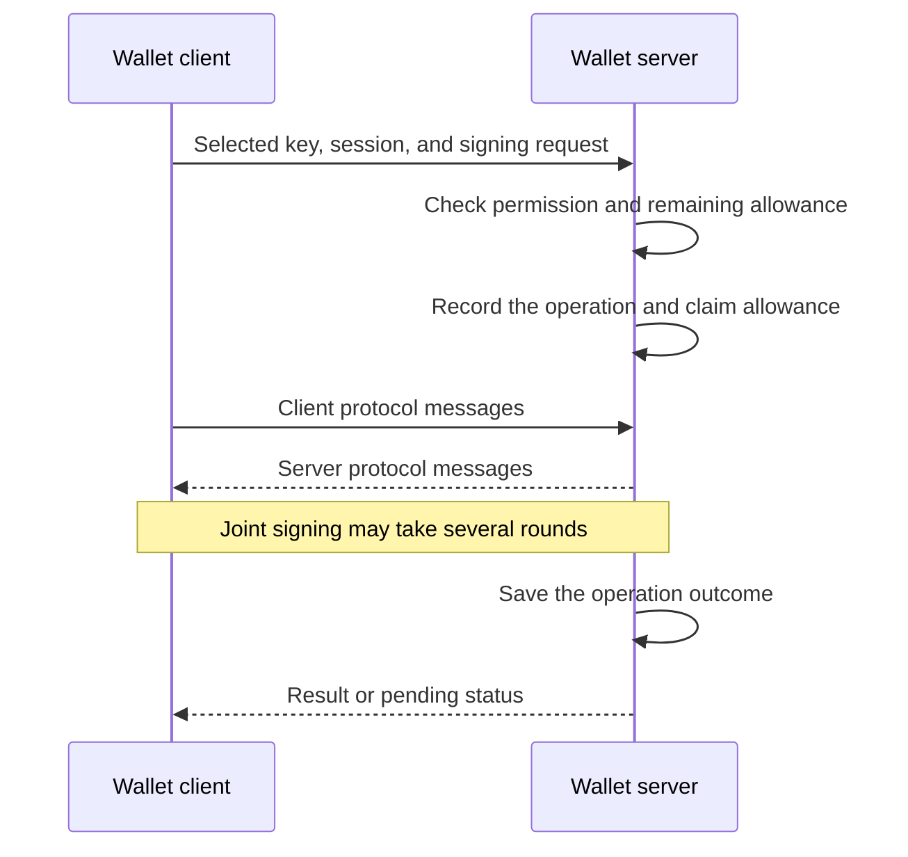

# Spec 3: Wallet sessions and execution lanes

Unlocking a wallet gives you a **Wallet Session**. It lets you sign with selected
keys for a limited time and number of uses, without approving every transaction
again.

A session belongs to the wallet authority and sign-in method that opened it.
The server checks its permission and limits on every request.

## Unlock and sign

Unlocking prepares the selected keys for use. Signing requires both an active
server session and usable material in the client cryptographic runtime.

The main steps are:



A request that fails these checks never starts signing or consumes allowance.
Repeating an accepted request uses the same operation identity and returns its
existing result or pending status. The
[persistence chapter](spec-4-persistence-and-durable-authority.md) explains why.

## Signing lanes

A **signing lane** is one permitted way to use a wallet key. For example, an owner
and a linked device can use the same public key through different permissions
and separately prepared signing material.

The session identifies the lanes it allows. A lane must be active and its
material ready before it can sign. Knowing a public key or finding an old local
record is insufficient.

A delegated lane can grant a narrower set of operations with spending limits.
It grants no permission to recover the wallet, manage sign-in methods, or export
owner keys. Permissions and readiness also apply to the selected chain target,
even when multiple chains share the same public key.

## Refresh, lock, and expiry

A page refresh can restore a valid session from encrypted local data. It must
match the same server session and signing access. Refresh grants no new time,
uses, or permissions.

The client keeps the session and its allowance tied together. This excerpt from
the [session status types](../packages/wallet/src/core/rpcClients/relayer/walletSessionAuthorizationStatus.ts)
shows the quota snapshot:

```ts
type ExactWalletSessionStatusIdentity = {
  readonly walletSessionId: WalletSessionId;
  readonly quotaId: MpcWalletSigningQuotaId;
};

export type ActiveWalletSessionQuotaStatusV1 = ExactWalletSessionStatusIdentity & {
  readonly status: 'active';
  readonly remainingUses: number;
  readonly expiresAtMs: number;
};
```

For example, refreshing a session with four uses left keeps those same four
uses and the same expiry. This snapshot describes allowance; the server still
checks the full authorization and its current state before signing.

The server determines expiry and revocation. The client can lock earlier and
must lock when the server reports expiry. On expiry, it clears its active
secrets and disables the saved session material. The wallet's durable sign-in
methods remain available for another unlock.

If the session has expired, its allowance is exhausted, or local signing
material cannot be restored, the next operation needs the appropriate
authentication before proceeding.

## Fresh approval for sensitive actions

Exporting keys and revealing recovery codes require fresh approval for that
specific action. A signing session alone cannot authorize them.

This additional check is called **step-up**. It approves one operation without
renewing the session or adding to its allowance. Changing the operation
invalidates that approval.

Owner key export returns only the supported owner key material. Per-lane and
server shares stay with their holders.

See [Intended Behaviours](intended-behaviours.md) for the exact flows and
[the session runtime](../packages/wallet/src/core/signingEngine/session) for
implementation details.
