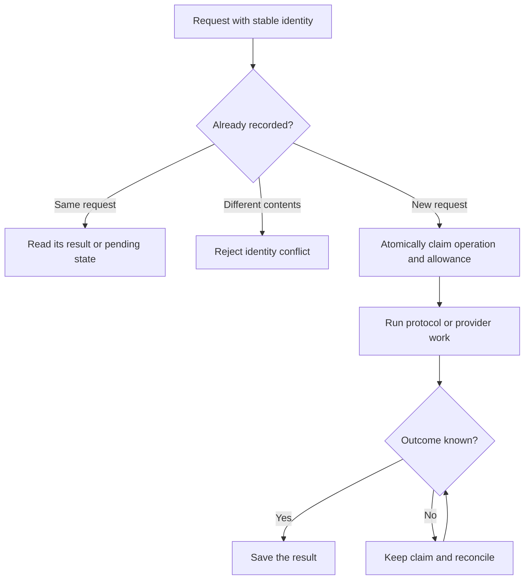

# Spec 4: Persistence and durable authority

A wallet has to work through page reloads, server restarts, and lost responses.
It does this by saving the facts needed to continue an operation safely.

## What gets saved

| Location | What it keeps |
| --- | --- |
| Gateway database | Wallet access, sessions, permissions, usage limits, and operation results |
| Private signing-role databases | Each role's own encrypted cryptographic material and progress |
| Browser storage | Encrypted local material, session data, and preferences |
| Process memory | Open secrets and temporary work; cleared when the process ends |

The Gateway handles the public Wallet API. Its database determines whether access
is still valid. A browser cache cannot restore a revoked method or create extra
signing allowance.

Private roles have separate stores and encryption keys. Each can read only its
own material. The Router forwards requests and has no mutable database of its
own.

## Saving a change together

Some changes must succeed together. During recovery, for example, the server
installs the new access and consumes the recovery code in one transaction.
A failed commit leaves both unchanged.

Signing admission similarly records the operation and claims its allowance
together. This prevents concurrent requests from using the same remaining
allowance.

Network work happens after that transaction. Its result is saved separately.
Operations that involve several services keep enough progress in each service
to resume after a restart.

The [execution admission types](../packages/wallet-server/src/router/domains/signingOperations/walletExecutionAdmission.ts)
make the stage before completion explicit:

```ts
export type ClaimedAuthorizedOperation = AuthorizedOperation & {
  readonly lifecycle: 'claimed';
  readonly result?: never;
  readonly response?: never;
  readonly resultDigest?: never;
  readonly completedAtMs?: never;
};
```

A claimed operation has permission to proceed. The `never` fields prevent code
from attaching a completed result to it before that transition has happened.

## When a response is lost

Suppose a signing request times out. The server may already have performed its
part, so starting again could repeat the effect.

Each accepted request has a stable operation identity tied to its caller and
contents. A retry uses that identity to find the result or continue the existing
work. Reusing the identity with different contents is rejected.

After authorization, the request follows this path:



While the result is unknown, the operation keeps its claim and any reserved
capacity. The system checks the external result before releasing the reservation
or attempting further work. Changing the retry key or signing lane cannot
bypass an existing claim.

The same rule applies to provider events: save the event's effect and mark it
processed together, so a duplicate delivery has no second effect.

## Reading, backing up, and deleting data

Stored records are checked when read into the domain. Code works with validated
states, and any temporary format migration stays at the storage boundary.

Backups preserve the separation between private roles. Retired secret material
is erased only after its replacement and required completion records are
verified. Saved progress, rather than a timer or log message, determines when
that is safe.

[Tenant backups and restore](spec-6-tenant-roots-recovery-and-portability.md)
explain how this works across deployments. For implementation, start with the
[Gateway repositories](../packages/wallet-server/src/router/cloudflare/d1).
