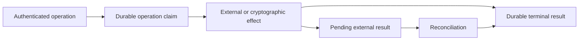

# Spec 4: Persistence and durable authority

Status: normative storage and effect-ownership specification.

Read [Spec 3](spec-3-wallet-sessions-and-execution-lanes.md) first. Continue with
[Spec 5](spec-5-router-ab-threshold-protocol.md) for private protocol roles and
[Spec 6](spec-6-tenant-roots-recovery-and-portability.md) for tenant-root journals.

In this specification, D1 means the Cloudflare SQL database bound to a Worker or
Gateway service. Separate D1 bindings represent separate stores and authorities.

## Mental model

Every durable effect has one owner and one authoritative record. Other stores may hold
encrypted material, receipts, indexes, projections, or caches. Those copies never
become independent authority.



The durable claim survives process restarts and lost responses. A retry resumes that
claim instead of creating another logical operation.

## State ownership

| Store | Owns | Must never become authority for |
| --- | --- | --- |
| Gateway D1 | Wallet and key metadata, auth methods, server sessions, authorizations, lanes, operation claims, replay keys, quotas, public tenant-root lifecycle, recovery admission, audit references | Private role shares or plaintext client custody material |
| Deriver A private D1 | Encrypted A-local protocol state, journal, receipts, epoch, and erasure state | Deriver B or SigningWorker state |
| Deriver B private D1 | Encrypted B-local protocol state, journal, receipts, epoch, and erasure state | Deriver A or SigningWorker state |
| SigningWorker private D1 | Encrypted activated signing material, nonce or presign state, journals, receipts, and erasure state | Deriver roots or client-held material |
| Browser storage | Sealed custody and session material, activation references, preferences, and continuity caches | Credential validity, tenant membership, sessions, quotas, grants, balances, or protocol completion |
| Process memory | Plaintext secrets, active cryptographic contexts, and transient transport state | The only record of a completed durable effect |

Router A/B itself has no mutable persistence binding. The Gateway owns public operation
state, while each private role owns its local durable facts.

Financial ledgers and agent grants belong in Gateway-owned storage when the proposed
agent-spending domain in [Spec 8](spec-8-agent-authority-spending-and-payment-rails.md)
is implemented.

## Durable operation identity

Every mutating operation binds:

- a stable operation ID and idempotency key;
- tenant, environment, and authenticated principal;
- operation kind;
- canonical input digest;
- any exact Wallet, authority, lane, grant, or protocol identity required by the
  operation.

The lifecycle is represented as a discriminated union:

```text
claimed -> pending_external_result -> succeeded
   |                                  -> failed
   +-------------------------------> succeeded
   +-------------------------------> failed
```

Each branch carries only its valid fields. For example, a pending external result
requires the provider request identity used for reconciliation. A succeeded result
requires its terminal timestamp and result reference.

## Claim semantics

Claiming an operation has three outcomes:

1. **Claimed:** this request owns the new operation and may continue.
2. **Existing same input:** the logical operation already exists; return or reconcile
   its current state.
3. **Idempotency conflict:** the same identity was reused with different authenticated
   content; reject it.

A request handler writes `claimed` before making an external call. If the response is
ambiguous, it writes `pending_external_result` with the external request identity. It
never creates a new operation ID to work around uncertainty.

## Atomicity

Effects owned by one database commit in one database transaction. Examples include:

- consuming a recovery code and installing a recovery authority;
- claiming an operation and reserving quota or delegated budget;
- applying a provider event and marking its event identity processed;
- committing an auth method, envelope metadata, and audit reference.

Conditional writes enforce lifecycle transitions. Unique keys enforce one-time
effects. Integer arithmetic with explicit units is required for quotas, token amounts,
money, epochs, and protocol counters.

No network or cryptographic protocol call runs inside a database transaction. The
transaction reserves authority; the effect follows; a second transaction records the
result.

## Operations that cross owners

A multi-role operation uses a journaled protocol. Each owner records only its local
phase, material, and receipt. Public commitments and receipt digests let the coordinator
decide the next action without assembling private shares.

Long-running journals record:

- canonical operation and participant identities;
- explicit lifecycle phase;
- input and transcript digests;
- participant receipts and epochs;
- terminal or unresolved state.

After restart, the next action is reconstructed from these durable facts. Timers, log
messages, browser callbacks, and process-local promises are never proof of completion.

## Persistence boundaries

Database rows and browser records are untrusted boundary data. Repositories parse and
normalize their versioned shapes before domain code receives them.

Core services do not accept raw rows, nullable lifecycle fields, or broad compatibility
objects. Temporary storage compatibility stays inside migration and repository parsers
and is removed after the stored data has been converted.

## Provider and event reconciliation

Every delivered provider event has a stable source identity. Applying the event and
recording that identity as processed is one atomic operation. Receiving a webhook or
transport response proves delivery only; the durable Wallet transition proves
application.

Unknown external outcomes keep their claims and reservations until reconciliation
finds a definitive result. A definitive failure releases only the authority whose
domain rules permit release.

## Backups and erasure

Backups preserve store ownership and cryptographic role separation. A managed
availability backup may restore one encrypted role store. It cannot assemble tenant
recovery authority.

Tenant-controlled recovery packages are encrypted, versioned, integrity-protected,
and restorable without the source deployment. [Spec 6](spec-6-tenant-roots-recovery-and-portability.md)
defines their protocol.

Retirement and deletion are explicit lifecycle transitions. A role records retirement
before erasing secret-bearing state, then records its own erasure confirmation without
exposing the material. Authoritative transitions invalidate dependent caches and
projections.

## Failure and reconciliation

- An interrupted operation resumes from its journal.
- An unknown external result retains its claim and reserved authority.
- Retry cannot create a second credit, authorization, signature, method, or ceremony.
- Role-local installation is complete only after durable write and public-evidence
  verification.
- Process crashes after an effect are reconciled from the original operation and
  provider identities.

## Code landmarks

| Responsibility | Location |
| --- | --- |
| Gateway D1 repositories | `packages/wallet-server/src/router/cloudflare/d1` |
| Gateway migrations | `packages/wallet-server/migrations` |
| Browser session persistence | `packages/wallet/src/core/signingEngine/session/persistence` |
| Shared persistence parsers | `packages/shared-ts/src` |
| Private Router role storage | `crates/router-ab-cloudflare/src` |
| Tenant-root protocol records | `crates/router-ab-core/src/derivation` |

## Non-goals

Private Console organizations, billing, CRM, transactional email, deployment secrets,
and product analytics are outside this repository's persistence authority.

## Source lineage

Consolidates Wallet-owned rules from R82, R85, R89, R90, R93, R94C, R95B, R100,
R103F, and R120.
