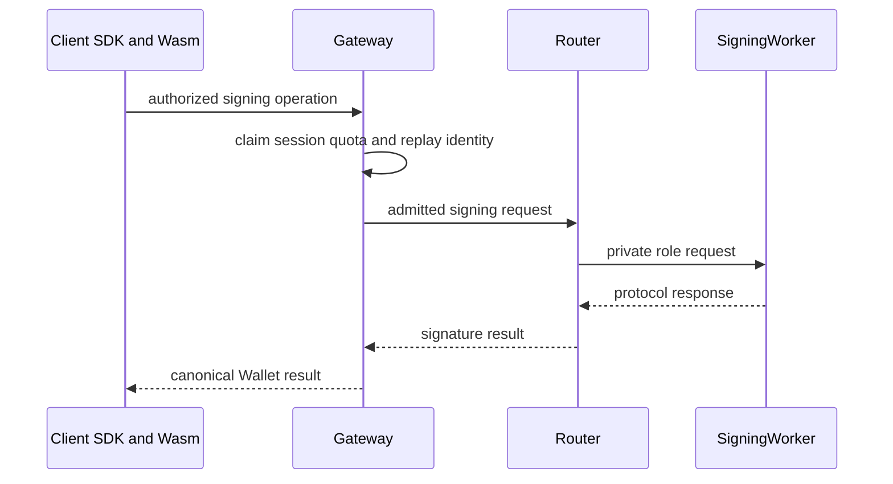
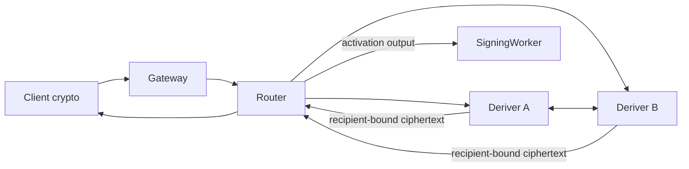

# Spec 5: Router A/B threshold protocol

Status: normative architecture index. The
[detailed protocol specification](router-ab/protocol.md) owns exact protocol and
cryptographic requirements. [Deployment](router-ab/deployment.md) owns production
role separation, and [local development](router-ab/local-development.md) owns local
composition.

Read [Spec 3](spec-3-wallet-sessions-and-execution-lanes.md) and
[Spec 4](spec-4-persistence-and-durable-authority.md) first. Continue with
[Spec 6](spec-6-tenant-roots-recovery-and-portability.md) for tenant-root operations.

## What this specification owns

This specification explains the stable Router A/B topology, the role of each
participant, the difference between derivation-time and normal-signing flows, and the
security boundaries shared by the supported protocols.

When a summary here conflicts with the detailed protocol, resolve the conflict in both
documents. The detailed protocol remains the authority for the final rule.

## Mental model

Router A/B is a split-custody architecture. The public client sees one Wallet Gateway
and Router service. Secret state remains separated among client cryptography, Deriver
A, Deriver B, and the SigningWorker.

The system has two distinct paths.

### Normal signing

Deriver A and Deriver B stay out of the hot signing path after material activation.
The client cryptographic runtime and SigningWorker execute the curve-specific online
protocol through the Router.

### Derivation-time operations

Registration, recovery, explicit export, activation refresh, and tenant-root
operations may require both Derivers. Each Deriver opens only its own input and emits
only recipient-bound output. The Router forwards ciphertext and public evidence without
joining protected values.

## Roles

| Role | Responsibility | Secret boundary |
| --- | --- | --- |
| Wallet Gateway | Authenticates public requests; resolves Wallet Session, lane, quota, and operation authority; owns public operation state | Holds no private protocol share |
| Router | Verifies Router admission policy, canonical request binding, CORS, and private-role routing | Has no mutable storage and opens no participant envelope |
| Deriver A | Holds A-local tenant-root and derivation state; fixed Ed25519 Yao garbler | Cannot read B-local or joined material |
| Deriver B | Holds B-local tenant-root and derivation state; fixed Ed25519 Yao evaluator | Cannot read A-local or joined material |
| SigningWorker | Holds activated server signing material and one-use nonce or presign state | Holds no tenant root or client material |
| Client Rust/Wasm | Holds client protocol state and performs client-side cryptographic operations | Holds no server or Deriver role material |

Production Deriver A and Deriver B run under independent deployment principals and
private stores. Development may compose the same role contracts locally without
weakening their message or persistence boundaries.

## Security invariant

No single service receives enough durable material to reconstruct a Wallet key or
tenant derivation root.

More specifically:

- the Router sees public metadata, signed policy, digests, and opaque ciphertext;
- each Deriver sees only its role-local root and derivation material;
- the SigningWorker sees only activated server-side signing material;
- the client sees its client-side material and may reconstruct an owner key only
  during an explicitly authorized export;
- logs contain identifiers, phases, durations, and sanitized error classes.

Shares, nonces, plaintext roots, lock secrets, custody seeds, and export plaintext
never enter logs or general diagnostics.

The detailed protocol defines the supported corruption and collusion model. This
summary makes no broader threshold-security claim.

## Supported protocol families

### Ed25519

Ed25519 derivation uses the role-separated Yao protocol. Deriver A and Deriver B hold
fixed garbler and evaluator roles. Activation delivers separate recipient-bound
packages to the client and SigningWorker. Normal signing uses the activated client and
SigningWorker material without invoking either Deriver.

### ECDSA

ECDSA derivation uses a strict threshold pseudorandom function (threshold PRF) and
additive secp256k1 shares.
Its derivation, activation, export, and normal-signing records remain distinct from the
Ed25519 Yao types. Stable EVM-family key-slot identity includes `signingRootId` and
`signingRootVersion` metadata.

The same EVM-family public key may serve multiple chain targets. Lane readiness,
authorization, budget, and persistence still bind the concrete chain target.

## Ceremony lifecycle

Every ceremony binds:

- tenant, Wallet, key, operation, and protocol identities;
- exact participant identities and epochs;
- canonical public input and transcript digests;
- recipient identity and output purpose;
- expiry, replay identity, and idempotency identity.

The Gateway owns the public operation and ceremony state. Each private role records its
own phase, one-use ticket state, receipt, and encrypted material. The Router derives
routing decisions from the admitted request and supplied durable facts; it stores no
mutable protocol state.

A disconnect has no failure semantics by itself. After timeout or restart, the Gateway
and private roles reconcile receipts under the original ceremony identity. Conflicting
input under that identity is rejected.

## One-use material

ECDSA presignatures and Ed25519 nonce or presign resources are one-use protocol
material. Allocation, claim, use, burn, and refill transitions are durable and
race-safe.

After an ambiguous signing attempt, claimed one-use material cannot return to the
available pool. Background warming improves latency and never changes authorization or
protocol correctness.

## Derivation and refresh

Wallet and key derivation use stable public identities and versioned epochs. A proactive
share refresh changes role-local representation while preserving public keys and root
lineage.

The following remain separate materials:

- Wallet custody seed and owner roots;
- lane holder shares;
- tenant-root role shares;
- activated SigningWorker material.

Cryptographic configuration and envelope keys are versioned protocol inputs. Rotation
introduces a new version through an explicit lifecycle. The old version retires only
after required state is readable and verified under the replacement.

## Public, private, and control-plane routes

Public Wallet operations enter through the Gateway. The Router and participant routes
accept an allowlisted set of exact internal commands under service authentication.
They are inaccessible through public routing.

Administrative operations use a separate control-plane authorization and audit path.
Read-only fleet health has no cryptographic mutation capability.

## Failure and reconciliation

- Wrong role, participant, epoch, transcript, recipient, expiry, or replay identity is
  rejected before secret processing.
- A timeout retains the existing ceremony and any claimed one-use material.
- Conflicting input cannot attach to an existing ceremony.
- Role-local write is acknowledged only after durable encryption and public-evidence
  verification.
- A terminal result commits once under the Gateway operation identity.

## Verification authority

Rust vectors own protocol encodings and cryptographic invariants. Cross-language
fixtures prove Rust and TypeScript agreement. Type fixtures own compile-time
constraints, and formal-verification commands own only the mathematical properties in
their documented models.

Tests use production encoders. Generated vectors and fixtures are regenerated by their
owning commands and are never edited by hand. [Spec 9](spec-9-behaviour-and-test-authority.md)
defines the complete evidence hierarchy.

## Code landmarks

| Responsibility | Location |
| --- | --- |
| Canonical protocol and derivation types | `crates/router-ab-core/src` |
| Cloudflare Router and role adapters | `crates/router-ab-cloudflare/src` |
| Local Router composition | `crates/router-ab-dev` |
| Ed25519 Yao protocol | `crates/router-ab-ed25519-yao-protocol` |
| ECDSA client protocol | `crates/router-ab-ecdsa-client-protocol` |
| ECDSA online signing | `crates/router-ab-ecdsa-online` |
| Client Wasm adapters | `wasm/router_ab_ecdsa_client`, `wasm/near_signer` |
| Detailed protocol | `docs/router-ab/protocol.md` |

## Non-goals

This specification does not define private administrative UI, production hostnames,
or a generic threshold framework beyond the supported Wallet protocols.

## Source lineage

Consolidates the stable Router rules from R89, R93, R94C, R95, R96, R99B, and R120.
