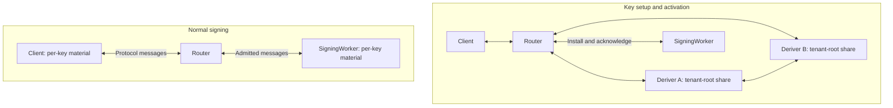
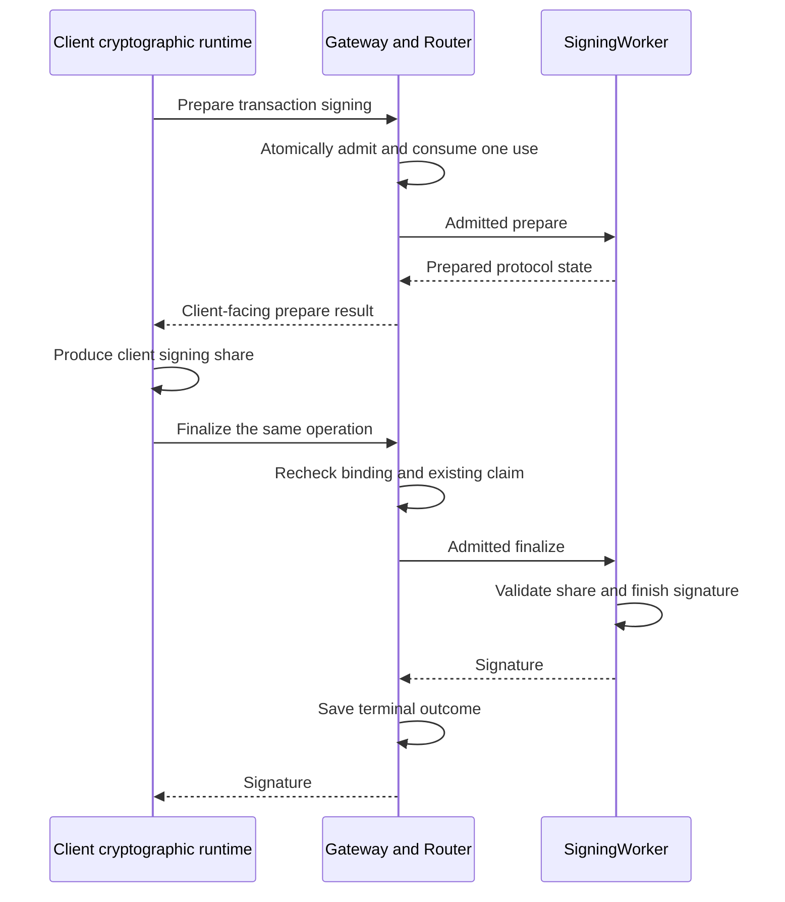

# Spec 5: Router A/B threshold protocol

Normal wallet signing uses secret material held by the client and separate
server roles. They run a threshold protocol together to produce a signature.
The server roles never assemble the complete wallet key.

Router A/B is the part of the system that coordinates this cryptographic work.

## The roles

| Component | Its job |
| --- | --- |
| Gateway | Checks wallet permissions and usage limits, then records the operation |
| Router | Checks protocol admission and forwards messages to the private roles |
| Deriver A and Deriver B | Cooperate during key setup and other derivation operations; each holds its own secrets |
| SigningWorker | Holds prepared server material and participates in normal signing |
| Client cryptographic runtime | Holds the client material and performs the client side of the protocol |

The diagram shows cryptographic traffic after Gateway admission.
The Router handles encrypted messages and public information. It has no
participant secret share. Its Durable Object serializes tenant-root lifecycle
progress without storing either Deriver share. Each private role saves only its
own material and progress.

## What is split?

There are two separate jobs. Deriver A and Deriver B hold shares of the
**tenant derivation root**, used during key setup. Once setup is complete,
normal signing uses the **per-key material** held by the client and
SigningWorker.

The tenant root is separate from the wallet custody seed that derives the
owner's signing roots. See
[Spec 2](spec-2-auth-custody-and-credentials.md) for that client-side custody flow.

## Preparing keys

Registration and recovery may need to derive and install signing material.
The Derivers cooperate, verify the result, and deliver encrypted output to the
client or SigningWorker that will use it. Each recipient opens only its own
output.

Activation requires the SigningWorker to save its material, verify the resulting
public identity, and return an activation receipt. Before signing, the client
also validates its material against the current session and key binding.
Ordinary unlock and page reload restore existing material; a saved handle still
needs validation by the current worker.

This setup also supports operations such as explicit key export and share
refresh. Those operations require their own authorization.

Ed25519 and ECDSA use different cryptographic protocols. They follow the same
separation of responsibilities, while keeping their cryptographic formats and
material distinct.

## Signing with prepared material

After setup, normal signing uses the client and SigningWorker through the
Router. The Derivers stay out of this path. This lets ordinary signing continue
without repeating key derivation.

For example, signing a NEAR transaction when no presignature is ready takes a
prepare call followed by a finalize/sign call. A presignature is one-use
cryptographic work prepared ahead of final signing.

Gateway and Router are grouped below to keep the sequence readable. Gateway
owns authorization and allowance; Router forwards admitted protocol requests.

The result is an ordinary signature verifiable with the wallet's public key.
Finalizing the same operation consumes no second signature use. Submission to
the blockchain happens separately.

A signature still needs the session and permission checks described in
[Spec 3](spec-3-wallet-sessions-and-execution-lanes.md). Having prepared material
does not grant permission to use it.

## When the response is lost

Suppose SigningWorker finishes its part, then the connection drops. The client
cannot tell from the timeout whether signing completed. It checks or retries
the same operation, with the same request binding, so the server can return
the recorded result or check what happened before continuing.

| What happened | What follows |
| --- | --- |
| The request was rejected before admission | Signing never starts and no signature use is consumed |
| A response is lost after admission | Keep the operation claim and reconcile the same request; the timeout grants no refund |
| The blockchain rejects an already-signed transaction | The signature use stays consumed; chain nonce handling is separate |

Nonces and presignatures are also one-use. Once claimed for a signing attempt,
failure or response uncertainty cannot return them to the available pool.
Uncertainty is no proof that the material went unused. A retry must recover the
existing operation rather than sign a different message with that material.

## Keeping secrets separated

Production Derivers run in independent administrative environments with separate
credentials, stores, and encryption keys. Private commands authenticate the
sender and check the intended operation and recipient before opening material.

Normal signing keeps the complete key unassembled. Explicit owner export is a
separate, freshly authorized flow that delivers the supported key material to
the client. It does not expose server shares or lane holder shares.

Logs contain public identifiers and progress, never secret material.

The [protocol reference](router-ab/protocol.md) defines the precise cryptographic
requirements and threat assumptions.
[Deployment](router-ab/deployment.md) covers role isolation, and
[local development](router-ab/local-development.md) shows how to run the roles.
