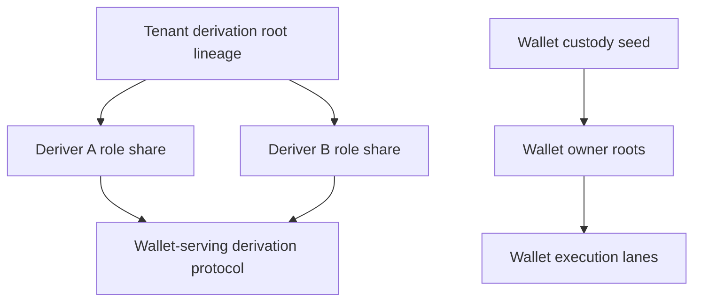
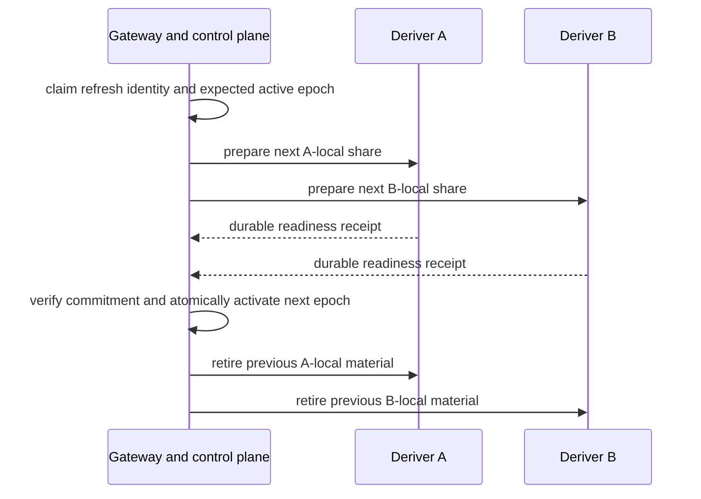

# Spec 6: Tenant roots, recovery, and portability

Status: normative operational-custody specification.

Read [Spec 4](spec-4-persistence-and-durable-authority.md) and
[Spec 5](spec-5-router-ab-threshold-protocol.md) first.

## What this specification owns

This specification defines the tenant derivation-root lifecycle, proactive share
refresh, backup separation, browser-approved CLI access, source-independent restore,
and direct deployment migration.

## Tenant roots and Wallet custody are separate

A **tenant derivation root** is tenant-scoped cryptographic authority used to derive
Wallet-serving material. Its role shares remain separated between Deriver A and
Deriver B.

A **Wallet custody seed** belongs to one Wallet and reproduces that Wallet's owner
signing roots. A **lane holder share** belongs to one execution lane. Neither belongs
to a tenant recovery package.



An operational-share refresh changes the A-local and B-local representations for the
same tenant-root lineage. A root replacement creates a new lineage. These operations
have separate state machines and separate authorization.

## Root lifecycle

```text
absent -> creating -> dormant -> activating -> active
active -> refreshing -> active
active -> retiring -> retired -> erased
```

Each state means:

- `absent`: no root lineage is installed at this destination;
- `creating`: the role-separated creation protocol is in progress;
- `dormant`: role shares are installed and publicly verified, while admission excludes
  the root;
- `activating`: the control plane is atomically admitting the verified root;
- `active`: new Wallet-serving work may claim this root and epoch;
- `refreshing`: a replacement role-share epoch is being prepared for the same lineage;
- `retiring`: new work is excluded while existing claims and safety conditions finish;
- `retired`: authority is disabled and erasure may proceed;
- `erased`: each role has durably confirmed deletion of its secret state.

An active record requires the exact root identity, lineage, public commitment, epoch,
deployment binding, lifecycle revision, and verified participant receipts.

Failure branches preserve the last verified public facts and enough journal state to
resume or reconcile.

## Operation authorization

Every tenant-root operation capability binds all fields that could redirect the
action:

- operation kind and idempotency key;
- organization, project, environment, and tenant-root identity;
- custody lineage and recovery-governance digest;
- expected lifecycle revision, commitment, and epoch when a root already exists;
- exact subject, such as the root, recovery set, or recipient pair;
- requesting actor, issue time, and expiry.

Authorization signs the canonical record digest. Changing an identity, role, subject,
revision, commitment, recipient, or expiry invalidates the capability.

Restore into an empty destination is a distinct branch. That destination has no active
lifecycle revision or root commitment to assert. Restore authorization binds the
recovery set, archive manifest, destination fingerprint, restore session, role import
key, generation, and nonce instead.

## Initial creation

Creation is a receipt-driven multi-party protocol:

1. Authorize one exact tenant, environment, lineage, participant set, and suite.
2. Create and persist A-local and B-local root shares through their private channels.
3. Collect role receipts and public commitment evidence.
4. Verify that both roles describe the same root identity, commitment, and epoch.
5. Commit the root as `dormant`.
6. Activate it through a separately authorized control-plane transition.

No coordinator, operator, database, backup service, or CLI receives the assembled root.

## Proactive share refresh

Refresh creates new role-local shares for the same root and advances
`RootShareEpoch`. Public keys and stable root lineage remain unchanged.



Each role writes encrypted replacement material before acknowledging readiness. New
work uses the newly active epoch. In-flight work continues under the epoch it already
claimed.

Previous material is retired and erased only after the new epoch and all required
receipts are durable. A retry uses the same refresh identity. Conflicting input and a
second concurrent refresh are rejected.

## Root replacement

Root replacement creates a fresh custody lineage and public commitment. It does not use
the refresh lifecycle or promise preservation of existing derived keys.

Replacement requires an explicit product migration plan covering Wallet identity,
admission, recovery governance, cutover, and retirement. A caller cannot select
replacement by passing a different root value to a refresh operation.

## Two backup products

Managed availability backup and tenant-controlled recovery solve different failures.

| Product | Contents and purpose | Authority limit |
| --- | --- | --- |
| Availability backup | One role's encrypted database state for restoring that role | Cannot authorize tenant recovery or assemble the root |
| Tenant recovery package | Complete, encrypted, versioned archive containing separated role artifacts and public verification data | Requires an authorized restore ceremony; exposes no plaintext root |

Recovery artifacts bind tenant, lineage, epoch, role, cryptographic suite,
deployment-independent schema version, integrity metadata, and creation identity.

Optional user-password encryption wraps the already protected recovery archive. The
internal authenticated encryption and role separation remain mandatory with or without
a password.

## Browser-approved CLI access

CLI enrollment begins with a short-lived, one-time browser approval request:

1. An authenticated owner reviews the tenant, environment, operation scopes, and
   expiry.
2. Approval creates one scoped CLI credential.
3. The credential is displayed or delivered once and stored in an OS-protected
   location.
4. The server retains a verifier or hash rather than reusable plaintext.

CLI credentials may authorize explicit recovery operations such as status, export,
restore preparation, activation, refresh, or retirement. They grant no ordinary
Console administration, Wallet signing, billing, or unrelated tenant access.

Every privileged operation rechecks scope, expiry, and revocation. Production CLI
trust uses OS-trusted HTTPS plus a signed deployment trust description that can be
verified offline. Local development trust is an explicit mode.

## Source-independent restore

A valid tenant recovery package can restore into a fresh compatible deployment without
contacting its source.

```mermaid
sequenceDiagram
  participant C as Recovery CLI
  participant G as Destination control plane
  participant A as Deriver A
  participant B as Deriver B

  C->>C: parse and authenticate archive
  C->>G: prepare exact restore destination
  G->>A: install A recipient artifact
  G->>B: install B recipient artifact
  A-->>G: public evidence and durable receipt
  B-->>G: public evidence and durable receipt
  G->>G: verify common commitment; record dormant root
  C->>G: separately authorized activation
  G->>G: atomically admit restored lineage
```

Restore validates tenant and root identity, suite, epoch, integrity, recovery set, and
destination compatibility. Each role receives only its own artifact through its
private authenticated channel.

Import always ends in `dormant`. Signing and derivation remain unavailable until a
separate activation succeeds. Import and activation are idempotent under their exact
operation identities.

## Direct deployment migration

Direct migration uses the same portable archive and dormant-activation boundary.

1. Keep the source active while the target imports and verifies dormant state.
2. Inspect both deployments and choose an explicit cutover point.
3. Atomically admit the target as active authority for the lineage.
4. Exclude, retire, and eventually erase the source according to operator policy.

Exactly one deployment is admitted as active authority for a root lineage at a time.
Target verification alone does not retire the source.

## Failure and audit

- Create, refresh, export, import, activation, retirement, and erasure have stable
  operation identities and typed phases.
- Unknown participant outcomes are reconciled before retry.
- Wrong role, epoch, commitment, destination, recovery set, or lifecycle revision fails
  closed.
- Audit records identify the actor, operation, target, phase, and sanitized result.
- Logs and archives redact credentials and secret material.

## Code landmarks

| Responsibility | Location |
| --- | --- |
| Tenant-root operation records | `packages/shared-ts/src/tenant-root` |
| Server tenant-root domains | `packages/wallet-server/src/router/domains/tenantRoot` |
| Canonical tenant-root protocol | `crates/router-ab-core/src/derivation` |
| Recovery archive and trust primitives | `crates/router-ab-core/src/derivation/tenant_root_recovery_artifacts.rs`, `tenant_root_recovery_trust.rs` |
| Recovery CLI | `crates/seams-cli`, `packages/seams-cli` |
| Public local workflows | `examples/wallet-console-lite` |

## Non-goals

This specification does not prescribe Cloudflare account setup, GitHub secrets,
provider tokens, production runbooks, or private Console screens.

## Source lineage

Consolidates R120, R121 and its focused follow-ups, R122, and R122B.
