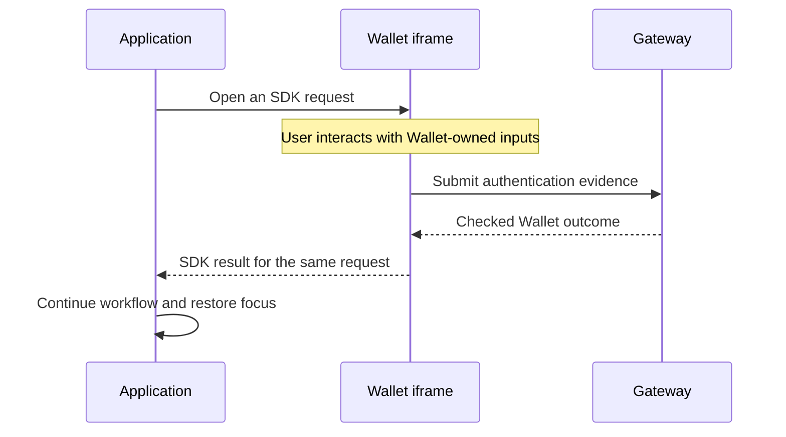

# Spec 7: Hosted surfaces and provider boundaries

An application opens Wallet authentication, signing, and settings through the
public SDK. Wallet supplies the screens and performs the wallet operations;
the application uses the returned result to continue its own workflow.

## Opening Wallet UI

The application owns the surrounding page and the container that displays
Wallet. The hosted iframe owns the authentication inputs and compact Wallet
interactions. Account, security, and device management live in the separate
Wallet settings application.

When a surface opens, the application manages placement, dismissal, and focus
return. Wallet manages its content, internal navigation, and authentication
progress. It reports its size so the container can fit the content.

The SDK returns a clear outcome: completed, cancelled, expired, or failed.
Closing a window or navigating away does not prove that an operation succeeded.

An authentication request crosses the boundary like this:



## Keeping the documents separate

Wallet UI runs on its configured origin. This keeps authentication inputs and
Wallet state inside the Wallet document while the application receives only the
supported SDK messages.

Each message is checked against the expected origin, window, request, and live
surface instance. A message from a closed surface cannot complete a later
request. Production configuration uses specific allowed origins.

Provider secrets and private service credentials stay on the server. Public
browser configuration contains only the values needed to reach and display
Wallet. The public Wallet site remains usable without signing in.

For example, [Console Lite's setup response](../examples/wallet-console-lite/src/localWorkspace.ts)
gives the browser this configuration:

```ts
export type LocalWalletConfig = {
  projectEnvironmentId: string;
  publishableKey: string;
  gatewayUrl: string;
  walletOrigin: string;
  signingWorkerId: string;
};
```

These values identify the project and services. The publishable key is designed
for the browser; private service credentials never enter this response.

## Email and identity providers

Wallet connects to email and identity providers through server adapters.
An adapter translates Wallet requests into provider calls and checks the
responses before returning a Wallet result.

Sending an email successfully is only a delivery result. The user must complete
the relevant challenge before the method can authorize a Wallet operation.

Applications can choose supported providers through configuration. That choice
preserves the same wallet identity and authentication rules described in
[Spec 2](spec-2-auth-custody-and-credentials.md).

## Running your own deployment

Self-hosting supplies the Wallet origins, passkey configuration, providers,
storage, and deployment credentials. It uses the same SDK contracts and server
checks.

For local development, run `pnpm router` and `pnpm site` in separate terminals.
Together they start the public Wallet services, hosted UI, and console-lite
example.

Start with [Wallet Console Lite](../examples/wallet-console-lite/README.md)
or the [self-hosting example](../examples/self-host-cloudflare-worker).
The [provider guides](auth-provider-integrations/README.md) cover configuration
for individual identity services.
