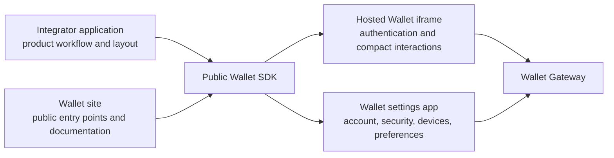
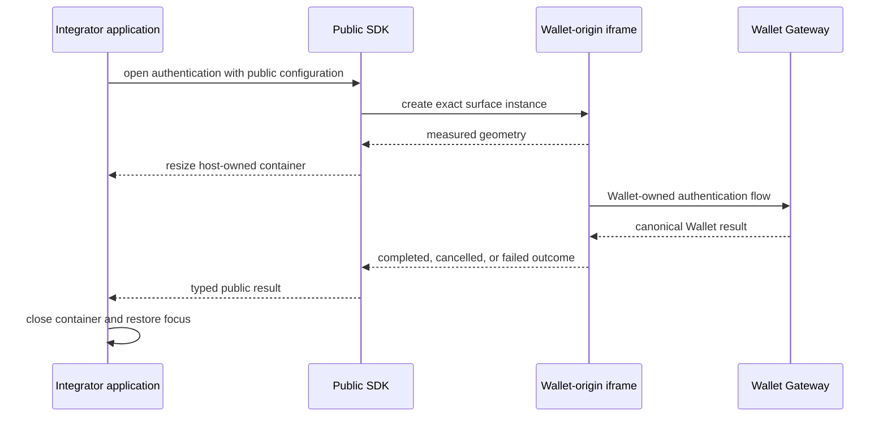
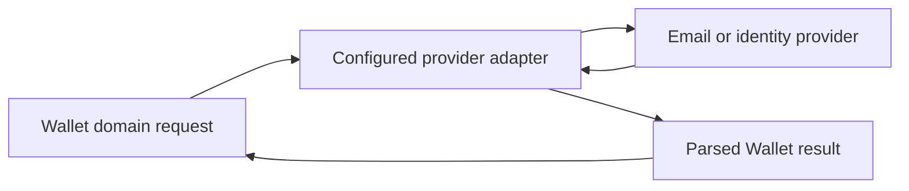

# Spec 7: Hosted surfaces and provider boundaries

Status: normative public integration specification.

New integrators can read this specification immediately after
[the architecture guide](README.md). Read
[Spec 1](spec-1-runtime-and-platform-boundaries.md) for runtime layering and
[Spec 2](spec-2-auth-custody-and-credentials.md) for the authentication transitions
performed inside Wallet-owned surfaces.

## What this specification owns

This specification defines the applications and documents visible to an integrator,
the SDK contract used to open them, cross-origin messaging, provider adapters,
self-hosting responsibilities, and deployment boundaries.

## Surface map

Wallet exposes four independently owned surfaces.



The private Seams Console consumes the same public SDK and server contracts as another
integrator. It does not gain a separate custody or signing path.

## Who owns what in a hosted interaction

| Concern | Parent application | Wallet iframe or settings document |
| --- | --- | --- |
| Product workflow and launch control | Owns | Observes only the typed request |
| Native dialog or container | Owns | Reports measured content geometry |
| Placement and responsive bounds | Owns | Renders within the supplied container |
| Focus trap, dismissal, and focus return | Owns | Owns internal focus order |
| Authentication inputs and progress | Cannot inspect | Owns |
| Wallet Session and operation results | Receives typed outcome | Produces through Wallet domain flows |
| Internal navigation | Does not control | Owns |

The application can open and close a Wallet surface. It cannot read auth inputs, OTP
state, secret material, or internal provider credentials from the Wallet document.

## Document and origin boundaries

The hosted iframe and settings application are separate static document entries with
explicit security headers. The Wallet site is another public document. API and private
Console route prefixes are resolved before any static single-page-application fallback.

Every hosted message binds and verifies:

- protocol version;
- exact source and target origin;
- browser window source;
- surface instance ID;
- request ID and operation kind.

Production origin lists contain no wildcards. Navigation URLs, API origins, iframe
origins, and return locations come from validated application configuration.

A closed or superseded instance is terminal. Messages from that instance cannot affect
a later surface, even when a request ID is accidentally reused.

## Hosted interaction flow



The host cannot infer success from navigation, window closure, or iframe disappearance.
Only the terminal typed response completes the SDK operation.

## Message protocol

Host-to-Wallet and Wallet-to-host messages form a versioned discriminated union.
Request branches carry the exact instance and request identity plus only the data valid
for that operation. Response branches distinguish measurement, completion,
cancellation, recoverable failure, session expiry, and terminal rejection.

The receiving event handler follows this order:

1. Compare `event.origin` with the configured origin.
2. Compare `event.source` with the expected window.
3. Parse `event.data` through the versioned protocol boundary.
4. Resolve the live surface instance and request identity.
5. Switch exhaustively on the parsed response branch.

Unparsed objects and navigation events have no completion semantics.

## Public SDK contract

The browser facade exposes narrow operations for supported authentication, settings,
recovery, signing, and account-management flows. Each call returns a typed result that
lets the integrator handle:

- successful completion;
- user cancellation;
- recoverable Wallet failure;
- Wallet Session expiry;
- terminal policy or security rejection.

Runtime configuration contains public origins, relying-party values, supported
capabilities, and public deployment facts. Browser bundles contain no provider secrets,
private worker bindings, deployment tokens, or long-lived integration credentials.

Published packages must work from packed artifacts without monorepo source aliases.

## Authentication-provider adapters

Email OTP and external identity providers sit behind Wallet-owned ports.



The domain produces a canonical delivery or verification request. The adapter
translates it into one provider call and parses the provider response into a
Wallet-owned result. Provider response objects do not reach core services.

OTP values, provider access tokens, and long-lived integration credentials never enter
public read models or logs. Delivery success proves only that the provider accepted a
delivery request. Verified challenge completion supplies one input to the exact
auth-method transition in [Spec 2](spec-2-auth-custody-and-credentials.md).

Provider selection belongs to server assembly. Missing or contradictory configuration
fails at startup or request admission with an operator-facing error. Explicitly
configured provider fallback must preserve the same normalized identity binding.

## Self-hosting and local development

The public repository provides two top-level local commands:

```sh
pnpm router
pnpm site
```

`pnpm router` starts the isolated protocol roles and Wallet Gateway. `pnpm site` starts
the Wallet site, documentation, console-lite, hosted iframe assets, and local Caddy
router. Together they compose the public Wallet without a runtime dependency on
`seams-monorepo`.

A self-hosted integrator supplies:

- public origins and routing;
- passkey relying-party and associated-domain configuration;
- authentication-provider adapters;
- database and worker bindings;
- TLS, deployment secrets, and service credentials.

Self-hosting uses the same canonical schemas, authorization rules, and role separation.
Configuration cannot bypass Wallet Session admission or threshold-role boundaries.

## Deployment ownership

This repository owns the contracts that every deployment must satisfy. Hostname
selection, DNS, TLS, Cloudflare project wiring, GitHub environments, OAuth provider
configuration, and production secret generation belong to deployment composition.

The private `seams-monorepo` owns Seams-operated deployment configuration. Public
Wallet packages and examples remain deployable without importing that configuration.

## Failure and retry

- Surface timeout, cancellation, and window closure return distinct typed outcomes.
- Closed or superseded instances have no message authority.
- Mutations carry stable operation identities through the surface and server flow.
- A retry reconciles server state before repeating an external effect.
- Ambiguous provider results remain pending until the provider or Wallet authority
  supplies a definitive result.

## Code landmarks

| Responsibility | Location |
| --- | --- |
| Hosted iframe client protocol | `packages/wallet/src/SeamsWeb/walletIframe/client` |
| Host-side iframe runtime | `packages/wallet/src/SeamsWeb/walletIframe/host` |
| Surface domain and geometry | `packages/wallet/src/SeamsWeb/walletIframe/client/surface` |
| Public authentication example | `examples/seams-auth-menu` |
| Public self-hosting example | `examples/self-host-cloudflare-worker` |
| Local full-stack example | `examples/wallet-console-lite` |
| Provider integration guides | `docs/auth-provider-integrations`, `docs/otp` |

## Non-goals

This specification does not assign public hostnames, configure provider accounts,
define private deployment workflows, or merge unrelated Seams products into Wallet
routes.

## Source lineage

Consolidates R86, R108, R110, R112, R119, R122B, and the public integration boundary
from R123.
