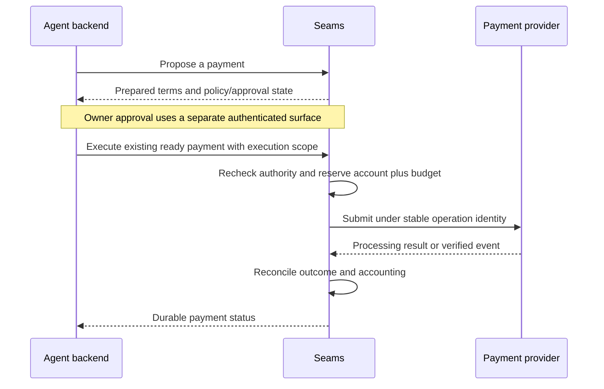

# Spec 8: Agent authority, spending, and payment rails

This is a proposed extension for agent-driven payments. R130A–D deliver Airwallex
card payments first, Wise transfers second, and traditional bank transfers third.
The first milestone is the wallet-funded Airwallex sandbox journey. Later phases
reuse its authority, approval, and accounting services. Provider execution is
verified separately from proposal support; live payments remain subsequent work.
Japan is a target market, with account and issuing eligibility verified per
product as described in [R130D](refactor-130D-airwallex-card-rail.md).

## Authority to propose and spend

An owner connects a funding account and grants an agent limited authority. The
account-owning business/customer, authorized human, integration tenant, and agent
are distinct identities with server-verified relationships.

An agent connection identifies the calling backend and permitted API operations.
A provider connection supplies owner-authorized account access. An **Agent Grant**
binds the agent to one funding account, permitted operations/providers and
recipients, budget, per-payment limit, approval threshold, and expiry. Its rules
are immutable; changing them creates a new grant. Connections and grants have
independent revocation states.

The initial tools are `get_spending_authority`, `propose_payment`,
`get_payment_status`, and separately scoped `execute_payment`. Owners connect
accounts, administer grants, and approve payments through their own authenticated
surface. Proposal-only agent access cannot approve or execute a payment.

## Payment proposals

A proposal records an immutable payment with authoritative prepared terms. It
includes the account, provider/operation, beneficiary and destination, source
debit, recipient amount, currency, fees, payment reference, and applicable quote
identity, conversion, and expiry. Merchant checkout also binds cart and delivery
details. Operation and provider are separate concepts: several integrations can
execute bank transfers.

Preparation can obtain quotes and validate owner-enrolled recipients. It cannot
submit payouts, create/fund payable transfers, or charge cards. Missing required
terms or account capabilities produce explicit preparation failures. Valid
proposals become blocked, pending approval, or ready for admission.

Approval binds the exact proposal and terms. Changed terms require a new proposal
and any required approval; expired quotes require fresh preparation. Approval
cannot expand hard grant limits. The executor must honor admitted terms or fail.

## Funding and budgets

Connected Wise accounts in phase 2 and bank accounts in phase 3 supply provider
balance evidence.
Connection and grant creation produce no funding credit. Keep observed balances,
Seams reservations, and agent budgets distinct. Several agents using the same
provider account/currency share one local account reservation boundary.

Local reservations constrain Seams-originated spending. External spending remains
possible, so provider acceptance and settlement are authoritative. Refresh balance
evidence before admission and reconcile local claims with provider holds without
double counting. Missing availability evidence blocks automated admission.

Airwallex sandbox card capacity uses a separate funding branch. An owner transfers
a chosen amount of testnet stablecoins into controlled escrow through existing
Wallet APIs. Verified finality, exact customer attribution, and deduplicated
transfer identity produce one credit after confirmed sandbox funding evidence.
The fiat bridge is simulated. Ordinary wallet deposits cannot credit cards or
connected provider accounts.

Amounts use integer minor units and explicit currencies. A grant reserves the
source debit including fees. For example, a $30 grant with $8 spent and $12
reserved has $10 remaining regardless of the account's larger balance.

## Execution and reconciliation

Before executing, recheck current account access, agent scope, grant, approval,
terms, and funding availability. In one local transaction, claim the proposal
and reserve both account capacity and grant budget. Network calls stay outside
that transaction. Serialize admission with revocation: revoked authority blocks
new admissions, including previously approved proposals. Accepted operations
still require reconciliation.

One proposal has one execution even when request retry keys change. Persist
operation identity before provider mutations and recover interrupted steps by
idempotency or lookup. An unknown outcome retains its reservation; blind retries
cannot create a second payment.

Provider acceptance and completed payment are distinct states. Capture or a
provider-confirmed transfer outcome commits spend. A definitive unpaid failure
releases the applicable claim. Linked returns/refunds restore applicable funding
without renewing consumed agent budget. Apply each accounting effect and processed
marker atomically so duplicate or reordered events converge.

Provider credentials stay in private adapters; providers process payments and
supply authoritative outcomes. Hosted account connections, provider adapters, payment
accounting, and Console UI live in the private application layer. Wallet custody
and onchain execution remain in `seams-wallet`.

[Spec 4](spec-4-persistence-and-durable-authority.md) supplies transaction and retry
rules. The [R130A–D plans](refactor-130A-agent-expense-domain.md) define proposal
and sandbox evidence; provider availability or a local approval alone cannot
establish live execution support.
