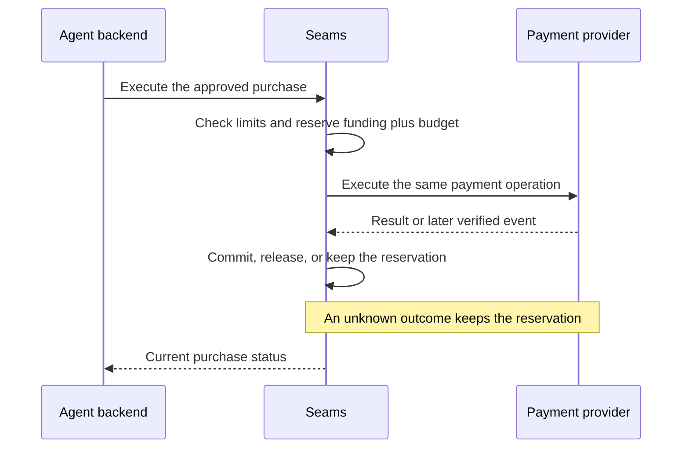

# Spec 8: Agent authority, spending, and payment rails

This is a proposed extension for agent purchases. The initial payment rail is
an Airwallex sandbox card; production card spending is outside this proposal.

An owner funds an account and gives an agent permission to spend within defined
limits. The agent proposes a purchase, the server checks it, and the payment
provider executes it.

## Permission to make purchases

An agent connection identifies who is calling the API. Its credential stays in
the integrator's backend.

An **Agent Grant** states what that agent may buy: the customer and funding
account, merchant, budget, purchase limit, approval threshold, expiry, and
payment rail. A grant can be revoked. Changing its rules creates a new grant.

The server checks that the connection and grant belong to the requested
customer, tenant, and environment. Revoking either blocks the corresponding new
requests or purchases. Previously accepted work still needs reconciliation.

## Funding and approval

Card capacity comes from a verified, finalized transfer of wallet stablecoins
to the configured escrow. The server records each transfer once. A wallet
balance or a newly created grant does not create card capacity.

A proposed purchase includes the merchant's quote, items, delivery details,
currency, and total. When approval is required, the owner approves that specific
purchase. Changing those details invalidates the approval, and approval cannot
expand the grant's limits.

Amounts use integer units so funding and budget calculations remain exact.

Here is an illustrative ledger view, using USD cents. These names show the
calculation without specifying a storage format:

```json
{
  "currency": "USD",
  "availableFundingMinor": 10000,
  "grant": {
    "budgetMinor": 3000,
    "spentMinor": 800,
    "reservedMinor": 1200
  }
}
```

The grant has $10 left: $30 budget minus $8 spent and $12 reserved. Another $12
purchase exceeds that grant, even though the funding account has $100 available.

## Executing a purchase

Before contacting the provider, the server checks the grant and approval and
reserves both the purchase amount and the agent's budget in one transaction.
Concurrent purchases cannot spend the same available funds.

One purchase has one payment operation. Repeated requests find that operation,
even when the caller changes its retry key.

The initial agent API supports checking spending authority, proposing a
purchase, executing it, and reading its status. Owners manage grants and approve
purchases through a separate authenticated surface.

For an approved purchase, the main flow is:



## Following the payment result

The adapter manages the purchase-bound sandbox card and verifies provider
events. Seams handles no card numbers or security codes.

A confirmed capture commits the reserved spend once. A definitive unpaid failure
releases the applicable reservation. A linked refund restores funding capacity
without renewing the agent's consumed budget.

When the provider's result is unknown, the purchase stays pending and its
reservation remains in place. The server checks the same payment before trying
again. Duplicate or reordered provider events must converge on the same ledger
result.

[Spec 4](spec-4-persistence-and-durable-authority.md) explains the shared rules
for transactions and retries. Production funding, settlement, conversion, and
withdrawal would require separate designs before enabling a live rail.
