# Spec 8: Agent authority, spending, and payment rails

Status: normative target architecture for the proposed R130 agent-expense work.
The components in this specification remain proposed until their implementation and
[Intended Behaviours](intended-behaviours.md) contracts land.

Read [the architecture guide](README.md),
[Spec 3](spec-3-wallet-sessions-and-execution-lanes.md), and
[Spec 4](spec-4-persistence-and-durable-authority.md) first. This specification is an
optional extension to the core Wallet path.

## Initial proposed journey

```mermaid
flowchart LR
  W[Wallet stablecoins] --> E[Tenant and customer escrow]
  E --> C[One finalized funding credit]
  C --> P[Authenticated agent proposal]
  P --> A[Grant and approval admission]
  A --> R[Atomic budget and funding reservation]
  R --> Card[Sandbox card execution]
  Card --> Recon[Provider reconciliation]
  Recon --> Receipt[Receipt and updated ledgers]
```



Ordinary Wallet stablecoin spending remains independent. Only a finalized transfer to
the configured escrow creates card capacity. A balance displayed in a Wallet provides
no card backing by itself.

## Domain model

| Concept | Meaning | Authority |
| --- | --- | --- |
| Agent connection | Credential binding between one registered application or agent actor and one tenant/environment | Gateway |
| Agent Grant | Immutable owner-approved spending limits for one customer, funding account, agent, merchant, and rail | Gateway |
| Purchase intent | Canonical description of one proposed purchase | Gateway after boundary normalization |
| Exact approval | Owner authorization for one purchase digest, amount, currency, and expiry | Gateway |
| Funding account | Wallet ledger that tracks finalized escrow credits, reservations, and spend | Gateway |
| Payment operation | One purchase-bound interaction with a configured payment rail | Gateway plus provider reference |

Identity and spending authority are separate. A connection authenticates an actor and
its API scopes. A grant authorizes spend. Revoking a connection blocks new API calls.
Revoking a grant blocks new purchase admission while permitted status reads may
continue.

## Identity and connection authority

An integration credential authenticates one registered application or agent actor in
one tenant and environment. Every request resolves the exact customer, agent,
connection, funding account, and grant through server-owned bindings.

Caller-supplied customer, funding, or grant identifiers are lookup inputs. They do not
prove access.

Long-lived credentials remain in the integrator's backend. They never enter browser
bundles, model context, public responses, or logs. The credential identifies the
registered actor. It makes no claim about which model or process generated a request.

## Agent Grant

An `AgentGrant` requires:

- owner and customer authority;
- tenant and environment;
- funding account and agent connection;
- merchant scope;
- fixed total budget and per-purchase limit;
- approval threshold;
- expiry and revocation lifecycle;
- one configured payment rail.

Grant rules are immutable. A policy change creates a new grant and leaves the old grant
available for audit and reconciliation.

All money uses exact integer minor units plus a currency. Floating-point values never
enter admission or ledger arithmetic.

## Purchase intent and approval

The first purchase-intent branch is `MerchantCheckout`. It binds:

- merchant;
- immutable quote identity and digest;
- quote expiry;
- reviewed line items and delivery details;
- itemized price and exact total;
- card currency.

Merchant input is validated and normalized once at the request boundary. Any change to
an approval-relevant field creates a new intent digest and invalidates an earlier
approval.

An exact approval binds customer authority, purchase identity, canonical intent digest,
approved amount, currency, and expiry. Approval may satisfy the grant's threshold. It
cannot expand the grant budget, merchant scope, per-purchase limit, expiry, or rail.

## Purchase lifecycle

```text
proposed -> pending_approval -> admitted -> provider_unknown -> captured
    |                              |              |             -> reversed
    +------------------------------+              +-----------> failed_unpaid
                                   +--------------------------> captured
                                   +--------------------------> reversed
                                   +--------------------------> failed_unpaid
```

`admitted` requires an atomic funding and grant reservation. `provider_unknown` retains
that reservation and the original provider operation identity until reconciliation.
Terminal branches record enough evidence to apply accounting once.

## Escrow funding

Funding ingestion verifies authoritative chain data:

- chain and token;
- exact escrow recipient;
- customer attribution;
- amount and units;
- required finality;
- unique transfer identity, including event index where the chain requires one.

Browser-reported success does not prove finality. In one database transaction, the
Gateway records the consumed transfer identity and credits the customer funding ledger.
Concurrent observation, replay, and restart can produce at most one credit.

A test conversion rate uses deterministic integer arithmetic and explicit precision.
An ambiguous bridge or provider result leaves the credit pending until authoritative
lookup resolves it.

## Atomic spending admission

Admission runs in one Gateway database transaction:

1. Claim the purchase and its canonical intent digest.
2. Validate the active connection and immutable grant.
3. Verify exact approval when the threshold requires it.
4. Reserve grant budget.
5. Reserve shared funding capacity.
6. Commit one purchase reservation and payment-operation identity.

The transaction enforces:

```text
grant spent + grant reserved + purchase amount <= grant budget
purchase amount <= funding account available card capacity
```

Failure rolls back the purchase claim and both reservations. No provider call runs
inside the transaction. Multiple grants may share one funding account, so creating a
grant never creates funding capacity.

The store returns a typed result such as reserved, existing purchase, approval required,
grant limit exceeded, funding capacity exceeded, or inactive grant. Core callers do
not infer admission from thrown database errors.

## Agent API

The initial backend API exposes four narrow tools:

- `get_spending_authority`;
- `propose_purchase`;
- `execute_purchase`;
- `get_purchase_status`.

Owner enrollment, grant administration, and exact purchase approval belong to a
separate owner-authorized surface. Cross-tenant, cross-customer, wrong-environment,
expired, and revoked requests fail before financial work.

## Payment-rail contract

The first rail is `AirwallexSandboxCard`. Rail configuration binds one sandbox account,
environment, and currency. Execution binds one admitted purchase, purchase-bound card,
amount, currency, and stable operation identity.

The adapter:

1. Creates or resolves the purchase-bound sandbox card.
2. Invokes the issued-card simulation by provider card identity.
3. Verifies webhook signatures and timestamp bounds.
4. Normalizes provider events into Wallet-owned event branches.

Seams receives no PAN or CVV. Provider credentials stay inside the server adapter.

One purchase has one payment operation even when callers supply new retry keys.
Provider idempotency and lookup reconcile uncertain card creation, funding,
authorization, and capture before another request is sent.

## Accounting transitions

Applying a provider event and recording its provider event identity is atomic.
Duplicate and reordered events converge on one ledger result:

- authorization retains reserved capacity;
- confirmed capture commits funding spend and grant spend once;
- definitive unpaid failure or reversal releases the applicable reservation once;
- a linked refund restores funding capacity and does not renew consumed agent budget;
- an unknown outcome retains its claim and reservation.

The Wallet ledger is authoritative for Seams capacity. Webhook receipt alone is not a
ledger transition.

## Historical card checkout

The earlier embedded card-on-file design described a user-present checkout vaulted by
a payment service provider (PSP). It is outside the active R130 direction. Four safety
rules carry forward:

- Seams handles no PAN or CVV;
- approval binds a canonical purchase intent;
- ambiguous provider results are reconciled before retry;
- verified events drive durable ledger outcomes.

## Failure and reconciliation

- Replayed finalized transfers create no second credit.
- Concurrent purchases cannot overspend grant or funding capacity.
- Changed purchase details invalidate existing approval.
- An unknown payment result retains the original purchase and reservation.
- Duplicate provider events apply no second accounting transition.
- Revocation blocks new authority and preserves in-flight reconciliation.

## Code and proposal landmarks

| Responsibility | Location |
| --- | --- |
| Agent expense domain proposal | `docs/refactor-130A-agent-expense-domain.md` |
| Agent connections proposal | `docs/refactor-130B-agent-connections.md` |
| Console journey proposal | `docs/refactor-130C-agent-expense-console.md` |
| Airwallex sandbox rail proposal | `docs/refactor-130D-airwallex-card-rail.md` |
| Future shared domain types | `packages/shared-ts/src` |
| Future Gateway persistence | `packages/wallet-server/src/router/cloudflare/d1` |

## Non-goals

R130 does not establish production treasury, liquidity, conversion, withdrawal, issuer
settlement, live-card acceptance, a generic policy engine, multiple rails, or a
transport-plugin framework. OAuth, MCP, and CLI adapters require their own concrete
integration specifications.

## Source lineage

Consolidates R104 and R130A–D. R130C contributes the reference journey while private
Console implementation remains in `seams-monorepo`.
